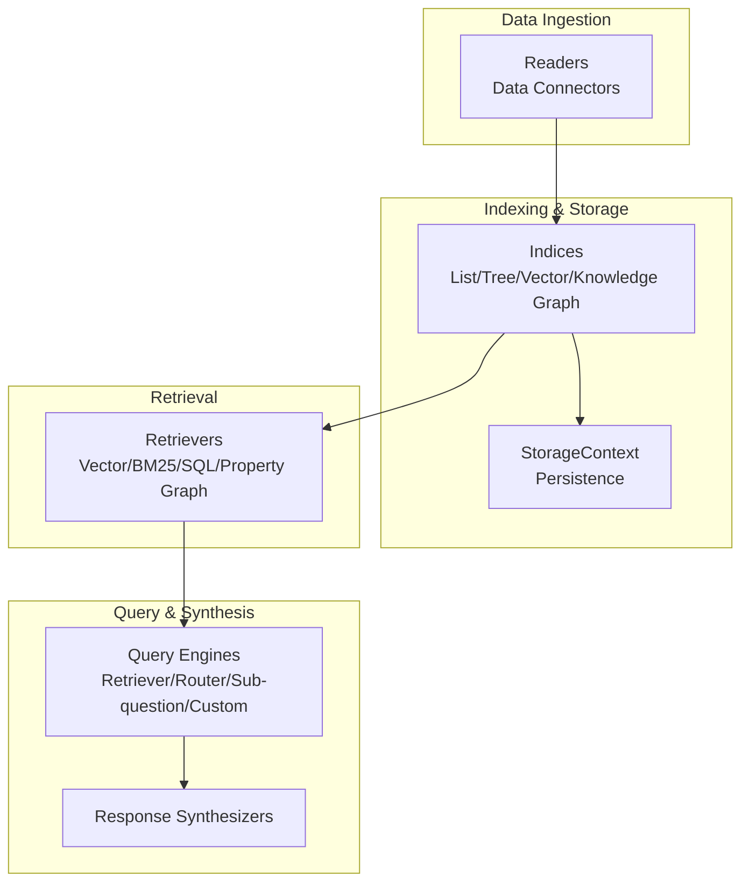
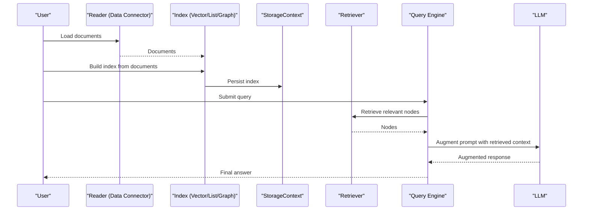
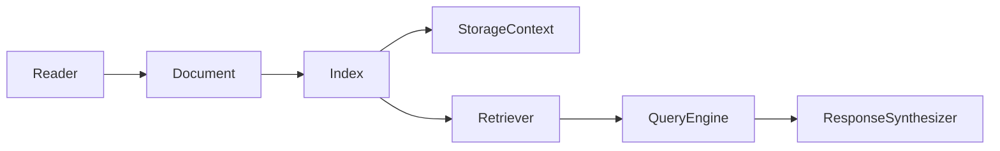

# Introduction and Core Concepts

<cite>
**Referenced Files in This Document**
- [README.md](file://README.md)
- [llama_index\core\__init__.py](file://llama-index-core/llama_index/core/__init__.py)
- [llama_index\core\readers\__init__.py](file://llama-index-core/llama_index/core/readers/__init__.py)
- [llama_index\core\indices\__init__.py](file://llama-index-core/llama_index/core/indices/__init__.py)
- [llama_index\core\query_engine\__init__.py](file://llama-index-core/llama_index/core/query_engine/__init__.py)
- [llama_index\core\retrievers\__init__.py](file://llama-index-core/llama_index/core/retrievers/__init__.py)
- [docs\examples\index.md](file://docs/examples/index.md)
</cite>

## Table of Contents
1. [Introduction](#introduction)
2. [Project Structure](#project-structure)
3. [Core Components](#core-components)
4. [Architecture Overview](#architecture-overview)
5. [Detailed Component Analysis](#detailed-component-analysis)
6. [Dependency Analysis](#dependency-analysis)
7. [Performance Considerations](#performance-considerations)
8. [Troubleshooting Guide](#troubleshooting-guide)
9. [Conclusion](#conclusion)

## Introduction
LlamaIndex is a data framework for LLM applications that augments Large Language Models with private data using retrieval-augmented generation. It solves the core problem of how to best combine public LLM capabilities with private, domain-specific data to produce accurate, contextual, and reliable knowledge generation. The framework offers:
- Data connectors to ingest existing data sources and formats
- Structuring capabilities to organize data into indices and graphs
- An advanced retrieval and query interface that returns knowledge-augmented outputs
- Easy integrations with external frameworks and providers

LlamaIndex supports both a starter approach and a customized approach, enabling rapid 5-line usage for beginners and deep customization for advanced users.

Why traditional LLMs alone are insufficient for private data use cases:
- Publicly trained LLMs lack access to internal knowledge, real-time data, or sensitive corporate information
- Without retrieval-augmented generation, answers may be hallucinated or irrelevant to the user’s private context
- Private data often requires specialized ingestion, structuring, and retrieval strategies tailored to the organization’s needs

How LlamaIndex bridges this gap:
- A comprehensive toolkit for data ingestion, structuring, and retrieval
- Modular components that allow swapping LLMs, embeddings, and vector stores
- A unified query engine that retrieves relevant context and synthesizes augmented responses

**Section sources**
- [README.md](file://README.md#L60-L92)

## Project Structure
At a high level, LlamaIndex organizes functionality around four pillars:
- Data connectors (readers): Load documents from diverse sources
- Indices: Store and structure data for efficient retrieval
- Retrievers: Retrieve relevant nodes based on queries
- Query engines: Orchestrate retrieval, synthesis, and response generation

**Diagram sources**
- [llama_index\core\readers\__init__.py](file://llama-index-core/llama_index/core/readers/__init__.py#L1-L33)
- [llama_index\core\indices\__init__.py](file://llama-index-core/llama_index/core/indices/__init__.py#L1-L88)
- [llama_index\core\retrievers\__init__.py](file://llama-index-core/llama_index/core/retrievers/__init__.py#L1-L89)
- [llama_index\core\query_engine\__init__.py](file://llama-index-core/llama_index/core/query_engine/__init__.py#L1-L88)

**Section sources**
- [README.md](file://README.md#L67-L79)
- [llama_index\core\readers\__init__.py](file://llama-index-core/llama_index/core/readers/__init__.py#L1-L33)
- [llama_index\core\indices\__init__.py](file://llama-index-core/llama_index/core/indices/__init__.py#L1-L88)
- [llama_index\core\retrievers\__init__.py](file://llama-index-core/llama_index/core/retrievers/__init__.py#L1-L89)
- [llama_index\core\query_engine\__init__.py](file://llama-index-core/llama_index/core/query_engine/__init__.py#L1-L88)

## Core Components
- Data connectors (readers): Provide a unified way to load documents from local directories, strings, and many third-party sources. They emit Document objects ready for indexing.
- Indices: Offer multiple data structures (list, tree, keyword tables, vector stores, knowledge graphs, property graphs) to efficiently store and organize content.
- Retrievers: Implement retrieval strategies (vector similarity, BM25, SQL, property graph traversal) to fetch relevant nodes for a given query.
- Query engines: Compose retrievers, routers, and synthesizers to return knowledge-augmented answers, supporting single-step and multi-step workflows.

Beginner-friendly 5-line usage pattern:
- Import a reader and an index type
- Load documents from a directory
- Build an index from documents
- Persist storage (optional)
- Query via a query engine

Dual approach to usage:
- Starter: Use the curated integration package for a quick start
- Customized: Install core and add only the integrations you need (LLMs, embeddings, vector stores)

**Section sources**
- [README.md](file://README.md#L93-L177)
- [llama_index\core\readers\__init__.py](file://llama-index-core/llama_index/core/readers/__init__.py#L1-L33)
- [llama_index\core\indices\__init__.py](file://llama-index-core/llama_index/core/indices/__init__.py#L1-L88)
- [llama_index\core\retrievers\__init__.py](file://llama-index-core/llama_index/core/retrievers/__init__.py#L1-L89)
- [llama_index\core\query_engine\__init__.py](file://llama-index-core/llama_index/core/query_engine/__init__.py#L1-L88)

## Architecture Overview
The LlamaIndex architecture centers on a data framework that turns private data into retrievable knowledge and augments LLM prompts with relevant context.

**Diagram sources**
- [llama_index\core\readers\__init__.py](file://llama-index-core/llama_index/core/readers/__init__.py#L1-L33)
- [llama_index\core\indices\__init__.py](file://llama-index-core/llama_index/core/indices/__init__.py#L1-L88)
- [llama_index\core\retrievers\__init__.py](file://llama-index-core/llama_index/core/retrievers/__init__.py#L1-L89)
- [llama_index\core\query_engine\__init__.py](file://llama-index-core/llama_index/core/query_engine/__init__.py#L1-L88)

## Detailed Component Analysis

### Data Connectors (Readers)
Data connectors are the entry point for ingesting private data. They normalize heterogeneous sources into Document objects, enabling downstream indexing and retrieval.

Key responsibilities:
- Connect to data sources (files, web, databases, APIs)
- Parse and convert raw content into structured Documents
- Support batch and streaming ingestion patterns

Practical example pattern:
- Use a directory reader to load files
- Pass documents into an index constructor

**Section sources**
- [llama_index\core\readers\__init__.py](file://llama-index-core/llama_index/core/readers/__init__.py#L1-L33)
- [README.md](file://README.md#L105-L116)

### Indices and Structuring
Indices define how data is stored and organized for efficient retrieval. LlamaIndex provides multiple index types:
- List/Tree indices for hierarchical summarization
- Keyword table indices for keyword-based retrieval
- Vector store indices for semantic similarity
- Knowledge graph and property graph indices for relational and graph-based queries

These structures enable scalable retrieval and support advanced query patterns.

**Section sources**
- [llama_index\core\indices\__init__.py](file://llama-index-core/llama_index/core/indices/__init__.py#L1-L88)

### Retrievers
Retrievers implement the retrieval interface over indices. They select relevant nodes for a given query using:
- Vector similarity (dense embeddings)
- BM25 (sparse lexical matching)
- SQL parsing and retrieval
- Property graph traversals

They form the backbone of retrieval-augmented generation by surfacing the most pertinent context.

**Section sources**
- [llama_index\core\retrievers\__init__.py](file://llama-index-core/llama_index/core/retrievers/__init__.py#L1-L89)

### Query Engines
Query engines orchestrate retrieval, routing, and synthesis to produce knowledge-augmented outputs. Options include:
- Retriever-based engines
- Router engines for multi-index or multi-source routing
- Sub-question decomposition engines
- Custom engines for specialized workflows

They integrate with response synthesizers to produce coherent answers.

**Section sources**
- [llama_index\core\query_engine\__init__.py](file://llama-index-core/llama_index/core/query_engine/__init__.py#L1-L88)

### Relationship Between LLMs, Private Data, and Knowledge Generation
- LLMs provide reasoning and language generation
- Private data provides factual grounding and domain specificity
- Retrieval augments prompts with relevant context
- Knowledge generation emerges from the combination of LLM understanding and retrieved facts

This relationship is central to why LlamaIndex focuses on retrieval-augmented generation as a robust solution for private data use cases.

**Section sources**
- [README.md](file://README.md#L60-L79)

## Dependency Analysis
LlamaIndex composes modular components with clear boundaries:
- Readers depend on Document schema and optional configuration
- Indices depend on storage contexts and embedding models
- Retrievers depend on indices and vector stores
- Query engines depend on retrievers and response synthesizers

**Diagram sources**
- [llama_index\core\readers\__init__.py](file://llama-index-core/llama_index/core/readers/__init__.py#L1-L33)
- [llama_index\core\indices\__init__.py](file://llama-index-core/llama_index/core/indices/__init__.py#L1-L88)
- [llama_index\core\retrievers\__init__.py](file://llama-index-core/llama_index/core/retrievers/__init__.py#L1-L89)
- [llama_index\core\query_engine\__init__.py](file://llama-index-core/llama_index/core/query_engine/__init__.py#L1-L88)

**Section sources**
- [llama_index\core\__init__.py](file://llama-index-core/llama_index/core/__init__.py#L1-L162)

## Performance Considerations
- Choose appropriate indices for scale and query patterns (vector vs keyword vs graph)
- Optimize embedding and tokenizer settings for your LLM
- Persist storage to avoid re-ingestion overhead
- Use retrieval strategies suited to your data distribution (semantic vs lexical)
- Monitor token usage and chunk sizes to balance quality and cost

[No sources needed since this section provides general guidance]

## Troubleshooting Guide
Common issues and resolutions:
- Missing credentials or tokens for LLMs or embeddings
  - Ensure environment variables are set before importing integrations
- Tokenizer mismatches
  - Align tokenizer with the selected LLM
- Persistence errors
  - Verify persistence directory permissions and paths
- Retrieval quality
  - Adjust retrieval mode (vector vs BM25) or tune index parameters

For deeper diagnostics, consult the examples and documentation pages covering agents, LLM integrations, and vector stores.

**Section sources**
- [README.md](file://README.md#L118-L177)
- [docs\examples\index.md](file://docs/examples/index.md#L1-L68)

## Conclusion
LlamaIndex is a data framework that empowers developers to build robust LLM applications by combining public LLM capabilities with private data through retrieval-augmented generation. Its modular components—data connectors, indices, retrievers, and query engines—provide both a streamlined 5-line beginner path and extensive customization for advanced scenarios. By structuring private data effectively and retrieving relevant context, LlamaIndex enables accurate, reliable, and scalable knowledge generation tailored to real-world use cases.

[No sources needed since this section summarizes without analyzing specific files]