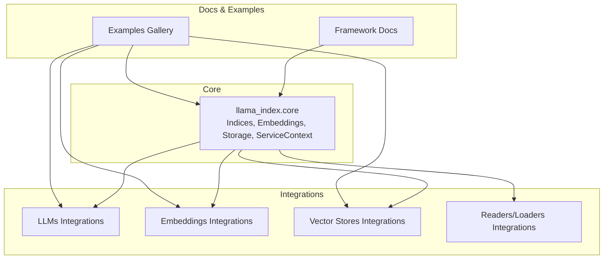
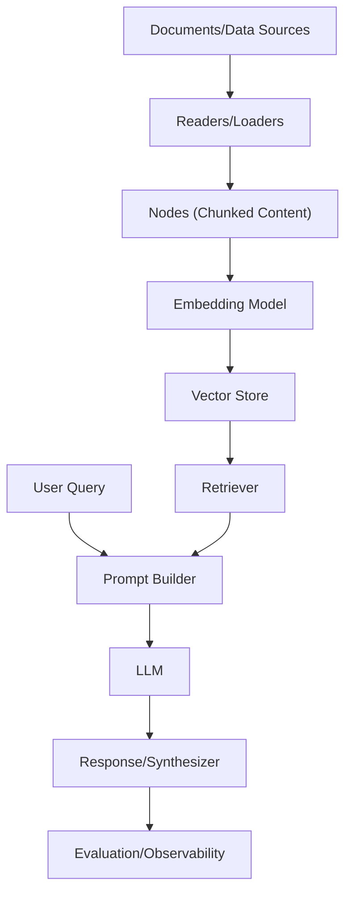
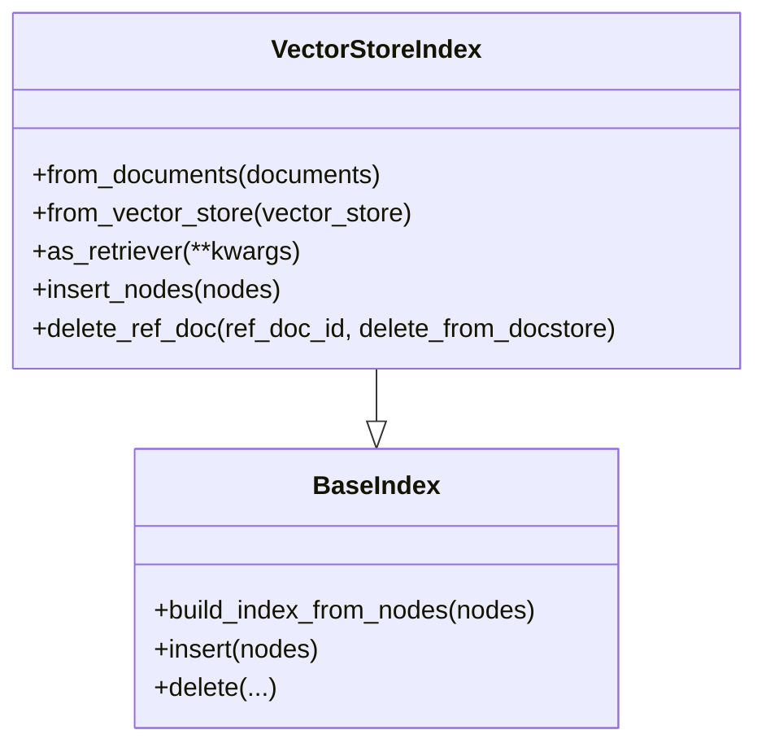
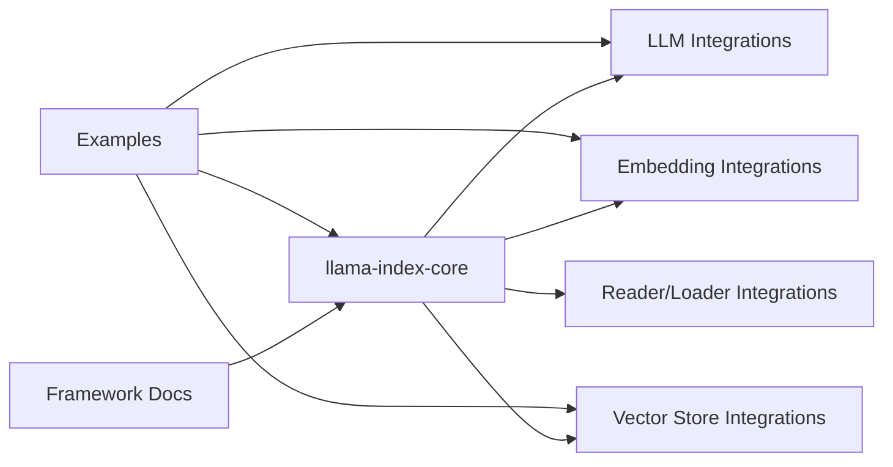

# Introduction and Purpose

<cite>
**Referenced Files in This Document**
- [README.md](file://README.md)
- [index.md](file://docs/src/content/docs/framework/index.md)
- [__init__.py](file://llama-index-core/llama_index/core/__init__.py)
- [schema.py](file://llama-index-core/llama_index/core/schema.py)
- [vector_store/base.py](file://llama-index-core/llama_index/core/indices/vector_store/base.py)
- [README.md](file://llama-index-integrations/README.md)
- [index.md](file://docs/examples/index.md)
</cite>

## Table of Contents
1. [Introduction](#introduction)
2. [Project Structure](#project-structure)
3. [Core Components](#core-components)
4. [Architecture Overview](#architecture-overview)
5. [Detailed Component Analysis](#detailed-component-analysis)
6. [Dependency Analysis](#dependency-analysis)
7. [Performance Considerations](#performance-considerations)
8. [Troubleshooting Guide](#troubleshooting-guide)
9. [Conclusion](#conclusion)

## Introduction
LlamaIndex is a data framework designed to help developers build LLM-powered applications by bridging custom, private, and structured data with Large Language Models (LLMs) through Retrieval-Augmented Generation (RAG). Its core mission is to close the gap between raw LLMs and production-ready AI applications by offering a comprehensive toolkit for data ingestion, structuring, retrieval, and query orchestration.

At its heart, LlamaIndex provides:
- Data connectors to ingest diverse sources and formats (APIs, PDFs, SQL, etc.)
- Structured indices and graphs to organize data for efficient consumption by LLMs
- Advanced retrieval and query interfaces that return context-augmented outputs
- Extensible integrations with LLMs, embeddings, vector stores, and application frameworks

LlamaIndex serves both beginners and advanced users. Beginners can achieve end-to-end RAG in a few lines of code, while advanced users can customize and extend any module—from data connectors and indices to retrievers, query engines, and reranking modules—tailoring the system to complex production needs.

Positioned in the AI/ML landscape, LlamaIndex sits at the intersection of data engineering and LLM application development. It transforms unstructured and semi-structured data into retrievable knowledge, enabling reliable, explainable, and controllable AI experiences. This makes it valuable for developers building intelligent applications such as question-answering systems, chatbots, autonomous agents, document understanding pipelines, and multi-modal applications.

Who benefits:
- Developers building RAG applications and agents
- Teams needing to operationalize LLMs over private or domain-specific data
- Organizations seeking to deploy scalable, monitored, and evaluated AI workflows
- Researchers and practitioners exploring fine-tuning, evaluation, and observability

## Project Structure
LlamaIndex is organized as a monorepo with a core package and a rich ecosystem of integrations. The core package defines foundational abstractions and building blocks (e.g., indices, embeddings, storage, service context), while integrations provide plug-and-play adapters for LLMs, embeddings, vector stores, readers, and more.

Key characteristics:
- Core package exposes high-level APIs for rapid prototyping and lower-level APIs for deep customization
- Integrations are distributed as separate packages, enabling modular selection of providers
- Documentation emphasizes both beginner-friendly workflows and advanced customization paths

**Diagram sources**
- [README.md](file://README.md#L11-L24)
- [README.md](file://README.md#L51-L55)
- [index.md](file://docs/src/content/docs/framework/index.md#L1-L37)
- [README.md](file://llama-index-integrations/README.md#L1-L5)

**Section sources**
- [README.md](file://README.md#L11-L24)
- [README.md](file://README.md#L51-L55)
- [README.md](file://README.md#L93-L177)
- [index.md](file://docs/src/content/docs/framework/index.md#L1-L37)
- [README.md](file://llama-index-integrations/README.md#L1-L5)

## Core Components
LlamaIndex’s core abstractions underpin the entire framework. The top-level initialization aggregates key modules such as indices, prompts, readers, storage, service context, and settings. Together, these form the foundation for building RAG pipelines and agents.

Highlights:
- Indices: Multiple index types (e.g., VectorStoreIndex, TreeIndex, KnowledgeGraphIndex) to structure data for retrieval
- Readers: Data ingestion utilities (e.g., SimpleDirectoryReader) to load documents from local or remote sources
- Prompts and templates: Structured prompt helpers and templates for consistent LLM interactions
- Storage and persistence: StorageContext for managing persisted indices and related artifacts
- ServiceContext and Settings: Centralized configuration for LLMs, embeddings, tokenizers, and other runtime settings

These components collectively enable a unified, extensible architecture for data-to-LM workflows.

**Section sources**
- [__init__.py](file://llama-index-core/llama_index/core/__init__.py#L24-L87)
- [__init__.py](file://llama-index-core/llama_index/core/__init__.py#L93-L150)

## Architecture Overview
The LlamaIndex architecture centers around transforming raw data into retrievable knowledge and then orchestrating retrieval and generation at query time. This is the canonical RAG flow, augmented by optional components such as agents, workflows, and evaluation/observability.

This flow illustrates how LlamaIndex moves from ingestion and chunking to embedding and storage, then to retrieval and generation, and finally to evaluation and monitoring.

**Diagram sources**
- [index.md](file://docs/src/content/docs/framework/index.md#L51-L71)
- [vector_store/base.py](file://llama-index-core/llama_index/core/indices/vector_store/base.py#L35-L124)

**Section sources**
- [index.md](file://docs/src/content/docs/framework/index.md#L51-L71)
- [vector_store/base.py](file://llama-index-core/llama_index/core/indices/vector_store/base.py#L35-L124)

## Detailed Component Analysis

### VectorStoreIndex: The RAG Backbone
VectorStoreIndex encapsulates the most common RAG index type. It manages embedding computation, batched insertion into vector stores, and retrieval via retrievers. It also coordinates storage of nodes and documents, depending on whether the vector store persists text.

Key behaviors:
- Embedding-aware node processing with batching
- Asynchronous and synchronous insertion paths
- Conditional storage of nodes in document stores when vector stores do not store text
- Retrieval integration via as_retriever()

**Diagram sources**
- [vector_store/base.py](file://llama-index-core/llama_index/core/indices/vector_store/base.py#L35-L124)
- [vector_store/base.py](file://llama-index-core/llama_index/core/indices/vector_store/base.py#L259-L355)

**Section sources**
- [vector_store/base.py](file://llama-index-core/llama_index/core/indices/vector_store/base.py#L35-L124)
- [vector_store/base.py](file://llama-index-core/llama_index/core/indices/vector_store/base.py#L259-L355)

### Schema and Base Types
The schema module defines foundational types and abstractions used across the framework. It includes base component models, transforms, and node/document abstractions that unify how data flows through the system.

Highlights:
- BaseComponent and TransformComponent for consistent serialization and transformation
- Node/document abstractions that carry content, metadata, and embeddings
- Utilities for pretty-printing, truncation, and interoperability with external libraries

These types ensure consistent behavior across indices, retrievers, and other components.

**Section sources**
- [schema.py](file://llama-index-core/llama_index/core/schema.py#L80-L200)

### Dual Approach to Usage
LlamaIndex offers a dual path:
- Beginner-friendly starter workflows: High-level APIs let users ingest data and query it in just a few lines
- Advanced customization: Lower-level APIs expose granular control over indices, retrievers, embeddings, and storage, enabling production-grade extensions

This duality ensures accessibility for newcomers while preserving flexibility for sophisticated deployments.

**Section sources**
- [README.md](file://README.md#L76-L79)
- [index.md](file://docs/src/content/docs/framework/index.md#L85-L92)

### Positioning in the AI/ML Landscape
LlamaIndex occupies a unique role between raw LLMs and production-ready AI applications:
- It augments LLMs with domain-specific, private, or structured data
- It provides modular, composable building blocks for retrieval, generation, agents, and workflows
- It supports both cloud-native and self-hosted deployment patterns

This positioning enables developers to move from prototype to production with minimal friction, while maintaining strong controls over data, models, and infrastructure.

**Section sources**
- [index.md](file://docs/src/content/docs/framework/index.md#L59-L71)
- [README.md](file://README.md#L60-L79)

## Dependency Analysis
LlamaIndex’s dependency model is intentionally modular:
- Core package defines foundational abstractions and APIs
- Integrations are separate packages that plug into core via standardized interfaces
- Documentation and examples demonstrate real-world usage patterns and best practices

This separation allows teams to select only the components they need, reducing overhead and simplifying maintenance.

**Diagram sources**
- [README.md](file://README.md#L11-L24)
- [README.md](file://README.md#L51-L55)
- [README.md](file://llama-index-integrations/README.md#L1-L5)
- [index.md](file://docs/examples/index.md#L1-L68)

**Section sources**
- [README.md](file://README.md#L11-L24)
- [README.md](file://README.md#L51-L55)
- [README.md](file://llama-index-integrations/README.md#L1-L5)
- [index.md](file://docs/examples/index.md#L1-L68)

## Performance Considerations
- Batched embedding and insertion reduce API overhead and improve throughput
- Asynchronous operations enable non-blocking ingestion and retrieval for high-throughput scenarios
- Choosing appropriate indices and vector stores impacts latency and accuracy trade-offs
- Proper chunking and metadata strategies influence retrieval quality and cost

[No sources needed since this section provides general guidance]

## Troubleshooting Guide
Common areas to inspect when building with LlamaIndex:
- Ensure correct provider integrations are installed and configured (e.g., LLM, embeddings, vector store)
- Verify environment variables for API keys and tokens
- Confirm data connectors are compatible with target sources and formats
- Validate index types and retrieval settings align with expected query patterns
- Use evaluation and observability integrations to monitor and iterate on performance

[No sources needed since this section provides general guidance]

## Conclusion
LlamaIndex exists to make it straightforward to connect real-world data with LLMs, enabling reliable, scalable, and customizable AI applications. By combining a beginner-friendly path with deep customization capabilities—and by operating at the center of the RAG and agent ecosystems—it empowers developers to move from concept to production with confidence.

[No sources needed since this section summarizes without analyzing specific files]