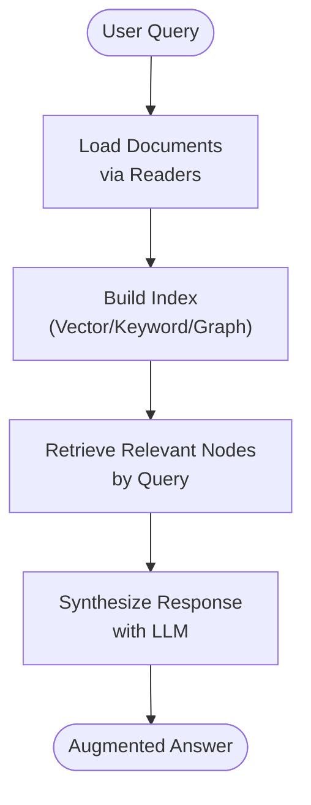
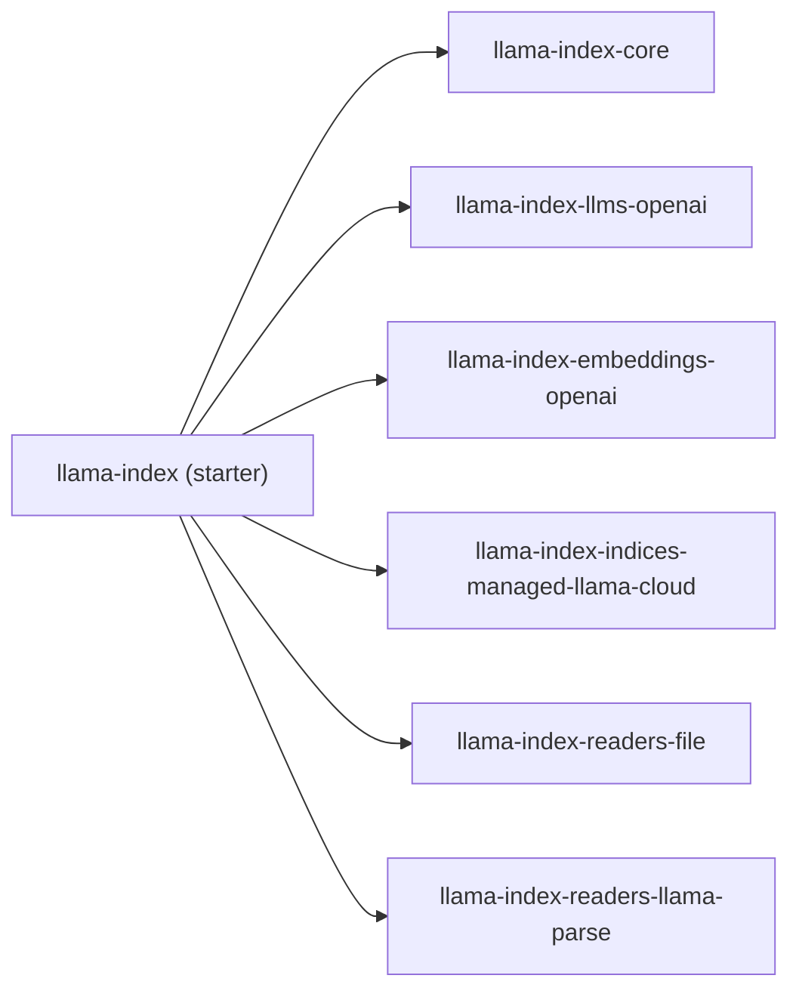

# Project Overview

<cite>
**Referenced Files in This Document**
- [README.md](file://README.md)
- [pyproject.toml](file://pyproject.toml)
- [llama-index-core/README.md](file://llama-index-core/README.md)
- [llama-index-core/llama_index/core/__init__.py](file://llama-index-core/llama_index/core/__init__.py)
- [llama-index-core/llama_index/core/settings.py](file://llama-index-core/llama_index/core/settings.py)
- [llama-index-integrations/README.md](file://llama-index-integrations/README.md)
- [llama-index-packs/README.md](file://llama-index-packs/README.md)
- [docs/examples/index.md](file://docs/examples/index.md)
</cite>

## Table of Contents
1. [Introduction](#introduction)
2. [Project Structure](#project-structure)
3. [Core Components](#core-components)
4. [Architecture Overview](#architecture-overview)
5. [Detailed Component Analysis](#detailed-component-analysis)
6. [Dependency Analysis](#dependency-analysis)
7. [Performance Considerations](#performance-considerations)
8. [Troubleshooting Guide](#troubleshooting-guide)
9. [Conclusion](#conclusion)
10. [Appendices](#appendices)

## Introduction
LlamaIndex is a data framework for building Retrieval-Augmented Generation (RAG) applications and other AI-powered systems that connect Large Language Models (LLMs) to your data. It provides a comprehensive toolkit to ingest, structure, retrieve, and synthesize knowledge from heterogeneous data sources, enabling accurate, context-aware responses powered by domain-specific information.

At its core, LlamaIndex offers:
- Data connectors to bring in your data (files, databases, web sources, etc.)
- Structuring mechanisms (indices, graphs) to organize data for efficient retrieval
- Advanced retrieval and query interfaces that augment prompts with relevant context
- Seamless integrations with external frameworks and providers (LLMs, embeddings, vector stores, etc.)

The framework supports two primary usage approaches:
- Starter: a curated bundle that includes core and a selection of integrations
- Customized: install core and add only the integrations you need from the ecosystem

Beyond core and integrations, LlamaIndex provides packs—ready-to-use templates that accelerate building common RAG and agent workflows.

## Project Structure
LlamaIndex is organized as a monorepo with multiple packages:
- Core: foundational abstractions and building blocks (indices, LLMs, embeddings, storage, settings)
- Integrations: over 300 community-driven packages that plug into core (LLMs, embeddings, readers, vector stores, retrievers, etc.)
- Packs: reusable templates for common use cases (RAG, agents, multi-modal, etc.)
- CLI: developer tooling to bootstrap and manage packs
- Examples and Docs: extensive examples and guides across agents, retrieval, embeddings, vector stores, and more

```mermaid
graph TB
subgraph "Starter Bundle"
A["llama-index<br/>starter package"]
end
subgraph "Core"
C["llama-index-core<br/>core abstractions"]
end
subgraph "Integrations"
I1["llama-index-llms-*"]
I2["llama-index-embeddings-*"]
I3["llama-index-readers-*"]
I4["llama-index-vector_stores-*"]
end
subgraph "Packs"
P1["llama-index-packs-*"]
end
subgraph "CLI"
CLI["llama-index-cli"]
end
A --> C
A --> I1
A --> I2
A --> I3
A --> I4
C --> I1
C --> I2
C --> I3
C --> I4
C --> P1
CLI --> P1
```

**Diagram sources**
- [README.md](file://README.md#L11-L19)
- [pyproject.toml](file://pyproject.toml#L42-L49)
- [llama-index-core/README.md](file://llama-index-core/README.md#L1-L11)
- [llama-index-integrations/README.md](file://llama-index-integrations/README.md#L1-L5)
- [llama-index-packs/README.md](file://llama-index-packs/README.md#L1-L33)

**Section sources**
- [README.md](file://README.md#L11-L19)
- [pyproject.toml](file://pyproject.toml#L42-L49)
- [llama-index-core/README.md](file://llama-index-core/README.md#L1-L11)
- [llama-index-integrations/README.md](file://llama-index-integrations/README.md#L1-L5)
- [llama-index-packs/README.md](file://llama-index-packs/README.md#L1-L33)

## Core Components
LlamaIndex’s core provides the foundational building blocks for RAG and related workflows. These include:
- Indices: multiple index types (vector, keyword, tree, summary, graph, property graph) to structure data
- Readers/Data Connectors: load data from files, databases, web sources, and more
- Prompts and Prompt Helpers: templating and context-aware prompt construction
- Service Context and Settings: centralized configuration for LLMs, embeddings, tokenizers, node parsers, and transformations
- Storage Context: persistence and retrieval of indices, docstores, and other artifacts
- Response Synthesizers: strategies to combine retrieved context with model outputs
- Utilities: tokenization helpers and SQL wrappers

Key entry points and exports are exposed via the core top-level package, enabling both high-level convenience and granular control.

**Section sources**
- [llama-index-core/README.md](file://llama-index-core/README.md#L3-L10)
- [llama-index-core/llama_index/core/__init__.py](file://llama-index-core/llama_index/core/__init__.py#L24-L87)
- [llama-index-core/llama_index/core/settings.py](file://llama-index-core/llama_index/core/settings.py#L17-L248)

## Architecture Overview
LlamaIndex follows a modular, plugin-based architecture:
- Core defines the essential abstractions and orchestration
- Integrations extend core with provider-specific implementations (LLMs, embeddings, readers, vector stores)
- Packs assemble reusable components into ready-to-run templates
- CLI helps discover, download, and customize packs
- Examples demonstrate real-world usage across agents, retrieval, embeddings, and vector stores

```mermaid
graph TB
subgraph "User Application"
UA["Your App"]
end
subgraph "LlamaIndex"
subgraph "Core"
CORE["Core Abstractions<br/>Indices, Readers, Prompts, Storage, Settings"]
end
subgraph "Integrations"
INT1["LLMs"]
INT2["Embeddings"]
INT3["Readers"]
INT4["Vector Stores"]
end
subgraph "Packs"
PACKS["Reusable Templates"]
end
subgraph "CLI"
CLI["Pack Management"]
end
end
UA --> CORE
CORE --> INT1
CORE --> INT2
CORE --> INT3
CORE --> INT4
CORE --> PACKS
CLI --> PACKS
```

**Diagram sources**
- [README.md](file://README.md#L11-L19)
- [pyproject.toml](file://pyproject.toml#L42-L49)
- [llama-index-integrations/README.md](file://llama-index-integrations/README.md#L1-L5)
- [llama-index-packs/README.md](file://llama-index-packs/README.md#L1-L33)

## Detailed Component Analysis

### Dual Approach to Usage: Starter vs Customized
- Starter package bundles core plus a curated selection of integrations for quick start
- Customized approach installs core and adds only the integrations you need, enabling fine-grained control and smaller footprints
- Import conventions distinguish core usage (via core) from integrations (via integration packages)

Practical example paths:
- Starter installation and basic usage: [README.md](file://README.md#L95-L120)
- Customized installation and configuration: [README.md](file://README.md#L95-L120)
- Import patterns and core vs integration distinction: [README.md](file://README.md#L25-L35)

**Section sources**
- [README.md](file://README.md#L11-L19)
- [README.md](file://README.md#L25-L35)
- [README.md](file://README.md#L95-L120)

### Modular Plugin-Based Architecture
- Core provides abstractions for LLMs, embeddings, readers, indices, and storage
- Integrations are separate packages that implement these abstractions for specific providers
- Packs encapsulate end-to-end workflows combining core and integrations

Example paths:
- Core exports and indices: [llama-index-core/llama_index/core/__init__.py](file://llama-index-core/llama_index/core/__init__.py#L24-L87)
- Settings as the central configuration hub: [llama-index-core/llama_index/core/settings.py](file://llama-index-core/llama_index/core/settings.py#L17-L248)
- Integrations overview: [llama-index-integrations/README.md](file://llama-index-integrations/README.md#L1-L5)
- Packs usage and discovery: [llama-index-packs/README.md](file://llama-index-packs/README.md#L1-L33)

**Section sources**
- [llama-index-core/llama_index/core/__init__.py](file://llama-index-core/llama_index/core/__init__.py#L24-L87)
- [llama-index-core/llama_index/core/settings.py](file://llama-index-core/llama_index/core/settings.py#L17-L248)
- [llama-index-integrations/README.md](file://llama-index-integrations/README.md#L1-L5)
- [llama-index-packs/README.md](file://llama-index-packs/README.md#L1-L33)

### RAG (Retrieval-Augmented Generation) in LlamaIndex
RAG is a first-class capability in LlamaIndex:
- Data ingestion via readers/connectors
- Indexing and structuring for efficient retrieval
- Retrieval of relevant context for a query
- Response synthesis using the selected synthesizer



[No sources needed since this diagram shows conceptual workflow, not actual code structure]

### Practical Examples Demonstrating Value Proposition
Explore guided examples across agents, retrieval, embeddings, and vector stores:
- Agents and agentic workflows: [docs/examples/index.md](file://docs/examples/index.md#L7-L28)
- LLM integrations: [docs/examples/index.md](file://docs/examples/index.md#L30-L41)
- Embedding models: [docs/examples/index.md](file://docs/examples/index.md#L43-L53)
- Vector stores: [docs/examples/index.md](file://docs/examples/index.md#L54-L67)

**Section sources**
- [docs/examples/index.md](file://docs/examples/index.md#L1-L68)

## Dependency Analysis
The starter package depends on core and a curated set of integrations, ensuring a balanced, production-ready baseline. The core package exposes a broad surface area of indices, readers, prompts, storage, and settings, while integrations remain decoupled and replaceable.



**Diagram sources**
- [pyproject.toml](file://pyproject.toml#L42-L49)

**Section sources**
- [pyproject.toml](file://pyproject.toml#L42-L49)

## Performance Considerations
- Choose appropriate indices and chunking strategies for your data scale and latency targets
- Select lightweight tokenizers and efficient embeddings for cost and speed
- Persist storage contexts to disk to avoid re-ingestion overhead
- Use retrievers and rerankers judiciously to balance accuracy and latency

[No sources needed since this section provides general guidance]

## Troubleshooting Guide
Common areas to review:
- Settings and tokenization mismatches between LLM and tokenizer
- Missing or misconfigured embedding models
- Persistence and storage context paths
- Integration availability and version compatibility

Example paths:
- Settings and configuration: [llama-index-core/llama_index/core/settings.py](file://llama-index-core/llama_index/core/settings.py#L17-L248)
- Core initialization and exports: [llama-index-core/llama_index/core/__init__.py](file://llama-index-core/llama_index/core/__init__.py#L24-L87)

**Section sources**
- [llama-index-core/llama_index/core/settings.py](file://llama-index-core/llama_index/core/settings.py#L17-L248)
- [llama-index-core/llama_index/core/__init__.py](file://llama-index-core/llama_index/core/__init__.py#L24-L87)

## Conclusion
LlamaIndex provides a robust, extensible foundation for building RAG and agent-driven applications. Its dual usage model (starter vs customized), plugin-based integrations, and reusable packs enable rapid prototyping and scalable production deployments. With over 300 integration packages and a rich ecosystem of examples and documentation, LlamaIndex fits developers ranging from beginners to enterprise teams seeking to connect LLMs to their data efficiently and reliably.

[No sources needed since this section summarizes without analyzing specific files]

## Appendices
- Ecosystem overview and links: [README.md](file://README.md#L51-L54)
- CLI usage for packs: [llama-index-packs/README.md](file://llama-index-packs/README.md#L18-L32)

**Section sources**
- [README.md](file://README.md#L51-L54)
- [llama-index-packs/README.md](file://llama-index-packs/README.md#L18-L32)