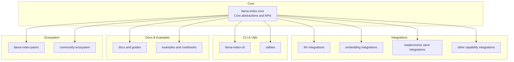
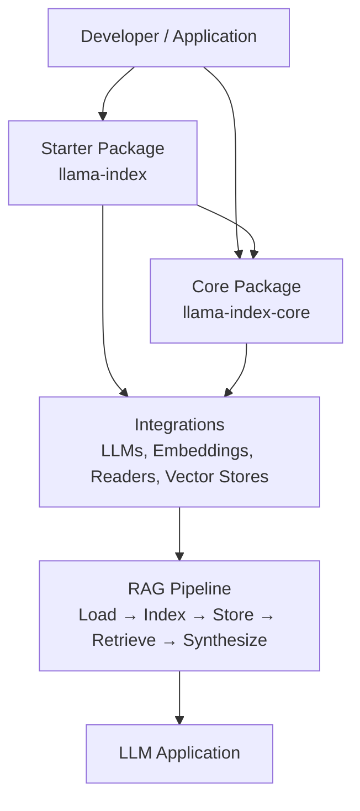
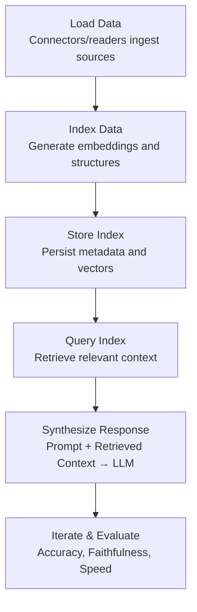
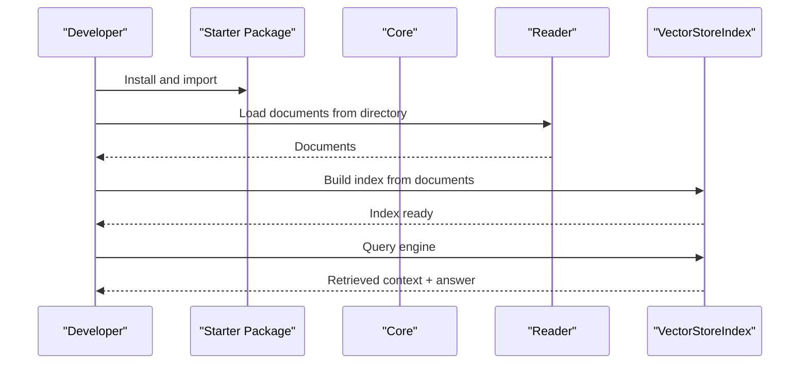
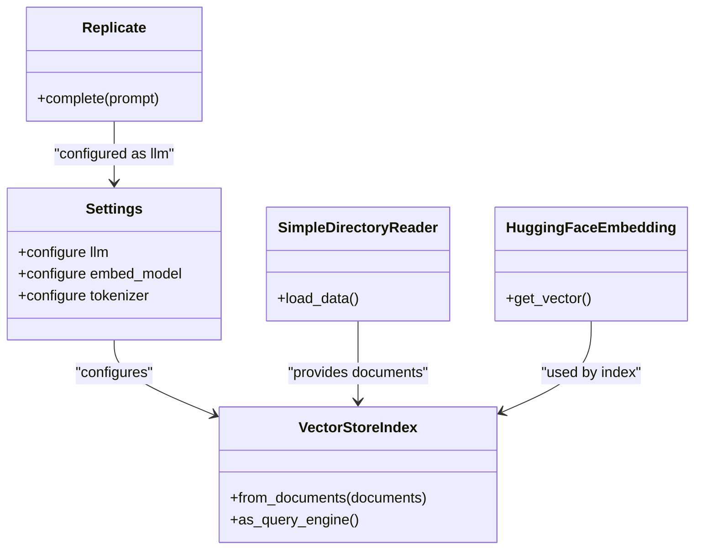
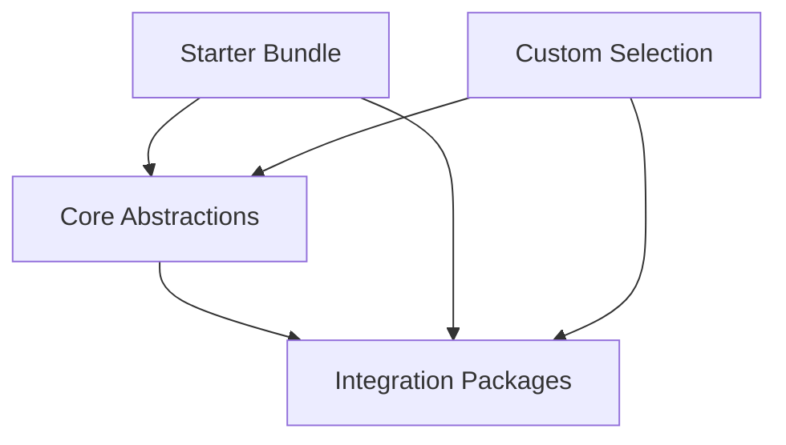
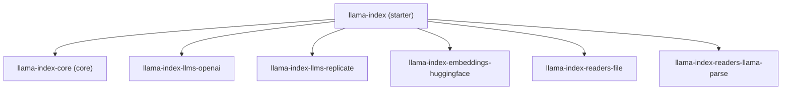

# Project Overview

<cite>
**Referenced Files in This Document**
- [README.md](file://README.md)
- [pyproject.toml](file://pyproject.toml)
- [llama_index\core\__init__.py](file://llama-index-core/llama_index/core/__init__.py)
- [llama_index\core\service_context.py](file://llama-index-core/llama_index/core/service_context.py)
- [docs\src\content\docs\framework\understanding\rag\index.mdx](file://docs/src/content/docs/framework/understanding/rag/index.mdx)
- [docs\examples\cookbooks\oreilly_course_cookbooks\Module-4\Metadata_Extraction.ipynb](file://docs/examples/cookbooks/oreilly_course_cookbooks/Module-4/Metadata_Extraction.ipynb)
- [llama-index-integrations\README.md](file://llama-index-integrations/README.md)
- [llama-index-core\README.md](file://llama-index-core/README.md)
</cite>

## Table of Contents
1. [Introduction](#introduction)
2. [Project Structure](#project-structure)
3. [Core Components](#core-components)
4. [Architecture Overview](#architecture-overview)
5. [Detailed Component Analysis](#detailed-component-analysis)
6. [Dependency Analysis](#dependency-analysis)
7. [Performance Considerations](#performance-considerations)
8. [Troubleshooting Guide](#troubleshooting-guide)
9. [Conclusion](#conclusion)
10. [Appendices](#appendices)

## Introduction
LlamaIndex is a data framework for LLM applications. Its purpose is to provide a comprehensive toolkit for data augmentation with private data via retrieval-augmented generation (RAG). The project positions itself as both a beginner-friendly platform for quick prototyping and a flexible, modular foundation for advanced, customized systems. It offers:
- Data connectors to ingest diverse sources and formats
- Structuring capabilities to organize data for efficient retrieval
- Advanced retrieval and query interfaces
- Seamless integration with external frameworks and providers

The project supports two primary usage approaches:
- Starter: a curated bundle that includes core and a selection of integrations
- Customized: core plus chosen integration packages tailored to your stack

Key benefits include:
- Rapid 5-line usage for basic RAG pipelines
- Modular architecture enabling customization of connectors, indices, retrievers, query engines, and more
- Rich ecosystem of over 300 integrations for LLMs, embeddings, vector stores, readers, and more

**Section sources**
- [README.md](file://README.md#L11-L78)
- [README.md](file://README.md#L51-L55)
- [README.md](file://README.md#L93-L177)

## Project Structure
At a high level, the repository is organized into:
- Core package: foundational abstractions and building blocks for LLM applications and RAG
- Integrations: separate packages for LLMs, embeddings, readers/vector stores, and other capabilities
- CLI and utilities: developer tooling and helpers
- Docs and examples: tutorials, guides, and practical demonstrations
- Ecosystem packages: packs and community extensions

```mermaid
graph TB
subgraph "Core"
CORE["llama-index-core<br/>Core abstractions and APIs"]
end
subgraph "Integrations"
LLMs["llm integrations"]
EMB["embedding integrations"]
READERS["reader/vector store integrations"]
OTHERS["other capability integrations"]
end
subgraph "CLI & Utils"
CLI["llama-index-cli"]
UTILS["utilities"]
end
subgraph "Docs & Examples"
DOCS["docs and guides"]
EX["examples and cookbooks"]
end
subgraph "Ecosystem"
PACKS["llama-index-packs"]
ECOSYS["community ecosystem"]
end
CORE --> LLMs
CORE --> EMB
CORE --> READERS
CORE --> OTHERS
CORE --> CLI
CORE --> UTILS
CORE --> DOCS
CORE --> EX
CORE --> PACKS
CORE --> ECOSYS
```

**Section sources**
- [README.md](file://README.md#L11-L19)
- [pyproject.toml](file://pyproject.toml#L41-L50)
- [llama-index-integrations\README.md](file://llama-index-integrations/README.md#L1-L5)

## Core Components
The core package exposes top-level imports for indices, readers, prompts, service context, storage, and settings. It serves as the foundation for building RAG pipelines and integrates with integrations to extend capabilities.

Representative highlights:
- Indices: list, tree, keyword table, vector store, summary, and graph-based indices
- Readers: data ingestion utilities (e.g., directory reader)
- Prompts and prompt templates
- Service context and settings for configuration
- Storage context for persistence
- Utilities for tokenization and SQL wrappers

These components collectively enable loading, indexing, storing, querying, and synthesizing responses in RAG workflows.

**Section sources**
- [llama_index\core\__init__.py](file://llama-index-core/llama_index/core/__init__.py#L24-L87)
- [llama_index\core\__init__.py](file://llama-index-core/llama_index/core/__init__.py#L93-L150)

## Architecture Overview
LlamaIndex’s architecture centers on a data framework that orchestrates data ingestion, indexing, storage, retrieval, and response synthesis. The core package provides foundational abstractions; integrations plug in providers and capabilities. The CLI and utilities support development workflows.

```mermaid
graph TB
User["Developer / Application"]
STARTER["Starter Package<br/>llama-index"]
COREPKG["Core Package<br/>llama-index-core"]
INTEGRATIONS["Integrations<br/>LLMs, Embeddings, Readers, Vector Stores"]
PIPELINE["RAG Pipeline<br/>Load → Index → Store → Retrieve → Synthesize"]
APP["LLM Application"]
User --> STARTER
User --> COREPKG
STARTER --> COREPKG
STARTER --> INTEGRATIONS
COREPKG --> INTEGRATIONS
INTEGRATIONS --> PIPELINE
PIPELINE --> APP
```

**Diagram sources**
- [README.md](file://README.md#L11-L19)
- [pyproject.toml](file://pyproject.toml#L41-L50)

**Section sources**
- [README.md](file://README.md#L11-L19)
- [pyproject.toml](file://pyproject.toml#L41-L50)

## Detailed Component Analysis

### RAG Fundamentals (Beginner-Friendly)
RAG augments LLMs with your private data by retrieving relevant context and combining it with the query to produce grounded answers. The five-stage RAG pipeline is widely applicable and forms the backbone of most LLM applications.

```mermaid
flowchart TD
A["Load Data<br/>Connectors/readers ingest sources"] --> B["Index Data<br/>Generate embeddings and structures"]
B --> C["Store Index<br/>Persist metadata and vectors"]
C --> D["Query Index<br/>Retrieve relevant context"]
D --> E["Synthesize Response<br/>Prompt + Retrieved Context → LLM"]
E --> F["Iterate & Evaluate<br/>Accuracy, Faithfulness, Speed"]
```

**Diagram sources**
- [docs\src\content\docs\framework\understanding\rag\index.mdx](file://docs/src/content/docs/framework/understanding/rag/index.mdx#L22-L36)

**Section sources**
- [docs\src\content\docs\framework\understanding\rag\index.mdx](file://docs/src/content/docs/framework/understanding/rag/index.mdx#L14-L36)
- [docs\examples\cookbooks\oreilly_course_cookbooks\Module-4\Metadata_Extraction.ipynb](file://docs/examples/cookbooks/oreilly_course_cookbooks/Module-4/Metadata_Extraction.ipynb#L598-L638)

### Practical Beginner Usage (5-Line Example)
Beginners can quickly build a vector index and query it using a few lines of code. The starter package simplifies getting started with a curated set of integrations.

```mermaid
sequenceDiagram
participant Dev as "Developer"
participant Starter as "Starter Package"
participant Core as "Core"
participant Reader as "Reader"
participant Index as "VectorStoreIndex"
Dev->>Starter : Install and import
Dev->>Reader : Load documents from directory
Reader-->>Dev : Documents
Dev->>Index : Build index from documents
Index-->>Dev : Index ready
Dev->>Index : Query engine
Index-->>Dev : Retrieved context + answer
```

**Diagram sources**
- [README.md](file://README.md#L105-L159)

**Section sources**
- [README.md](file://README.md#L105-L159)

### Advanced Customization Patterns (Developer-Focused)
Advanced users can compose custom pipelines by selecting specific integrations and configuring core components. The core package exposes settings and utilities to tailor behavior, while integrations plug in providers for LLMs, embeddings, readers, and vector stores.

```mermaid
classDiagram
class Settings {
+configure llm
+configure embed_model
+configure tokenizer
}
class VectorStoreIndex {
+from_documents(documents)
+as_query_engine()
}
class SimpleDirectoryReader {
+load_data()
}
class HuggingFaceEmbedding {
+get_vector()
}
class Replicate {
+complete(prompt)
}
Settings --> VectorStoreIndex : "configures"
SimpleDirectoryReader --> VectorStoreIndex : "provides documents"
HuggingFaceEmbedding --> VectorStoreIndex : "used by index"
Replicate --> Settings : "configured as llm"
```

**Diagram sources**
- [README.md](file://README.md#L125-L151)
- [llama_index\core\__init__.py](file://llama-index-core/llama_index/core/__init__.py#L78-L87)

**Section sources**
- [README.md](file://README.md#L125-L151)
- [llama_index\core\__init__.py](file://llama-index-core/llama_index/core/__init__.py#L78-L87)

### Relationship Between Core and Integrations
The core package defines foundational abstractions and APIs. Integrations are separate packages that extend core with provider-specific implementations (e.g., LLMs, embeddings, readers, vector stores). The starter package bundles core and a curated subset of integrations, while the customized approach lets you pick and mix integrations from the ecosystem.

```mermaid
graph TB
CORE["Core Abstractions"]
INTL["Integration Packages"]
STARTER["Starter Bundle"]
CUSTOM["Custom Selection"]
CORE --> INTL
STARTER --> CORE
STARTER --> INTL
CUSTOM --> CORE
CUSTOM --> INTL
```

**Diagram sources**
- [README.md](file://README.md#L11-L19)
- [llama-index-integrations\README.md](file://llama-index-integrations/README.md#L1-L5)

**Section sources**
- [README.md](file://README.md#L11-L19)
- [llama-index-integrations\README.md](file://llama-index-integrations/README.md#L1-L5)

### Ecosystem Positioning and Community Resources
LlamaIndex positions itself as a comprehensive toolkit for building LLM applications with private data. The ecosystem includes:
- LlamaHub: a community library of data loaders/connectors
- LlamaLab: cutting-edge AGI projects using LlamaIndex
- Over 300 integration packages for LLMs, embeddings, vector stores, readers, and more

These resources enable rapid prototyping and advanced customization across diverse domains and stacks.

**Section sources**
- [README.md](file://README.md#L51-L55)
- [README.md](file://README.md#L17-L18)

## Dependency Analysis
The starter package depends on core and a curated set of integrations, while the core package remains the foundation for both starter and customized setups.

```mermaid
graph TB
ST["llama-index (starter)"]
CR["llama-index-core (core)"]
OP["llama-index-llms-openai"]
RP["llama-index-llms-replicate"]
HF["llama-index-embeddings-huggingface"]
FD["llama-index-readers-file"]
LP["llama-index-readers-llama-parse"]
ST --> CR
ST --> OP
ST --> RP
ST --> HF
ST --> FD
ST --> LP
```

**Diagram sources**
- [pyproject.toml](file://pyproject.toml#L41-L50)

**Section sources**
- [pyproject.toml](file://pyproject.toml#L41-L50)

## Performance Considerations
- Choose appropriate indices and retrieval strategies for your data scale and latency requirements
- Persist indices and metadata to avoid repeated ingestion and indexing
- Select embeddings and vector stores aligned with your performance and cost targets
- Use routers and postprocessors judiciously to balance accuracy and speed

[No sources needed since this section provides general guidance]

## Troubleshooting Guide
Common issues and remedies:
- Deprecated service context: migrate to settings-based configuration
- Integration installation: ensure required integration packages are installed and importable
- Persistence: confirm storage context persists and reloads correctly

**Section sources**
- [llama_index\core\service_context.py](file://llama-index-core/llama_index/core/service_context.py#L4-L48)

## Conclusion
LlamaIndex is a data framework for LLM applications that enables retrieval-augmented generation with private data. It offers a dual path—starter for quick starts and customized for deep tailoring—while providing a modular architecture, rich ecosystem, and practical examples. Whether you are building a simple chatbot or a complex agent, LlamaIndex equips you to load, index, store, retrieve, and synthesize with confidence.

[No sources needed since this section summarizes without analyzing specific files]

## Appendices

### Beginner 5-Line Usage Reference
- Install the starter package
- Load documents from a directory
- Build a vector index from documents
- Configure optional LLM and embeddings
- Query the index with a query engine

**Section sources**
- [README.md](file://README.md#L105-L159)

### Core Purpose and Capabilities Reference
- Data connectors for ingestion
- Structuring capabilities for indices and graphs
- Retrieval interfaces and query engines
- Integration flexibility with external frameworks

**Section sources**
- [README.md](file://README.md#L69-L74)
- [llama-index-core\README.md](file://llama-index-core/README.md#L1-L11)