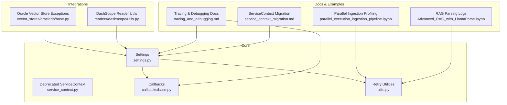
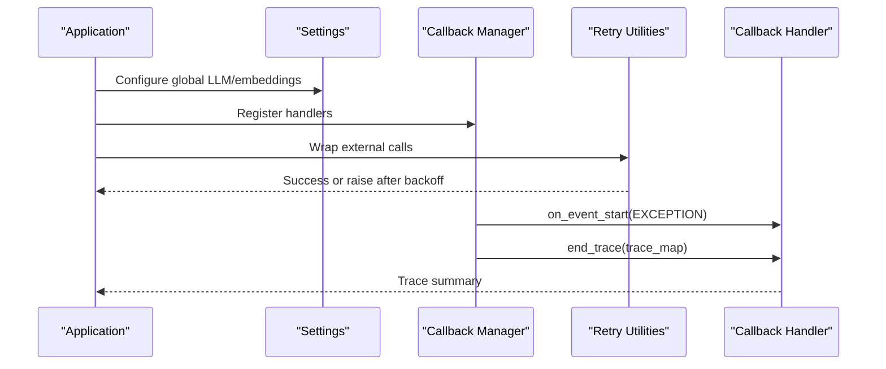
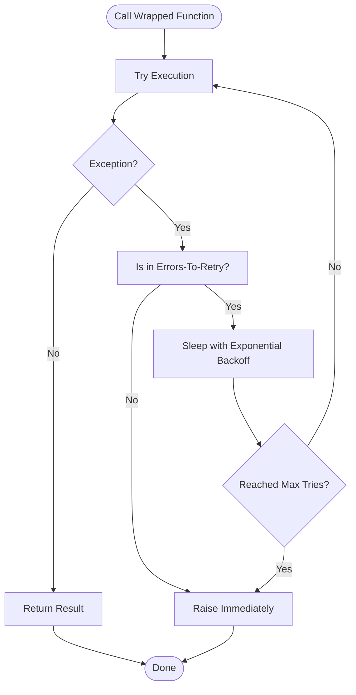
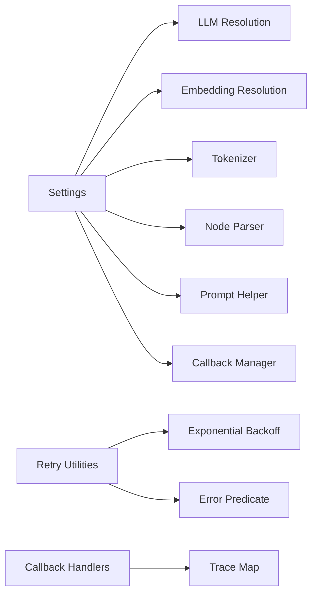

# Troubleshooting and FAQ

<cite>
**Referenced Files in This Document**
- [CONTRIBUTING.md](file://CONTRIBUTING.md)
- [CODE_OF_CONDUCT.md](file://CODE_OF_CONDUCT.md)
- [tracing_and_debugging.md](file://docs/src/content/docs/framework/understanding/tracing_and_debugging/tracing_and_debugging.md)
- [service_context_migration.md](file://docs/src/content/docs/framework/module_guides/supporting_modules/service_context_migration.md)
- [settings.py](file://llama-index-core/llama_index/core/settings.py)
- [service_context.py](file://llama-index-core/llama_index/core/service_context.py)
- [utils.py](file://llama-index-core/llama_index/core/utils.py)
- [base.py](file://llama-index-core/llama_index/core/callbacks/base.py)
- [vector_stores_oracledb_base.py](file://llama-index-integrations/vector_stores/llama-index-vector-stores-oracledb/llama_index/vector_stores/oracledb/base.py)
- [readers_dashscope_utils.py](file://llama-index-integrations/readers/llama-index-readers-dashscope/llama_index/readers/dashscope/utils.py)
- [llama_index_readers_env_example](file://llama-index-integrations/embeddings/llama-index-embeddings-isaacus/.env.example)
- [llama_index_readers_env_example](file://llama-index-integrations/llms/llama-index-llms-cometapi/.env.example)
- [mini_mt_bench_singlegrading_README.md](file://llama-datasets/mini_mt_bench_singlegrading/README.md)
- [integration_health_check.py](file://scripts/integration_health_check.py)
- [parallel_execution_ingestion_pipeline.ipynb](file://docs/examples/ingestion/parallel_execution_ingestion_pipeline.ipynb)
- [Advanced_RAG_with_LlamaParse.ipynb](file://docs/examples/cookbooks/oreilly_course_cookbooks/Module-8/Advanced_RAG_with_LlamaParse.ipynb)
</cite>

## Table of Contents
1. [Introduction](#introduction)
2. [Project Structure](#project-structure)
3. [Core Components](#core-components)
4. [Architecture Overview](#architecture-overview)
5. [Detailed Component Analysis](#detailed-component-analysis)
6. [Dependency Analysis](#dependency-analysis)
7. [Performance Considerations](#performance-considerations)
8. [Troubleshooting Guide](#troubleshooting-guide)
9. [Conclusion](#conclusion)
10. [Appendices](#appendices)

## Introduction
This document provides a comprehensive troubleshooting and FAQ guide for LlamaIndex. It focuses on diagnosing and resolving common issues across installation, configuration, performance, and integration layers. It explains logging and tracing, error handling patterns, retry mechanisms, and observability integration. It also outlines step-by-step debugging procedures, diagnostic tools, and systematic problem-solving approaches. Guidance is included for seeking community support, reporting bugs, and contributing fixes, along with frequently asked questions about architecture decisions, best practices, and migration scenarios.

## Project Structure
LlamaIndex is a monorepo with core packages, integrations, packs, datasets, and documentation. Troubleshooting spans:
- Core configuration and settings
- Callbacks and tracing
- Retry utilities
- Integration-specific error handling
- Environment configuration examples
- Benchmark and example notebooks for diagnostics

**Diagram sources**
- [settings.py](file://llama-index-core/llama_index/core/settings.py#L1-L249)
- [service_context.py](file://llama-index-core/llama_index/core/service_context.py#L1-L49)
- [base.py](file://llama-index-core/llama_index/core/callbacks/base.py#L196-L234)
- [utils.py](file://llama-index-core/llama_index/core/utils.py#L214-L327)
- [vector_stores_oracledb_base.py](file://llama-index-integrations/vector_stores/llama-index-vector-stores-oracledb/llama_index/vector_stores/oracledb/base.py#L71-L97)
- [readers_dashscope_utils.py](file://llama-index-integrations/readers/llama-index-readers-dashscope/llama_index/readers/dashscope/utils.py#L39-L77)
- [tracing_and_debugging.md](file://docs/src/content/docs/framework/understanding/tracing_and_debugging/tracing_and_debugging.md#L1-L49)
- [service_context_migration.md](file://docs/src/content/docs/framework/module_guides/supporting_modules/service_context_migration.md#L1-L30)
- [parallel_execution_ingestion_pipeline.ipynb](file://docs/examples/ingestion/parallel_execution_ingestion_pipeline.ipynb#L220-L296)
- [Advanced_RAG_with_LlamaParse.ipynb](file://docs/examples/cookbooks/oreilly_course_cookbooks/Module-8/Advanced_RAG_with_LlamaParse.ipynb#L698-L777)

**Section sources**
- [settings.py](file://llama-index-core/llama_index/core/settings.py#L1-L249)
- [service_context.py](file://llama-index-core/llama_index/core/service_context.py#L1-L49)
- [tracing_and_debugging.md](file://docs/src/content/docs/framework/understanding/tracing_and_debugging/tracing_and_debugging.md#L1-L49)
- [service_context_migration.md](file://docs/src/content/docs/framework/module_guides/supporting_modules/service_context_migration.md#L1-L30)

## Core Components
- Settings: Global configuration container with lazy initialization for LLM, embeddings, callbacks, tokenizer, node parser, prompt helper, and transformations.
- Callbacks: Event-driven tracing and exception recording with trace maps and handlers.
- Retry Utilities: Configurable retries with exponential backoff and customizable error predicates.
- Deprecated ServiceContext: Legacy container replaced by Settings; raises clear migration guidance.
- Integration Error Handling: Standardized exception raising and retry patterns in readers and vector stores.

Key references:
- Settings singleton and properties: [settings.py](file://llama-index-core/llama_index/core/settings.py#L17-L249)
- Callback lifecycle and exception handling: [base.py](file://llama-index-core/llama_index/core/callbacks/base.py#L196-L234)
- Retry utilities and decorators: [utils.py](file://llama-index-core/llama_index/core/utils.py#L214-L327)
- Deprecated ServiceContext behavior: [service_context.py](file://llama-index-core/llama_index/core/service_context.py#L4-L49)

**Section sources**
- [settings.py](file://llama-index-core/llama_index/core/settings.py#L1-L249)
- [base.py](file://llama-index-core/llama_index/core/callbacks/base.py#L196-L234)
- [utils.py](file://llama-index-core/llama_index/core/utils.py#L214-L327)
- [service_context.py](file://llama-index-core/llama_index/core/service_context.py#L1-L49)

## Architecture Overview
The troubleshooting architecture centers on three pillars:
- Logging and tracing for visibility
- Structured error handling and retries
- Observability integration for production-grade monitoring

**Diagram sources**
- [settings.py](file://llama-index-core/llama_index/core/settings.py#L32-L46)
- [base.py](file://llama-index-core/llama_index/core/callbacks/base.py#L196-L234)
- [utils.py](file://llama-index-core/llama_index/core/utils.py#L229-L275)

## Detailed Component Analysis

### Logging and Tracing
- Enable basic logging to inspect runtime behavior.
- Use the global handler to attach a simple callback handler for trace summaries.
- Callback manager records durations, counts, and trace maps for downstream analysis.

Practical steps:
- Turn on debug logging at the start of your script.
- Set a global handler to enable automatic trace printing after operations.
- Review trace maps and handler outputs to locate bottlenecks or failures.

References:
- [tracing_and_debugging.md](file://docs/src/content/docs/framework/understanding/tracing_and_debugging/tracing_and_debugging.md#L7-L49)
- [base.py](file://llama-index-core/llama_index/core/callbacks/base.py#L196-L234)

**Section sources**
- [tracing_and_debugging.md](file://docs/src/content/docs/framework/understanding/tracing_and_debugging/tracing_and_debugging.md#L1-L49)
- [base.py](file://llama-index-core/llama_index/core/callbacks/base.py#L196-L234)

### Configuration and Migration
- ServiceContext is deprecated; migrate to Settings for global configuration.
- Settings lazily initializes components and propagates callback managers to modules.

Migration guidance:
- Replace ServiceContext usage with Settings attributes.
- Ensure callback manager is attached globally for consistent tracing.

References:
- [service_context.py](file://llama-index-core/llama_index/core/service_context.py#L4-L49)
- [service_context_migration.md](file://docs/src/content/docs/framework/module_guides/supporting_modules/service_context_migration.md#L1-L30)
- [settings.py](file://llama-index-core/llama_index/core/settings.py#L32-L46)

**Section sources**
- [service_context.py](file://llama-index-core/llama_index/core/service_context.py#L1-L49)
- [service_context_migration.md](file://docs/src/content/docs/framework/module_guides/supporting_modules/service_context_migration.md#L1-L30)
- [settings.py](file://llama-index-core/llama_index/core/settings.py#L17-L46)

### Retry and Backoff
- Centralized retry utilities support synchronous and asynchronous functions.
- Exponential backoff with configurable max tries and bounds.
- Decorators and helpers allow targeted retries for specific exceptions.

Common use cases:
- External API calls behind readers and retrievers.
- Batch operations with transient network errors.

References:
- [utils.py](file://llama-index-core/llama_index/core/utils.py#L214-L327)

**Diagram sources**
- [utils.py](file://llama-index-core/llama_index/core/utils.py#L229-L275)

**Section sources**
- [utils.py](file://llama-index-core/llama_index/core/utils.py#L214-L327)

### Integration-Specific Error Handling
- Vector stores and readers implement standardized exception handling and retry patterns.
- DashScope reader utilities encapsulate response validation and raise explicit exceptions.
- Oracle vector store wraps database operations with typed exception handling and logging.

References:
- [readers_dashscope_utils.py](file://llama-index-integrations/readers/llama-index-readers-dashscope/llama_index/readers/dashscope/utils.py#L39-L77)
- [vector_stores_oracledb_base.py](file://llama-index-integrations/vector_stores/llama-index-vector-stores-oracledb/llama_index/vector_stores/oracledb/base.py#L71-L97)

**Section sources**
- [readers_dashscope_utils.py](file://llama-index-integrations/readers/llama-index-readers-dashscope/llama_index/readers/dashscope/utils.py#L39-L77)
- [vector_stores_oracledb_base.py](file://llama-index-integrations/vector_stores/llama-index-vector-stores-oracledb/llama_index/vector_stores/oracledb/base.py#L71-L97)

### Environment Configuration
- Many integrations rely on environment variables for credentials and endpoints.
- Example environment templates demonstrate required keys and optional overrides.

References:
- [llama_index_readers_env_example](file://llama-index-integrations/embeddings/llama-index-embeddings-isaacus/.env.example#L1-L8)
- [llama_index_readers_env_example](file://llama-index-integrations/llms/llama-index-llms-cometapi/.env.example#L1-L8)

**Section sources**
- [.env.example (Isaacus)](file://llama-index-integrations/embeddings/llama-index-embeddings-isaacus/.env.example#L1-L8)
- [.env.example (CometAPI)](file://llama-index-integrations/llms/llama-index-llms-cometapi/.env.example#L1-L8)

### Benchmark and Diagnostic Examples
- Benchmark datasets provide reproducible evaluation setups with notes on rate limits and tuning.
- Example notebooks include logs and progress indicators useful for diagnosing throughput and timeouts.

References:
- [mini_mt_bench_singlegrading_README.md](file://llama-datasets/mini_mt_bench_singlegrading/README.md#L58-L69)
- [parallel_execution_ingestion_pipeline.ipynb](file://docs/examples/ingestion/parallel_execution_ingestion_pipeline.ipynb#L220-L296)
- [Advanced_RAG_with_LlamaParse.ipynb](file://docs/examples/cookbooks/oreilly_course_cookbooks/Module-8/Advanced_RAG_with_LlamaParse.ipynb#L698-L777)

**Section sources**
- [mini_mt_bench_singlegrading_README.md](file://llama-datasets/mini_mt_bench_singlegrading/README.md#L58-L69)
- [parallel_execution_ingestion_pipeline.ipynb](file://docs/examples/ingestion/parallel_execution_ingestion_pipeline.ipynb#L220-L296)
- [Advanced_RAG_with_LlamaParse.ipynb](file://docs/examples/cookbooks/oreilly_course_cookbooks/Module-8/Advanced_RAG_with_LlamaParse.ipynb#L698-L777)

## Dependency Analysis
- Settings depends on LLM, embeddings, tokenizer, node parser, and prompt helper resolution utilities.
- Callbacks depend on the global callback manager and handlers to record events and traces.
- Retry utilities depend on exception classification and backoff scheduling.

**Diagram sources**
- [settings.py](file://llama-index-core/llama_index/core/settings.py#L32-L46)
- [utils.py](file://llama-index-core/llama_index/core/utils.py#L229-L275)
- [base.py](file://llama-index-core/llama_index/core/callbacks/base.py#L196-L234)

**Section sources**
- [settings.py](file://llama-index-core/llama_index/core/settings.py#L17-L249)
- [utils.py](file://llama-index-core/llama_index/core/utils.py#L214-L327)
- [base.py](file://llama-index-core/llama_index/core/callbacks/base.py#L196-L234)

## Performance Considerations
- Use parallel ingestion and batching strategies to improve throughput.
- Monitor tokenization and chunk sizing impacts on latency and cost.
- Tune retry backoff and max tries for external APIs to balance resilience and latency.
- Profile with notebook examples to identify hotspots and adjust worker counts.

[No sources needed since this section provides general guidance]

## Troubleshooting Guide

### Installation Problems
Symptoms:
- Import errors for core or integration modules
- Version conflicts or missing dependencies

Steps:
- Verify Python version compatibility and environment setup.
- Reinstall packages in a clean virtual environment.
- Confirm integration-specific dependencies are present.

References:
- [CONTRIBUTING.md](file://CONTRIBUTING.md#L10-L72)

**Section sources**
- [CONTRIBUTING.md](file://CONTRIBUTING.md#L10-L72)

### Configuration Errors
Symptoms:
- Unexpected default components or missing LLM/embeddings
- Deprecated ServiceContext usage causing errors

Steps:
- Migrate from ServiceContext to Settings.
- Explicitly set LLM and embeddings in Settings.
- Ensure callback manager is configured globally if tracing is needed.

References:
- [service_context.py](file://llama-index-core/llama_index/core/service_context.py#L4-L49)
- [service_context_migration.md](file://docs/src/content/docs/framework/module_guides/supporting_modules/service_context_migration.md#L1-L30)
- [settings.py](file://llama-index-core/llama_index/core/settings.py#L32-L46)

**Section sources**
- [service_context.py](file://llama-index-core/llama_index/core/service_context.py#L1-L49)
- [service_context_migration.md](file://docs/src/content/docs/framework/module_guides/supporting_modules/service_context_migration.md#L1-L30)
- [settings.py](file://llama-index-core/llama_index/core/settings.py#L17-L46)

### Performance Issues
Symptoms:
- Slow ingestion or query latency
- High CPU or memory usage

Steps:
- Use parallel ingestion and adjust batch sizes.
- Inspect tokenization and chunk size settings.
- Profile with example notebooks to identify bottlenecks.

References:
- [parallel_execution_ingestion_pipeline.ipynb](file://docs/examples/ingestion/parallel_execution_ingestion_pipeline.ipynb#L220-L296)
- [settings.py](file://llama-index-core/llama_index/core/settings.py#L137-L184)

**Section sources**
- [parallel_execution_ingestion_pipeline.ipynb](file://docs/examples/ingestion/parallel_execution_ingestion_pipeline.ipynb#L220-L296)
- [settings.py](file://llama-index-core/llama_index/core/settings.py#L137-L184)

### Integration Problems
Symptoms:
- Authentication failures or invalid responses from external APIs
- Database connection or query errors

Steps:
- Validate environment variables for credentials and endpoints.
- Check response validation and error messages from integration utilities.
- Wrap external calls with retry utilities and exponential backoff.

References:
- [.env.example (Isaacus)](file://llama-index-integrations/embeddings/llama-index-embeddings-isaacus/.env.example#L1-L8)
- [.env.example (CometAPI)](file://llama-index-integrations/llms/llama-index-llms-cometapi/.env.example#L1-L8)
- [readers_dashscope_utils.py](file://llama-index-integrations/readers/llama-index-readers-dashscope/llama_index/readers/dashscope/utils.py#L39-L77)
- [vector_stores_oracledb_base.py](file://llama-index-integrations/vector_stores/llama-index-vector-stores-oracledb/llama_index/vector_stores/oracledb/base.py#L71-L97)
- [utils.py](file://llama-index-core/llama_index/core/utils.py#L229-L275)

**Section sources**
- [.env.example (Isaacus)](file://llama-index-integrations/embeddings/llama-index-embeddings-isaacus/.env.example#L1-L8)
- [.env.example (CometAPI)](file://llama-index-integrations/llms/llama-index-llms-cometapi/.env.example#L1-L8)
- [readers_dashscope_utils.py](file://llama-index-integrations/readers/llama-index-readers-dashscope/llama_index/readers/dashscope/utils.py#L39-L77)
- [vector_stores_oracledb_base.py](file://llama-index-integrations/vector_stores/llama-index-vector-stores-oracledb/llama_index/vector_stores/oracledb/base.py#L71-L97)
- [utils.py](file://llama-index-core/llama_index/core/utils.py#L229-L275)

### Logging and Error Analysis
Symptoms:
- Unclear failure points or missing context

Steps:
- Enable debug logging at the application start.
- Attach a simple global handler to capture traces.
- Inspect trace maps and exception payloads recorded by callbacks.

References:
- [tracing_and_debugging.md](file://docs/src/content/docs/framework/understanding/tracing_and_debugging/tracing_and_debugging.md#L7-L49)
- [base.py](file://llama-index-core/llama_index/core/callbacks/base.py#L196-L234)

**Section sources**
- [tracing_and_debugging.md](file://docs/src/content/docs/framework/understanding/tracing_and_debugging/tracing_and_debugging.md#L1-L49)
- [base.py](file://llama-index-core/llama_index/core/callbacks/base.py#L196-L234)

### Performance Profiling
Symptoms:
- Unknown hotspots or throughput bottlenecks

Steps:
- Use profiling outputs from example notebooks to identify top callers.
- Adjust worker counts and batch sizes accordingly.
- Monitor ingestion logs and progress bars for throughput trends.

References:
- [parallel_execution_ingestion_pipeline.ipynb](file://docs/examples/ingestion/parallel_execution_ingestion_pipeline.ipynb#L220-L296)
- [Advanced_RAG_with_LlamaParse.ipynb](file://docs/examples/cookbooks/oreilly_course_cookbooks/Module-8/Advanced_RAG_with_LlamaParse.ipynb#L698-L777)

**Section sources**
- [parallel_execution_ingestion_pipeline.ipynb](file://docs/examples/ingestion/parallel_execution_ingestion_pipeline.ipynb#L220-L296)
- [Advanced_RAG_with_LlamaParse.ipynb](file://docs/examples/cookbooks/oreilly_course_cookbooks/Module-8/Advanced_RAG_with_LlamaParse.ipynb#L698-L777)

### Support Resource Utilization
- Report issues with clear reproduction steps and logs.
- Use benchmark notes to tune rate limits and parameters.
- Engage with the community via Discord and follow the code of conduct.

References:
- [CONTRIBUTING.md](file://CONTRIBUTING.md#L100-L113)
- [CODE_OF_CONDUCT.md](file://CODE_OF_CONDUCT.md#L61-L68)
- [mini_mt_bench_singlegrading_README.md](file://llama-datasets/mini_mt_bench_singlegrading/README.md#L58-L69)

**Section sources**
- [CONTRIBUTING.md](file://CONTRIBUTING.md#L100-L113)
- [CODE_OF_CONDUCT.md](file://CODE_OF_CONDUCT.md#L61-L68)
- [mini_mt_bench_singlegrading_README.md](file://llama-datasets/mini_mt_bench_singlegrading/README.md#L58-L69)

## Conclusion
This guide consolidates actionable troubleshooting strategies for LlamaIndex across installation, configuration, performance, and integration domains. By leveraging logging and tracing, adopting Settings for configuration, applying retry backoff, and utilizing benchmark examples, most issues can be diagnosed and resolved systematically. When needed, engage the community responsibly and follow the code of conduct.

[No sources needed since this section summarizes without analyzing specific files]

## Appendices

### Frequently Asked Questions (FAQ)

Q: How do I migrate from ServiceContext to Settings?
A: Replace ServiceContext usage with Settings attributes and propagate callback managers globally. See the migration guide for examples.

References:
- [service_context_migration.md](file://docs/src/content/docs/framework/module_guides/supporting_modules/service_context_migration.md#L1-L30)
- [service_context.py](file://llama-index-core/llama_index/core/service_context.py#L4-L49)

Q: How do I enable tracing and debug logs?
A: Turn on debug logging and set a global handler to capture traces and event maps.

References:
- [tracing_and_debugging.md](file://docs/src/content/docs/framework/understanding/tracing_and_debugging/tracing_and_debugging.md#L7-L49)

Q: How do I handle transient errors from external APIs?
A: Wrap calls with retry utilities using exponential backoff and configure error predicates.

References:
- [utils.py](file://llama-index-core/llama_index/core/utils.py#L229-L275)

Q: Where do I set credentials for integrations?
A: Use environment variables as demonstrated in the integration examples.

References:
- [.env.example (Isaacus)](file://llama-index-integrations/embeddings/llama-index-embeddings-isaacus/.env.example#L1-L8)
- [.env.example (CometAPI)](file://llama-index-integrations/llms/llama-index-llms-cometapi/.env.example#L1-L8)

Q: How do I troubleshoot slow ingestion?
A: Inspect profiling outputs and adjust batch sizes and worker counts; review ingestion logs and progress bars.

References:
- [parallel_execution_ingestion_pipeline.ipynb](file://docs/examples/ingestion/parallel_execution_ingestion_pipeline.ipynb#L220-L296)

Q: How do I report bugs and seek help?
A: Follow contribution guidelines, provide reproduction steps, and engage via Discord while adhering to the code of conduct.

References:
- [CONTRIBUTING.md](file://CONTRIBUTING.md#L100-L113)
- [CODE_OF_CONDUCT.md](file://CODE_OF_CONDUCT.md#L61-L68)

**Section sources**
- [service_context_migration.md](file://docs/src/content/docs/framework/module_guides/supporting_modules/service_context_migration.md#L1-L30)
- [service_context.py](file://llama-index-core/llama_index/core/service_context.py#L4-L49)
- [tracing_and_debugging.md](file://docs/src/content/docs/framework/understanding/tracing_and_debugging/tracing_and_debugging.md#L7-L49)
- [utils.py](file://llama-index-core/llama_index/core/utils.py#L229-L275)
- [.env.example (Isaacus)](file://llama-index-integrations/embeddings/llama-index-embeddings-isaacus/.env.example#L1-L8)
- [.env.example (CometAPI)](file://llama-index-integrations/llms/llama-index-llms-cometapi/.env.example#L1-L8)
- [parallel_execution_ingestion_pipeline.ipynb](file://docs/examples/ingestion/parallel_execution_ingestion_pipeline.ipynb#L220-L296)
- [CONTRIBUTING.md](file://CONTRIBUTING.md#L100-L113)
- [CODE_OF_CONDUCT.md](file://CODE_OF_CONDUCT.md#L61-L68)