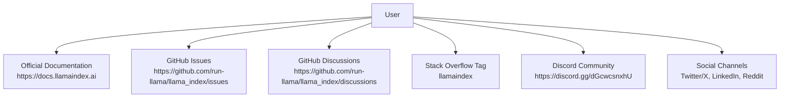
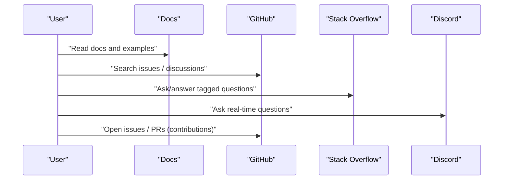
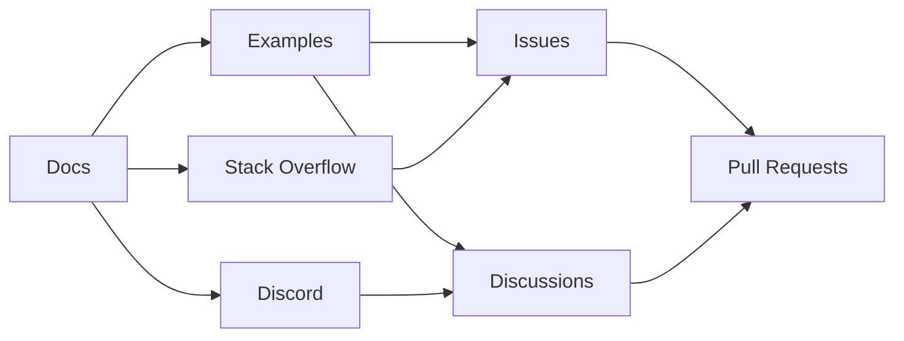

# Community Resources

<cite>
**Referenced Files in This Document**
- [README.md](file://README.md)
- [CONTRIBUTING.md](file://CONTRIBUTING.md)
- [CODE_OF_CONDUCT.md](file://CODE_OF_CONDUCT.md)
- [SECURITY.md](file://SECURITY.md)
- [docs/src/content/docs/framework/index.md](file://docs/src/content/docs/framework/index.md)
- [docs/examples/index.md](file://docs/examples/index.md)
</cite>

## Table of Contents
1. [Introduction](#introduction)
2. [Project Structure](#project-structure)
3. [Core Components](#core-components)
4. [Architecture Overview](#architecture-overview)
5. [Detailed Component Analysis](#detailed-component-analysis)
6. [Dependency Analysis](#dependency-analysis)
7. [Performance Considerations](#performance-considerations)
8. [Troubleshooting Guide](#troubleshooting-guide)
9. [Conclusion](#conclusion)
10. [Appendices](#appendices)

## Introduction
This document consolidates official community resources and support channels for LlamaIndex users. It covers how to get help, ask effective questions, contribute, report bugs, request features, and engage responsibly. It also lists official documentation, tutorials, learning resources, and community channels such as GitHub, discussion forums, Stack Overflow tags, and community Slack/Discord.

## Project Structure
LlamaIndex provides official documentation, examples, and community entry points through:
- Official website and documentation portal
- GitHub repository for issues, discussions, and contributions
- Community chat on Discord
- Social channels (Twitter/X, LinkedIn, Reddit)
- Stack Overflow tag for technical Q&A
- Security reporting channels

**Diagram sources**
- [README.md](file://README.md#L37-L50)
- [docs/src/content/docs/framework/index.md](file://docs/src/content/docs/framework/index.md#L129-L136)

**Section sources**
- [README.md](file://README.md#L37-L50)
- [docs/src/content/docs/framework/index.md](file://docs/src/content/docs/framework/index.md#L129-L136)

## Core Components
- Official documentation and examples: primary learning and reference resource
- GitHub Issues: bug reports and feature requests
- GitHub Discussions: Q&A, ideas, announcements
- Stack Overflow: tagged Q&A for technical problems
- Discord: real-time chat and collaboration
- Social channels: announcements, updates, and broader conversations
- Security reporting: responsible disclosure pathways

Key links and roles:
- Documentation and examples: https://docs.llamaindex.ai
- GitHub repository: https://github.com/run-llama/llama_index
- Discord: https://discord.gg/dGcwcsnxhU
- Stack Overflow tag: llamaindex
- Social channels: Twitter/X, LinkedIn, Reddit (see README badges and links)

**Section sources**
- [README.md](file://README.md#L37-L50)
- [docs/src/content/docs/framework/index.md](file://docs/src/content/docs/framework/index.md#L129-L136)

## Architecture Overview
How users typically interact with LlamaIndex community resources:

**Diagram sources**
- [docs/examples/index.md](file://docs/examples/index.md#L1-L68)
- [docs/src/content/docs/framework/index.md](file://docs/src/content/docs/framework/index.md#L129-L136)
- [README.md](file://README.md#L37-L50)

## Detailed Component Analysis

### Official Documentation and Learning Resources
- Official documentation portal: https://docs.llamaindex.ai
- Examples and tutorials: curated by topic (agents, workflows, LLM integrations, embeddings, vector stores)
- Getting started quickstarts and framework concepts
- Ecosystem links (LlamaHub, related projects)

Recommended usage:
- Browse examples by category to find relevant patterns
- Use the framework docs for conceptual understanding
- Explore ecosystem projects for additional integrations

**Section sources**
- [docs/src/content/docs/framework/index.md](file://docs/src/content/docs/framework/index.md#L1-L37)
- [docs/examples/index.md](file://docs/examples/index.md#L1-L68)

### GitHub Issues (Bug Reports and Feature Requests)
- Purpose: report bugs, request features, track development
- Best practice: search existing issues before filing new ones
- Good issues include: clear description, reproduction steps, environment info, logs or minimal code
- Feature requests: describe use case, desired behavior, and impact

Where to go:
- Issues: https://github.com/run-llama/llama_index/issues
- Discussions: https://github.com/run-llama/llama_index/discussions

**Section sources**
- [CONTRIBUTING.md](file://CONTRIBUTING.md#L98-L101)
- [docs/src/content/docs/framework/index.md](file://docs/src/content/docs/framework/index.md#L129-L136)

### GitHub Discussions (Q&A and Ideas)
- Purpose: ask questions, propose ideas, share announcements
- Use tags and titles to categorize threads
- Engage respectfully and reference relevant documentation

Where to go:
- Discussions: https://github.com/run-llama/llama_index/discussions

**Section sources**
- [docs/src/content/docs/framework/index.md](file://docs/src/content/docs/framework/index.md#L129-L136)

### Stack Overflow (Technical Q&A)
- Tag: llamaindex
- Use the tag when posting technical questions
- Include environment details, minimal reproducible code, and expected vs. actual behavior

Where to go:
- Stack Overflow: search or ask with tag “llamaindex”

**Section sources**
- [docs/src/content/docs/framework/index.md](file://docs/src/content/docs/framework/index.md#L129-L136)

### Community Slack/Discord
- Purpose: real-time chat, collaboration, peer support
- Join the official Discord community
- Keep discussions focused and follow the code of conduct

Where to go:
- Discord: https://discord.gg/dGcwcsnxhU

**Section sources**
- [CONTRIBUTING.md](file://CONTRIBUTING.md#L218-L223)
- [docs/src/content/docs/framework/index.md](file://docs/src/content/docs/framework/index.md#L129-L136)

### Social Channels (Twitter/X, LinkedIn, Reddit)
- Announcements, updates, and broader conversations
- Follow official handles and participate in community discussions

Where to go:
- Twitter/X: https://x.com/llama_index
- LinkedIn: https://www.linkedin.com/company/llamaindex/
- Reddit: https://www.reddit.com/r/LlamaIndex/

**Section sources**
- [README.md](file://README.md#L41-L49)

### Contribution Guidelines
- Quick start: environment setup, project layout, running tests
- Contribution ideas: new integrations, features, bug fixes, documentation improvements
- Pull request workflow: fork, branch, test, submit PR
- Community engagement: join Discord for collaboration

Where to go:
- Contribution guide: CONTRIBUTING.md
- Discord: https://discord.gg/dGcwcsnxhU

**Section sources**
- [CONTRIBUTING.md](file://CONTRIBUTING.md#L1-L231)

### Code of Conduct
- Expected behavior: empathy, respect, constructive feedback, inclusion
- Unacceptable behavior: harassment, trolling, doxxing, threats
- Enforcement: reporting via designated email, investigation, consequences escalate from correction to permanent ban
- Scope: applies in community spaces and when representing the community publicly

Where to go:
- Code of Conduct: CODE_OF_CONDUCT.md
- Report violations to the email listed in the CoC

**Section sources**
- [CODE_OF_CONDUCT.md](file://CODE_OF_CONDUCT.md#L61-L67)

### Security Reporting
- In-scope and out-of-scope targets
- Responsible disclosure for integrations and core packages
- Reporting pathways for LlamaCloud and general security concerns

Where to go:
- Security policy: SECURITY.md

**Section sources**
- [SECURITY.md](file://SECURITY.md#L1-L88)

## Dependency Analysis
Community resources are interconnected:
- Documentation drives discovery of examples and integrations
- GitHub Issues and Discussions feed feature development and bug fixes
- Stack Overflow complements real-time support with searchable Q&A
- Discord enables rapid iteration and collaboration
- Social channels amplify announcements and community reach

**Diagram sources**
- [docs/examples/index.md](file://docs/examples/index.md#L1-L68)
- [docs/src/content/docs/framework/index.md](file://docs/src/content/docs/framework/index.md#L129-L136)
- [README.md](file://README.md#L37-L50)

## Performance Considerations
- Use the documentation and examples to select optimal integrations and configurations
- For performance-sensitive deployments, leverage managed services and validated integrations
- Engage with the community to learn best practices and avoid common pitfalls

[No sources needed since this section provides general guidance]

## Troubleshooting Guide
Common scenarios and where to turn for help:
- Need help with a concept or feature: documentation and examples
- Found a bug or regression: GitHub Issues
- Need help using an integration: GitHub Discussions
- Have a feature request: GitHub Issues
- Ask a technical question: Stack Overflow (tag: llamaindex)
- Real-time assistance: Discord
- Security concern: Security policy channels

Effective question tips:
- Provide context: environment, versions, configuration
- Include minimal reproducible steps
- Attach logs or small code samples
- Search existing issues and discussions before posting

**Section sources**
- [docs/src/content/docs/framework/index.md](file://docs/src/content/docs/framework/index.md#L129-L136)
- [docs/examples/index.md](file://docs/examples/index.md#L1-L68)
- [CONTRIBUTING.md](file://CONTRIBUTING.md#L98-L101)
- [SECURITY.md](file://SECURITY.md#L34-L35)

## Conclusion
LlamaIndex offers a robust set of community resources: authoritative documentation, curated examples, GitHub Issues/Discussions, Stack Overflow, Discord, and social channels. Use these resources responsibly, follow the code of conduct, and engage constructively to get the best support and contribute to the ecosystem.

[No sources needed since this section summarizes without analyzing specific files]

## Appendices

### Quick Links
- Official documentation: https://docs.llamaindex.ai
- GitHub repository: https://github.com/run-llama/llama_index
- Discord: https://discord.gg/dGcwcsnxhU
- Stack Overflow tag: llamaindex
- Social channels: Twitter/X, LinkedIn, Reddit
- Security reporting: SECURITY.md

**Section sources**
- [README.md](file://README.md#L37-L50)
- [SECURITY.md](file://SECURITY.md#L77-L87)