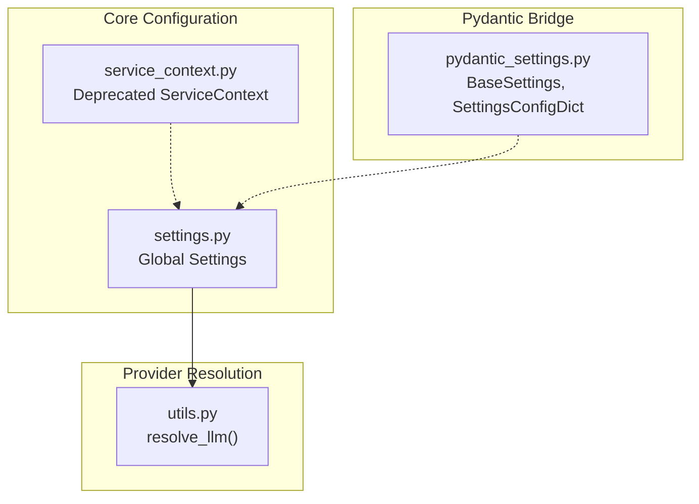
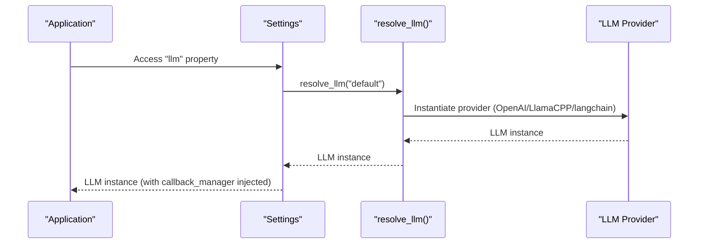
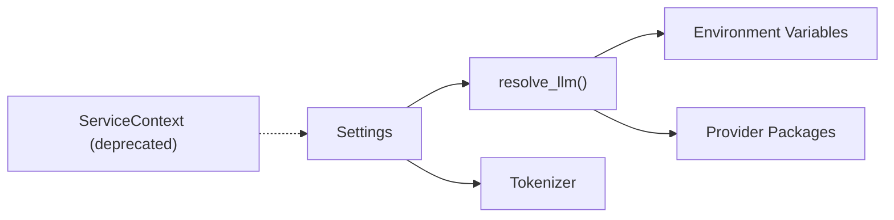

# Configuration Problems

<cite>
**Referenced Files in This Document**
- [settings.py](file://llama-index-core/llama_index/core/settings.py)
- [service_context.py](file://llama-index-core/llama_index/core/service_context.py)
- [utils.py](file://llama-index-core/llama_index/core/llms/utils.py)
- [pydantic_settings.py](file://llama-index-core/llama_index/core/bridge/pydantic_settings.py)
</cite>

## Table of Contents
1. [Introduction](#introduction)
2. [Project Structure](#project-structure)
3. [Core Components](#core-components)
4. [Architecture Overview](#architecture-overview)
5. [Detailed Component Analysis](#detailed-component-analysis)
6. [Dependency Analysis](#dependency-analysis)
7. [Performance Considerations](#performance-considerations)
8. [Troubleshooting Guide](#troubleshooting-guide)
9. [Conclusion](#conclusion)

## Introduction
This document focuses on diagnosing and resolving configuration problems in LlamaIndex. It covers common issues such as settings initialization errors, provider authentication failures, environment variable misconfigurations, and service context deprecation. It also provides solutions for LLM provider setup, embedding model configuration, and storage backend connectivity, along with diagnostic steps and debugging techniques. Guidance is included for YAML configuration pitfalls, settings precedence, and context manager usage.

## Project Structure
LlamaIndex centralizes configuration via a global settings singleton and a deprecation notice for the legacy ServiceContext. Provider resolution and environment checks are handled in LLM utilities. Pydantic settings bridging is exposed for configuration frameworks that rely on pydantic settings.

**Diagram sources**
- [settings.py](file://llama-index-core/llama_index/core/settings.py#L1-L249)
- [service_context.py](file://llama-index-core/llama_index/core/service_context.py#L1-L49)
- [utils.py](file://llama-index-core/llama_index/core/llms/utils.py#L1-L185)
- [pydantic_settings.py](file://llama-index-core/llama_index/core/bridge/pydantic_settings.py#L1-L6)

**Section sources**
- [settings.py](file://llama-index-core/llama_index/core/settings.py#L1-L249)
- [service_context.py](file://llama-index-core/llama_index/core/service_context.py#L1-L49)
- [utils.py](file://llama-index-core/llama_index/core/llms/utils.py#L1-L185)
- [pydantic_settings.py](file://llama-index-core/llama_index/core/bridge/pydantic_settings.py#L1-L6)

## Core Components
- Global Settings: Provides lazy-initialized accessors for LLM, embedding model, callback manager, tokenizer, node parser, prompt helper, and transformations. It ensures callback managers propagate to configured components.
- ServiceContext: Deprecated in favor of Settings or passing modules directly to APIs.
- LLM Resolution: Handles default provider selection, environment checks, and error messaging for missing packages or invalid keys.
- Pydantic Settings Bridge: Exposes BaseSettings and SettingsConfigDict for configuration frameworks.

Key responsibilities:
- Centralized configuration management
- Provider resolution and validation
- Deprecation migration guidance

**Section sources**
- [settings.py](file://llama-index-core/llama_index/core/settings.py#L17-L249)
- [service_context.py](file://llama-index-core/llama_index/core/service_context.py#L4-L49)
- [utils.py](file://llama-index-core/llama_index/core/llms/utils.py#L15-L110)
- [pydantic_settings.py](file://llama-index-core/llama_index/core/bridge/pydantic_settings.py#L1-L6)

## Architecture Overview
The configuration architecture relies on a global Settings singleton that lazily resolves providers and injects shared resources like callback managers. Legacy ServiceContext is deprecated and raises explicit errors to guide migration.

**Diagram sources**
- [settings.py](file://llama-index-core/llama_index/core/settings.py#L32-L46)
- [utils.py](file://llama-index-core/llama_index/core/llms/utils.py#L15-L110)

**Section sources**
- [settings.py](file://llama-index-core/llama_index/core/settings.py#L32-L46)
- [utils.py](file://llama-index-core/llama_index/core/llms/utils.py#L15-L110)

## Detailed Component Analysis

### Global Settings
- Lazy initialization: Properties like llm, embed_model, node_parser, and prompt_helper are created on first access.
- Callback propagation: When a callback manager is present, it is attached to resolved LLM, embedding model, and node parser.
- Tokenizer handling: Supports transformer tokenizer instances and falls back to a default tokenizer.
- Chunk sizing: chunk_size and chunk_overlap are validated against the current node parser.

Common configuration pitfalls:
- Forgetting to set a callback manager before accessing LLM/embedding model/node parser.
- Using a node parser without chunk_size/chunk_overlap attributes when reading those properties.
- Overwriting settings after first access without understanding lazy initialization.

Diagnostic tips:
- Verify Settings.callback_manager is set before accessing LLM/embedding/node parser.
- Confirm node parser supports chunk_size/chunk_overlap before setting those properties.

**Section sources**
- [settings.py](file://llama-index-core/llama_index/core/settings.py#L18-L249)

### ServiceContext (Deprecated)
- Explicitly raises errors for instantiation and default creation.
- Encourages migration to Settings or passing modules directly to APIs.

Impact:
- Any code relying on ServiceContext will fail at runtime with a clear message guiding migration.

**Section sources**
- [service_context.py](file://llama-index-core/llama_index/core/service_context.py#L13-L49)

### LLM Resolution and Provider Setup
- Default provider selection: Attempts OpenAI by default; if unavailable, falls back to local LlamaCPP or raises import errors.
- Environment validation: Validates API keys for providers; raises actionable errors when keys are missing or invalid.
- Local provider parsing: Requires a specific prefix and path format; otherwise raises a value error.
- LangChain integration: Wraps BaseLanguageModel instances; missing packages produce import errors.

Common issues:
- Missing provider packages causing ImportError during resolution.
- Incorrect or missing API keys leading to ValueError during validation.
- Misformatted local provider strings causing ValueError.
- Passing None disables the LLM and uses a mock.

**Section sources**
- [utils.py](file://llama-index-core/llama_index/core/llms/utils.py#L15-L110)

### Pydantic Settings Bridge
- Exposes BaseSettings and SettingsConfigDict for configuration frameworks that rely on pydantic settings.
- Enables integration with external configuration systems while maintaining compatibility with LlamaIndex’s Settings.

**Section sources**
- [pydantic_settings.py](file://llama-index-core/llama_index/core/bridge/pydantic_settings.py#L1-L6)

## Dependency Analysis
The configuration system exhibits clear separation of concerns:
- Settings depends on provider resolvers and tokenizers.
- LLM resolution depends on environment variables and optional packages.
- ServiceContext is intentionally decoupled and deprecated.

**Diagram sources**
- [settings.py](file://llama-index-core/llama_index/core/settings.py#L32-L46)
- [utils.py](file://llama-index-core/llama_index/core/llms/utils.py#L15-L110)
- [service_context.py](file://llama-index-core/llama_index/core/service_context.py#L13-L49)

**Section sources**
- [settings.py](file://llama-index-core/llama_index/core/settings.py#L32-L46)
- [utils.py](file://llama-index-core/llama_index/core/llms/utils.py#L15-L110)
- [service_context.py](file://llama-index-core/llama_index/core/service_context.py#L13-L49)

## Performance Considerations
- Lazy initialization avoids unnecessary provider instantiation until accessed.
- Callback manager injection occurs only when present, minimizing overhead.
- Tokenizer fallback ensures minimal performance impact when transformers are unavailable.

[No sources needed since this section provides general guidance]

## Troubleshooting Guide

### Settings Initialization Errors
Symptoms:
- Accessing LLM/embedding/node parser before setting callback manager yields inconsistent behavior.
- Reading chunk_size/chunk_overlap fails if the node parser lacks these attributes.

Solutions:
- Set Settings.callback_manager before first access to ensure callback propagation.
- Ensure the node parser supports chunk_size/chunk_overlap before reading or writing those properties.

Validation steps:
- Confirm Settings.callback_manager is not None before accessing LLM/embedding/node parser.
- Verify node parser type supports chunk_size/chunk_overlap before setting.

**Section sources**
- [settings.py](file://llama-index-core/llama_index/core/settings.py#L95-L104)
- [settings.py](file://llama-index-core/llama_index/core/settings.py#L154-L183)

### Provider Authentication Failures
Symptoms:
- ImportError when provider packages are missing.
- ValueError during provider validation due to missing or invalid API keys.

Solutions:
- Install the required provider package indicated in the ImportError.
- Set the appropriate environment variable (e.g., OPENAI_API_KEY) and verify correctness.

Validation steps:
- Check environment variables for provider-specific keys.
- Verify provider package installation and version compatibility.

**Section sources**
- [utils.py](file://llama-index-core/llama_index/core/llms/utils.py#L44-L57)
- [utils.py](file://llama-index-core/llama_index/core/llms/utils.py#L82-L85)
- [utils.py](file://llama-index-core/llama_index/core/llms/utils.py#L93-L97)

### Environment Variable Misconfigurations
Symptoms:
- Provider validation fails with a ValueError indicating key issues.
- Default provider selection attempts OpenAI but fails due to missing API key.

Solutions:
- Set the correct environment variable for the selected provider.
- Ensure the value matches the expected format and permissions.

Validation steps:
- Print or log environment variables at runtime to confirm values.
- Temporarily switch to a local provider to isolate environment issues.

**Section sources**
- [utils.py](file://llama-index-core/llama_index/core/llms/utils.py#L28-L33)
- [utils.py](file://llama-index-core/llama_index/core/llms/utils.py#L42-L57)

### Service Context Problems
Symptoms:
- Instantiation or default creation of ServiceContext raises a ValueError.
- Migration warnings or errors when using deprecated APIs.

Solutions:
- Replace ServiceContext usage with Settings or pass modules directly to APIs.
- Follow migration guidance referenced in the error message.

Validation steps:
- Search codebase for ServiceContext usage and replace with Settings.
- Review API documentation for updated patterns.

**Section sources**
- [service_context.py](file://llama-index-core/llama_index/core/service_context.py#L14-L19)
- [service_context.py](file://llama-index-core/llama_index/core/service_context.py#L33-L38)

### LLM Provider Setup Issues
Symptoms:
- Local provider string not prefixed correctly causes ValueError.
- Passing None disables the LLM and uses a mock.

Solutions:
- Use the correct local provider prefix and path format.
- Pass a valid provider identifier or instance instead of None.

Validation steps:
- Verify local provider string format.
- Test with a known-good provider before switching configurations.

**Section sources**
- [utils.py](file://llama-index-core/llama_index/core/llms/utils.py#L63-L66)
- [utils.py](file://llama-index-core/llama_index/core/llms/utils.py#L98-L102)

### Embedding Model Configuration Errors
Symptoms:
- ImportErrors when embedding provider packages are missing.
- Validation errors when embedding model parameters are incorrect.

Solutions:
- Install the required embedding provider package.
- Adjust embedding model parameters to match provider expectations.

Validation steps:
- Confirm embedding provider installation.
- Test embedding model resolution independently.

**Section sources**
- [settings.py](file://llama-index-core/llama_index/core/settings.py#L60-L74)

### Storage Backend Connectivity Problems
Symptoms:
- Errors when initializing storage backends (e.g., vector stores, docstores).
- Connection timeouts or permission errors.

Solutions:
- Verify connection strings, credentials, and network access.
- Ensure storage backend packages are installed.

Validation steps:
- Test connectivity outside of LlamaIndex (e.g., CLI tools).
- Use minimal reproducible example to isolate backend issues.

[No sources needed since this section provides general guidance]

### YAML Configuration Files
Common mistakes:
- Incorrect indentation or mixing tabs/spaces.
- Using deprecated keys or sections (e.g., ServiceContext).
- Omitting required environment variables.

Solutions:
- Validate YAML syntax and indentation.
- Use supported keys and avoid deprecated sections.
- Ensure environment variables are exported before running.

Validation steps:
- Lint YAML files with a linter.
- Run a dry-run of configuration loading to surface errors early.

[No sources needed since this section provides general guidance]

### Settings Precedence Issues
Common mistakes:
- Expecting late changes to take effect after first access due to lazy initialization.
- Conflicting settings between global Settings and per-module overrides.

Solutions:
- Set all desired settings before first access.
- Prefer explicit module passing over global Settings for clarity.

Validation steps:
- Reset or reinitialize Settings before accessing components.
- Use explicit module arguments in APIs to override global defaults.

**Section sources**
- [settings.py](file://llama-index-core/llama_index/core/settings.py#L32-L46)
- [settings.py](file://llama-index-core/llama_index/core/settings.py#L60-L74)

### Context Manager Usage Problems
Common mistakes:
- Not setting a callback manager before accessing LLM/embedding/node parser.
- Expecting callback manager changes to propagate retroactively.

Solutions:
- Set Settings.callback_manager before first access.
- Understand that callback manager injection happens at resolution time.

Validation steps:
- Verify callback manager presence before accessing components.
- Re-access components after changing callback manager.

**Section sources**
- [settings.py](file://llama-index-core/llama_index/core/settings.py#L95-L104)
- [settings.py](file://llama-index-core/llama_index/core/settings.py#L143-L144)

## Conclusion
Most LlamaIndex configuration problems stem from provider resolution, environment variables, and deprecated APIs. By leveraging the global Settings singleton, validating environment variables, installing required provider packages, and migrating away from deprecated ServiceContext, most issues can be resolved quickly. Use the diagnostic steps and validation techniques outlined above to isolate and fix configuration issues efficiently.