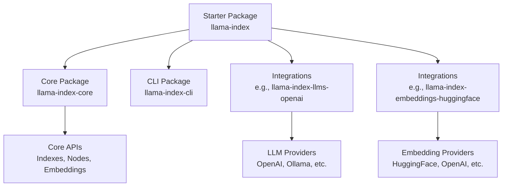
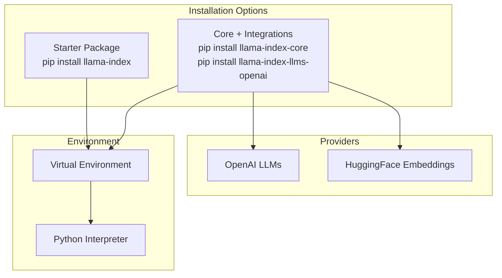
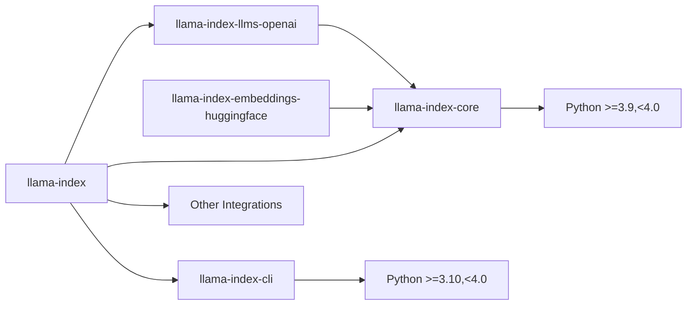

# Installation Issues

<cite>
**Referenced Files in This Document**
- [README.md](file://README.md)
- [pyproject.toml](file://pyproject.toml)
- [llama-index-core/pyproject.toml](file://llama-index-core/pyproject.toml)
- [llama-index-cli/pyproject.toml](file://llama-index-cli/pyproject.toml)
- [llama-index-integrations/llms/llama-index-llms-openai/pyproject.toml](file://llama-index-integrations/llms/llama-index-llms-openai/pyproject.toml)
- [llama-index-integrations/embeddings/llama-index-embeddings-huggingface/pyproject.toml](file://llama-index-integrations/embeddings/llama-index-embeddings-huggingface/pyproject.toml)
- [examples/fastapi_rag_ollama/requirements.txt](file://examples/fastapi_rag_ollama/requirements.txt)
- [CONTRIBUTING.md](file://CONTRIBUTING.md)
</cite>

## Table of Contents
1. [Introduction](#introduction)
2. [Project Structure](#project-structure)
3. [Core Components](#core-components)
4. [Architecture Overview](#architecture-overview)
5. [Detailed Component Analysis](#detailed-component-analysis)
6. [Dependency Analysis](#dependency-analysis)
7. [Performance Considerations](#performance-considerations)
8. [Troubleshooting Guide](#troubleshooting-guide)
9. [Conclusion](#conclusion)

## Introduction
This document provides a comprehensive troubleshooting guide for LlamaIndex installation issues across platforms and environments. It focuses on common problems such as dependency conflicts, version mismatches, environment setup failures, and platform-specific issues. It also covers virtual environment problems, package manager conflicts, and system requirement issues, with step-by-step diagnostics and alternative installation methods tailored to Windows, macOS, and Linux.

## Project Structure
LlamaIndex is a monorepo containing:
- A starter distribution package that bundles core and selected integrations
- A core package with foundational APIs and utilities
- CLI and integration packages for LLMs, embeddings, readers, vector stores, and more
- Example applications and requirements files demonstrating real-world setups

Key installation entry points:
- Starter package: a single pip-installable bundle
- Core package: install separately and add only the integrations you need
- Example requirements: show recommended combinations for specific stacks

**Diagram sources**
- [README.md](file://README.md#L14-L19)
- [pyproject.toml](file://pyproject.toml#L41-L50)
- [llama-index-core/pyproject.toml](file://llama-index-core/pyproject.toml#L34-L84)
- [llama-index-cli/pyproject.toml](file://llama-index-cli/pyproject.toml#L28-L47)
- [llama-index-integrations/llms/llama-index-llms-openai/pyproject.toml](file://llama-index-integrations/llms/llama-index-llms-openai/pyproject.toml#L29-L36)
- [llama-index-integrations/embeddings/llama-index-embeddings-huggingface/pyproject.toml](file://llama-index-integrations/embeddings/llama-index-embeddings-huggingface/pyproject.toml#L28-L39)

**Section sources**
- [README.md](file://README.md#L14-L19)
- [pyproject.toml](file://pyproject.toml#L41-L50)

## Core Components
- Starter package: includes core and curated integrations; convenient for getting started quickly
- Core package: foundational APIs and utilities; install when you need fine-grained control
- CLI package: command-line tools for scaffolding and upgrades
- Integration packages: provider-specific adapters for LLMs, embeddings, readers, and vector stores

System requirements and constraints:
- Python version constraints are defined per package; ensure your interpreter meets the minimum requirement
- Some integrations depend on external services or binaries; configure credentials and environment variables accordingly

**Section sources**
- [README.md](file://README.md#L14-L19)
- [pyproject.toml](file://pyproject.toml#L72-L72)
- [llama-index-core/pyproject.toml](file://llama-index-core/pyproject.toml#L38-L38)
- [llama-index-cli/pyproject.toml](file://llama-index-cli/pyproject.toml#L32-L32)
- [llama-index-integrations/llms/llama-index-llms-openai/pyproject.toml](file://llama-index-integrations/llms/llama-index-llms-openai/pyproject.toml#L33-L33)
- [llama-index-integrations/embeddings/llama-index-embeddings-huggingface/pyproject.toml](file://llama-index-integrations/embeddings/llama-index-embeddings-huggingface/pyproject.toml#L32-L32)

## Architecture Overview
The installation architecture centers around choosing between the starter package and a custom combination of core plus integrations. Integrations often introduce additional constraints (e.g., provider SDKs, native libraries), which can lead to installation conflicts if not aligned with your environment.

**Diagram sources**
- [README.md](file://README.md#L95-L101)
- [pyproject.toml](file://pyproject.toml#L41-L50)
- [llama-index-integrations/llms/llama-index-llms-openai/pyproject.toml](file://llama-index-integrations/llms/llama-index-llms-openai/pyproject.toml#L33-L36)
- [llama-index-integrations/embeddings/llama-index-embeddings-huggingface/pyproject.toml](file://llama-index-integrations/embeddings/llama-index-embeddings-huggingface/pyproject.toml#L32-L39)

## Detailed Component Analysis

### Starter vs Core Installation Paths
- Starter package: installs core plus curated integrations in a single step
- Core + integrations: allows precise control over which integrations to include and avoids unnecessary dependencies

Common pitfalls:
- Conflicts between integrations that depend on incompatible versions of shared libraries
- Excessive dependencies when using the starter package for minimal use cases

Recommendations:
- Prefer the starter package for rapid prototyping
- Switch to core + selective integrations for production or constrained environments

**Section sources**
- [README.md](file://README.md#L14-L19)
- [pyproject.toml](file://pyproject.toml#L41-L50)

### Provider-Specific Integration Constraints
- LLM integrations may require provider SDKs and environment variables
- Embedding integrations may rely on model libraries or inference clients

Diagnostic tips:
- Verify provider credentials are configured before installing integrations
- Confirm compatibility between the integration version and the core package version

**Section sources**
- [llama-index-integrations/llms/llama-index-llms-openai/pyproject.toml](file://llama-index-integrations/llms/llama-index-llms-openai/pyproject.toml#L33-L36)
- [llama-index-integrations/embeddings/llama-index-embeddings-huggingface/pyproject.toml](file://llama-index-integrations/embeddings/llama-index-embeddings-huggingface/pyproject.toml#L32-L39)

### Example-Based Installation Patterns
Examples demonstrate practical combinations of packages and their requirements. These can serve as templates for compatible installations.

**Section sources**
- [examples/fastapi_rag_ollama/requirements.txt](file://examples/fastapi_rag_ollama/requirements.txt#L1-L7)

## Dependency Analysis
LlamaIndex packages declare explicit Python version requirements and dependencies. Version ranges indicate compatibility windows; mismatches at boundaries can cause resolution failures.

**Diagram sources**
- [llama-index-core/pyproject.toml](file://llama-index-core/pyproject.toml#L38-L38)
- [llama-index-cli/pyproject.toml](file://llama-index-cli/pyproject.toml#L32-L32)
- [llama-index-integrations/llms/llama-index-llms-openai/pyproject.toml](file://llama-index-integrations/llms/llama-index-llms-openai/pyproject.toml#L33-L33)
- [llama-index-integrations/embeddings/llama-index-embeddings-huggingface/pyproject.toml](file://llama-index-integrations/embeddings/llama-index-embeddings-huggingface/pyproject.toml#L32-L32)
- [pyproject.toml](file://pyproject.toml#L41-L50)

**Section sources**
- [llama-index-core/pyproject.toml](file://llama-index-core/pyproject.toml#L38-L38)
- [llama-index-cli/pyproject.toml](file://llama-index-cli/pyproject.toml#L32-L32)
- [llama-index-integrations/llms/llama-index-llms-openai/pyproject.toml](file://llama-index-integrations/llms/llama-index-llms-openai/pyproject.toml#L33-L33)
- [llama-index-integrations/embeddings/llama-index-embeddings-huggingface/pyproject.toml](file://llama-index-integrations/embeddings/llama-index-embeddings-huggingface/pyproject.toml#L32-L32)
- [pyproject.toml](file://pyproject.toml#L41-L50)

## Performance Considerations
- Installing fewer integrations reduces resolution complexity and potential conflicts
- Using the starter package can speed up initial setup but may include unused dependencies
- Ensure your environment satisfies Python version requirements to avoid re-installs and rebuilds

[No sources needed since this section provides general guidance]

## Troubleshooting Guide

### Step-by-Step Diagnostic Checklist
- Confirm Python version meets the package requirements
- Isolate whether the issue occurs with the starter package or a specific integration
- Check for conflicting integrations that depend on incompatible versions of shared libraries
- Verify environment variables for provider credentials are set
- Test with a clean virtual environment to eliminate interference from system-wide packages

**Section sources**
- [llama-index-core/pyproject.toml](file://llama-index-core/pyproject.toml#L38-L38)
- [llama-index-cli/pyproject.toml](file://llama-index-cli/pyproject.toml#L32-L32)
- [pyproject.toml](file://pyproject.toml#L41-L50)

### Virtual Environment Problems
Symptoms:
- Import errors after successful installation
- Conflicting package versions across environments

Solutions:
- Create a fresh virtual environment with a compatible Python version
- Avoid mixing system and user site-packages
- Use a dedicated environment per project to prevent cross-contamination

**Section sources**
- [CONTRIBUTING.md](file://CONTRIBUTING.md#L55-L68)

### Package Manager Conflicts (pip vs uv)
Symptoms:
- Resolution failures or inconsistent installs
- Different behavior compared to documented examples

Solutions:
- Align your package manager with the repository’s development tooling
- Prefer the package manager used in the repository for reproducible environments
- If using pip, pin compatible versions based on integration constraints

**Section sources**
- [CONTRIBUTING.md](file://CONTRIBUTING.md#L11-L24)

### System Requirement Issues
Symptoms:
- Installation fails due to unsupported Python version
- Missing system-level dependencies for certain integrations

Solutions:
- Upgrade or downgrade Python to meet the package’s minimum/maximum version range
- Install any required system libraries or compilers before installing integrations that depend on them

**Section sources**
- [llama-index-core/pyproject.toml](file://llama-index-core/pyproject.toml#L38-L38)
- [llama-index-cli/pyproject.toml](file://llama-index-cli/pyproject.toml#L32-L32)
- [pyproject.toml](file://pyproject.toml#L72-L72)

### Common pip Install Errors
Symptoms:
- Resolution errors indicating incompatible versions
- Platform-specific compilation failures

Solutions:
- Use compatible versions of integrations with the core package
- Prefer wheel distributions when available
- If compilation is required, ensure build dependencies are present

**Section sources**
- [pyproject.toml](file://pyproject.toml#L41-L50)
- [llama-index-integrations/llms/llama-index-llms-openai/pyproject.toml](file://llama-index-integrations/llms/llama-index-llms-openai/pyproject.toml#L33-L36)
- [llama-index-integrations/embeddings/llama-index-embeddings-huggingface/pyproject.toml](file://llama-index-integrations/embeddings/llama-index-embeddings-huggingface/pyproject.toml#L32-L39)

### Conda Environment Issues
Symptoms:
- Environment activation failures or import errors
- Conflicts between conda-forge and pip-installed packages

Solutions:
- Create a fresh conda environment with a compatible Python version
- Prefer conda-forge packages for system-level dependencies
- Keep conda and pip isolated within the same environment to reduce conflicts

**Section sources**
- [CONTRIBUTING.md](file://CONTRIBUTING.md#L55-L68)

### Docker-Related Installation Problems
Symptoms:
- Missing build tools or native dependencies in container images
- Permission issues when installing into restricted directories

Solutions:
- Use multi-stage builds to install dependencies cleanly
- Install required system packages in the Dockerfile before pip installation
- Run pip with appropriate flags to avoid permission issues and ensure deterministic installs

**Section sources**
- [README.md](file://README.md#L191-L208)

### Platform-Specific Troubleshooting

#### Windows
Common issues:
- Native dependency compilation failures
- Path and environment variable handling differences

Remedies:
- Use prebuilt wheels when available
- Ensure Visual Studio build tools or appropriate compilers are installed
- Set environment variables consistently in the shell profile or within the environment

**Section sources**
- [README.md](file://README.md#L191-L208)

#### macOS
Common issues:
- Homebrew-installed libraries conflicting with pip-installed binaries
- M1/M2 architecture-specific binary compatibility

Remedies:
- Prefer system Python or pyenv-managed interpreters for consistency
- Install required Xcode command line tools
- Use universal wheels or rebuild against compatible architectures

**Section sources**
- [README.md](file://README.md#L191-L208)

#### Linux
Common issues:
- Distribution-specific library versions causing ABI incompatibilities
- Missing compiler toolchains or development headers

Remedies:
- Use distribution package managers to install system dependencies
- Prefer static or universal wheels to avoid native extensions
- Pin versions to known-good combinations when necessary

**Section sources**
- [README.md](file://README.md#L191-L208)

### Alternative Installation Methods
- Use the starter package for a quick baseline
- Switch to core + integrations for fine-grained control
- Follow example requirements as templates for compatible combinations

**Section sources**
- [README.md](file://README.md#L95-L101)
- [examples/fastapi_rag_ollama/requirements.txt](file://examples/fastapi_rag_ollama/requirements.txt#L1-L7)

## Conclusion
Installation issues often stem from version mismatches, environment setup, and provider-specific dependencies. By aligning Python versions, isolating environments, and selecting compatible integrations, most problems can be resolved efficiently. When in doubt, start with the starter package, then refine to core + targeted integrations as your needs evolve.