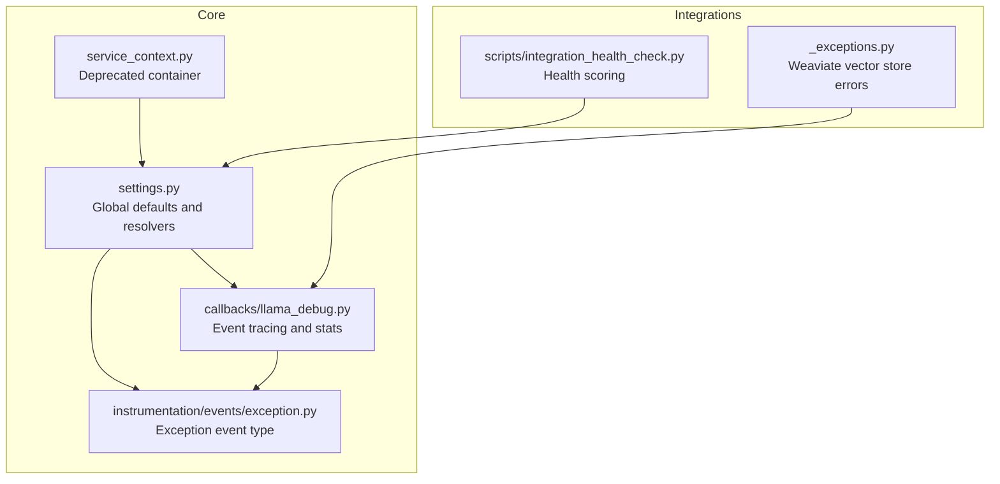
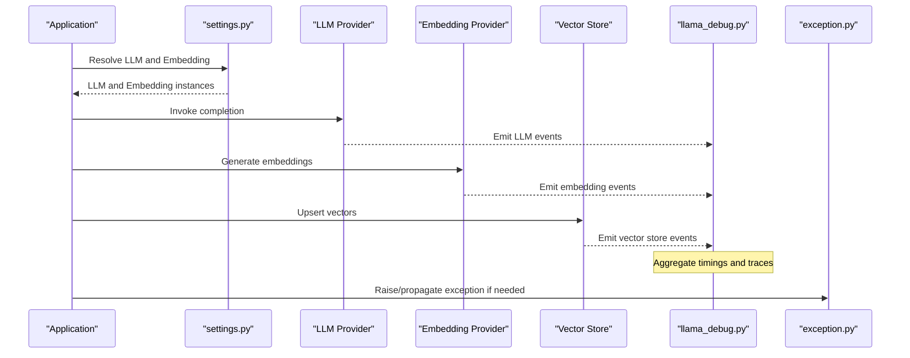
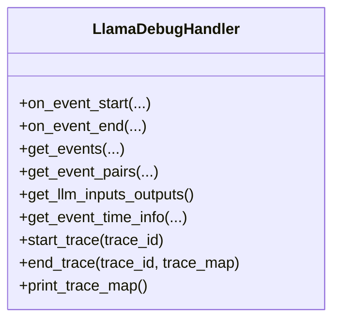
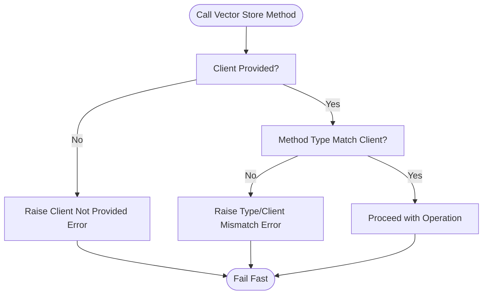
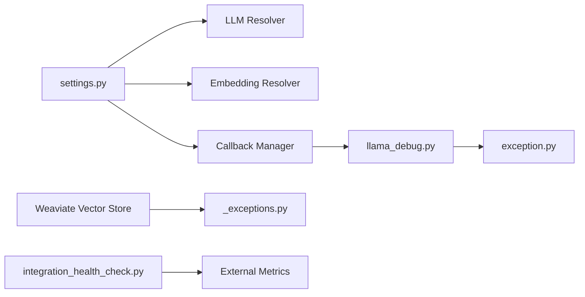

# Integration Troubles

<cite>
**Referenced Files in This Document**
- [settings.py](file://llama-index-core/llama_index/core/settings.py)
- [service_context.py](file://llama-index-core/llama_index/core/service_context.py)
- [llama_debug.py](file://llama-index-core/llama_index/core/callbacks/llama_debug.py)
- [exception.py](file://llama-index-core/llama_index/core/instrumentation/events/exception.py)
- [_exceptions.py](file://llama-index-integrations/vector_stores/llama-index-vector-stores-weaviate/llama_index/vector_stores/weaviate/_exceptions.py)
- [integration_health_check.py](file://scripts/integration_health_check.py)
- [README.md](file://README.md)
</cite>

## Table of Contents
1. [Introduction](#introduction)
2. [Project Structure](#project-structure)
3. [Core Components](#core-components)
4. [Architecture Overview](#architecture-overview)
5. [Detailed Component Analysis](#detailed-component-analysis)
6. [Dependency Analysis](#dependency-analysis)
7. [Performance Considerations](#performance-considerations)
8. [Troubleshooting Guide](#troubleshooting-guide)
9. [Conclusion](#conclusion)
10. [Appendices](#appendices)

## Introduction
This document provides a comprehensive troubleshooting guide for integrating LlamaIndex with external systems. It focuses on common issues with LLM providers, embedding services, vector stores, and external API connections. It covers authentication failures, API rate limits, connectivity issues, compatibility problems, and service-specific pitfalls. It also outlines debugging approaches using built-in tracing and callback mechanisms, validation strategies, and operational best practices such as proxy configuration and environment setup.

## Project Structure
At a high level, integration-related concerns span:
- Global configuration and defaults for LLMs and embeddings
- Callback and tracing infrastructure for diagnosing runtime behavior
- Instrumentation events for error propagation
- Vector store integrations with explicit exceptions
- Health-check utilities for evaluating integration maturity and reliability

**Diagram sources**
- [settings.py](file://llama-index-core/llama_index/core/settings.py#L17-L249)
- [service_context.py](file://llama-index-core/llama_index/core/service_context.py#L1-L49)
- [llama_debug.py](file://llama-index-core/llama_index/core/callbacks/llama_debug.py#L1-L211)
- [exception.py](file://llama-index-core/llama_index/core/instrumentation/events/exception.py#L1-L19)
- [_exceptions.py](file://llama-index-integrations/vector_stores/llama-index-vector-stores-weaviate/llama_index/vector_stores/weaviate/_exceptions.py#L1-L21)
- [integration_health_check.py](file://scripts/integration_health_check.py#L1-L463)

**Section sources**
- [settings.py](file://llama-index-core/llama_index/core/settings.py#L17-L249)
- [service_context.py](file://llama-index-core/llama_index/core/service_context.py#L1-L49)
- [llama_debug.py](file://llama-index-core/llama_index/core/callbacks/llama_debug.py#L1-L211)
- [exception.py](file://llama-index-core/llama_index/core/instrumentation/events/exception.py#L1-L19)
- [_exceptions.py](file://llama-index-integrations/vector_stores/llama-index-vector-stores-weaviate/llama_index/vector_stores/weaviate/_exceptions.py#L1-L21)
- [integration_health_check.py](file://scripts/integration_health_check.py#L1-L463)

## Core Components
- Global settings and resolvers: Centralized configuration for LLMs, embeddings, tokenizers, and transformations. Misconfiguration here often cascades across the stack.
- Callback and tracing: Event-driven tracing with timing and hierarchical trace printing to diagnose slow or failing steps.
- Instrumentation events: Typed event for propagating exceptions through the instrumentation pipeline.
- Vector store integration exceptions: Explicit exceptions surface misconfiguration or misuse of clients.
- Health checks: Automated scoring of integration maturity and reliability signals.

**Section sources**
- [settings.py](file://llama-index-core/llama_index/core/settings.py#L32-L74)
- [llama_debug.py](file://llama-index-core/llama_index/core/callbacks/llama_debug.py#L59-L178)
- [exception.py](file://llama-index-core/llama_index/core/instrumentation/events/exception.py#L4-L19)
- [_exceptions.py](file://llama-index-integrations/vector_stores/llama-index-vector-stores-weaviate/llama_index/vector_stores/weaviate/_exceptions.py#L1-L21)
- [integration_health_check.py](file://scripts/integration_health_check.py#L33-L341)

## Architecture Overview
The integration lifecycle typically involves:
- Resolving LLMs and embeddings from configuration
- Executing prompts and generating embeddings
- Persisting vectors via vector stores
- Observing and tracing events for diagnostics
- Propagating exceptions through instrumentation

**Diagram sources**
- [settings.py](file://llama-index-core/llama_index/core/settings.py#L32-L74)
- [llama_debug.py](file://llama-index-core/llama_index/core/callbacks/llama_debug.py#L59-L178)
- [exception.py](file://llama-index-core/llama_index/core/instrumentation/events/exception.py#L4-L19)

## Detailed Component Analysis

### Global Settings and Defaults
- Purpose: Provide centralized resolution of LLMs and embeddings, manage callback managers, tokenizer, and transformations.
- Common issues:
  - Incorrect provider identifiers or missing credentials lead to resolution failures.
  - Mismatched context windows or chunk sizes cause downstream tokenization errors.
  - Global callback manager not attached to components can hide diagnostic events.

**Section sources**
- [settings.py](file://llama-index-core/llama_index/core/settings.py#L32-L74)
- [settings.py](file://llama-index-core/llama_index/core/settings.py#L108-L134)
- [settings.py](file://llama-index-core/llama_index/core/settings.py#L137-L184)

### Callback and Tracing Infrastructure
- Purpose: Capture and correlate events across LLM calls, embedding generation, and vector store operations. Provides timing stats and trace maps.
- Common issues:
  - Events ignored due to filters can hide problematic stages.
  - Trace maps require proper trace IDs to render meaningful hierarchies.
  - Excessive event volume can overwhelm logs; tune ignores and print controls.

**Diagram sources**
- [llama_debug.py](file://llama-index-core/llama_index/core/callbacks/llama_debug.py#L17-L211)

**Section sources**
- [llama_debug.py](file://llama-index-core/llama_index/core/callbacks/llama_debug.py#L59-L178)
- [llama_debug.py](file://llama-index-core/llama_index/core/callbacks/llama_debug.py#L164-L198)

### Instrumentation Exception Event
- Purpose: Standardized event type for propagating exceptions through instrumentation.
- Common issues:
  - Unhandled exceptions bypass tracing if not emitted as instrumentation events.
  - Consumers rely on typed events to correlate failures with traces.

**Section sources**
- [exception.py](file://llama-index-core/llama_index/core/instrumentation/events/exception.py#L4-L19)

### Vector Store Integration Exceptions (Weaviate)
- Purpose: Surface explicit misconfiguration or misuse of clients.
- Common issues:
  - Calling sync methods without a synchronous client raises a dedicated error.
  - Calling async methods without an async client raises a dedicated error.
- Resolution:
  - Ensure the correct client type is passed to the vector store constructor.
  - Match sync/async usage with the provided client.

**Diagram sources**
- [_exceptions.py](file://llama-index-integrations/vector_stores/llama-index-vector-stores-weaviate/llama_index/vector_stores/weaviate/_exceptions.py#L1-L21)

**Section sources**
- [_exceptions.py](file://llama-index-integrations/vector_stores/llama-index-vector-stores-weaviate/llama_index/vector_stores/weaviate/_exceptions.py#L1-L21)

### Integration Health Check Utility
- Purpose: Compute a relative health score for integrations based on download trends, commit activity, and test coverage.
- Common issues:
  - New packages lack sufficient metrics and are scored conservatively.
  - Metrics depend on external APIs; transient failures can impact results.
- Resolution:
  - Use the utility to identify under-maintained integrations.
  - Focus on packages with higher scores for production-grade integrations.

**Section sources**
- [integration_health_check.py](file://scripts/integration_health_check.py#L33-L341)
- [integration_health_check.py](file://scripts/integration_health_check.py#L416-L463)

## Dependency Analysis
- Global settings depends on resolvers for LLMs and embeddings; misconfiguration here affects all downstream components.
- Callback tracing depends on instrumentation events and callback handlers to collect and correlate data.
- Vector store integrations depend on explicit client types; mismatches trigger dedicated exceptions.
- Health checks depend on external metrics and commit histories; they inform integration selection and risk assessment.

**Diagram sources**
- [settings.py](file://llama-index-core/llama_index/core/settings.py#L32-L74)
- [llama_debug.py](file://llama-index-core/llama_index/core/callbacks/llama_debug.py#L59-L178)
- [exception.py](file://llama-index-core/llama_index/core/instrumentation/events/exception.py#L4-L19)
- [_exceptions.py](file://llama-index-integrations/vector_stores/llama-index-vector-stores-weaviate/llama_index/vector_stores/weaviate/_exceptions.py#L1-L21)
- [integration_health_check.py](file://scripts/integration_health_check.py#L33-L341)

**Section sources**
- [settings.py](file://llama-index-core/llama_index/core/settings.py#L32-L74)
- [llama_debug.py](file://llama-index-core/llama_index/core/callbacks/llama_debug.py#L59-L178)
- [_exceptions.py](file://llama-index-integrations/vector_stores/llama-index-vector-stores-weaviate/llama_index/vector_stores/weaviate/_exceptions.py#L1-L21)
- [integration_health_check.py](file://scripts/integration_health_check.py#L33-L341)

## Performance Considerations
- Use tracing to identify bottlenecks in LLM calls, embedding generation, and vector store operations.
- Tune chunk size and overlap to balance recall and cost while respecting provider context windows.
- Prefer async vector store operations when supported to improve throughput.
- Monitor external API usage and apply backoff strategies for rate-limited endpoints.

[No sources needed since this section provides general guidance]

## Troubleshooting Guide

### Authentication Failures
- Symptoms:
  - Immediate resolution errors when setting or resolving LLM/embedding providers.
  - Explicit client misconfiguration in vector stores.
- Diagnostics:
  - Verify provider identifiers and credential resolution in global settings.
  - Confirm client types match method usage for vector stores.
- Fixes:
  - Supply correct credentials and environment variables expected by resolvers.
  - Provide the required client instance to vector store constructors.

**Section sources**
- [settings.py](file://llama-index-core/llama_index/core/settings.py#L32-L74)
- [_exceptions.py](file://llama-index-integrations/vector_stores/llama-index-vector-stores-weaviate/llama_index/vector_stores/weaviate/_exceptions.py#L1-L21)

### API Rate Limits and Connectivity Issues
- Symptoms:
  - Transient timeouts, retries, or throttling responses from providers.
  - Slow or failing LLM calls and embedding generations.
- Diagnostics:
  - Use tracing to measure per-stage latency and identify slow providers.
  - Inspect external metrics and commit/activity trends for integration stability.
- Fixes:
  - Implement retry/backoff with jitter.
  - Scale out horizontally or adjust batch sizes.
  - Switch to managed providers or regional endpoints if latency is high.

**Section sources**
- [llama_debug.py](file://llama-index-core/llama_index/core/callbacks/llama_debug.py#L123-L156)
- [integration_health_check.py](file://scripts/integration_health_check.py#L33-L341)

### Compatibility Problems
- Symptoms:
  - Unexpected tokenization errors due to mismatched chunk sizes.
  - Incompatible client types for vector store operations.
- Diagnostics:
  - Validate chunk size and overlap settings against the configured node parser.
  - Confirm client type matches method usage.
- Fixes:
  - Align chunk settings with provider context windows.
  - Provide the correct client instance to the vector store.

**Section sources**
- [settings.py](file://llama-index-core/llama_index/core/settings.py#L154-L184)
- [_exceptions.py](file://llama-index-integrations/vector_stores/llama-index-vector-stores-weaviate/llama_index/vector_stores/weaviate/_exceptions.py#L1-L21)

### Proxy Configuration Issues
- Symptoms:
  - Network timeouts or SSL handshake failures when connecting to external APIs.
- Diagnostics:
  - Test direct connectivity to provider endpoints.
  - Verify environment variable-based proxy settings are applied consistently.
- Fixes:
  - Configure proxies at the HTTP client level for LLM and embedding providers.
  - Ensure vector store clients respect proxy settings.

[No sources needed since this section provides general guidance]

### Integration Validation and Error Handling
- Validation:
  - Use tracing to capture end-to-end flows and inspect LLM inputs/outputs.
  - Emit instrumentation events for exceptions to correlate failures with traces.
- Error handling:
  - Catch explicit integration exceptions and escalate appropriately.
  - Leverage health checks to assess integration maturity before deployment.

**Section sources**
- [llama_debug.py](file://llama-index-core/llama_index/core/callbacks/llama_debug.py#L148-L150)
- [exception.py](file://llama-index-core/llama_index/core/instrumentation/events/exception.py#L4-L19)
- [integration_health_check.py](file://scripts/integration_health_check.py#L33-L341)

## Conclusion
Effective LlamaIndex integration requires robust configuration, comprehensive tracing, and disciplined error handling. Use global settings for consistent defaults, tracing for visibility, instrumentation for exception correlation, and explicit integration exceptions for fail-fast feedback. Complement these with health checks to select reliable integrations and operational best practices for proxies and rate limiting.

[No sources needed since this section summarizes without analyzing specific files]

## Appendices

### Quick Reference: Common Checks
- LLM resolution and credentials
- Embedding model resolution and dimensions
- Chunk size and overlap alignment
- Vector store client type and endpoint
- Proxy environment variables
- Rate limit and retry policies
- Tracing enabled with appropriate filters
- Instrumentation events for exceptions

[No sources needed since this section provides general guidance]