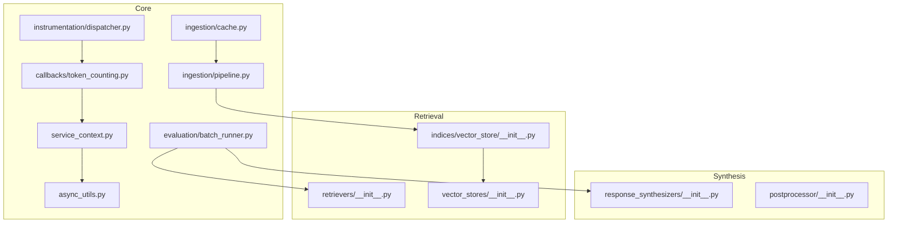
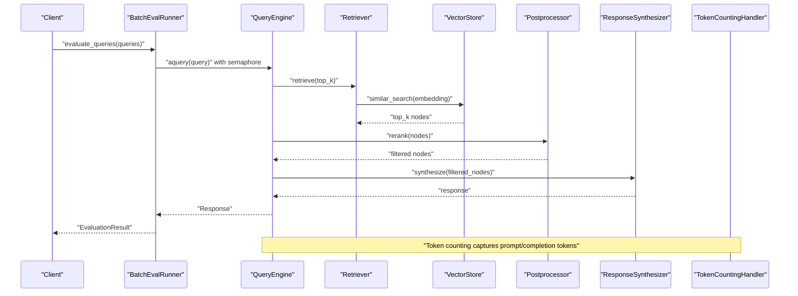
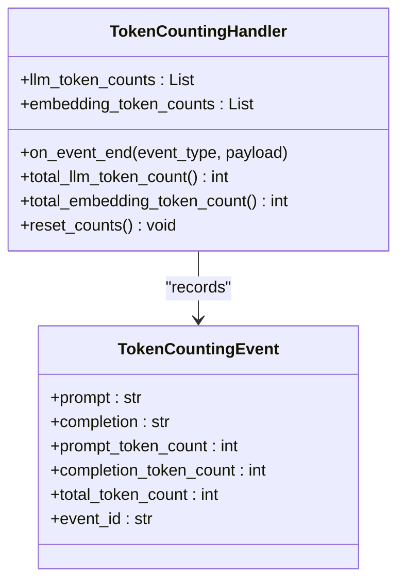
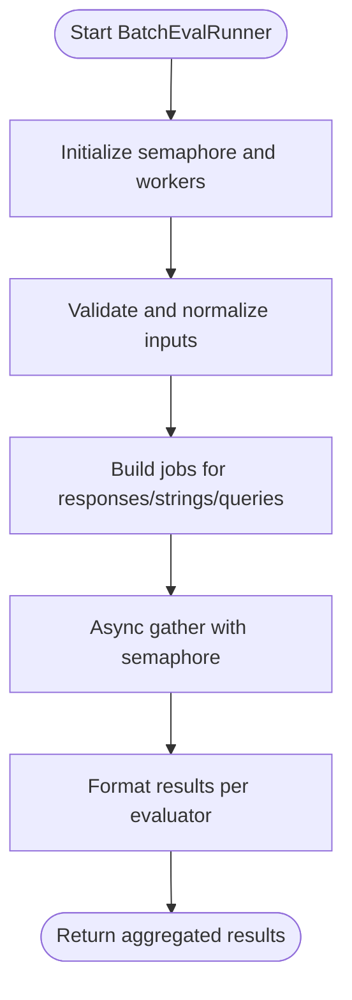
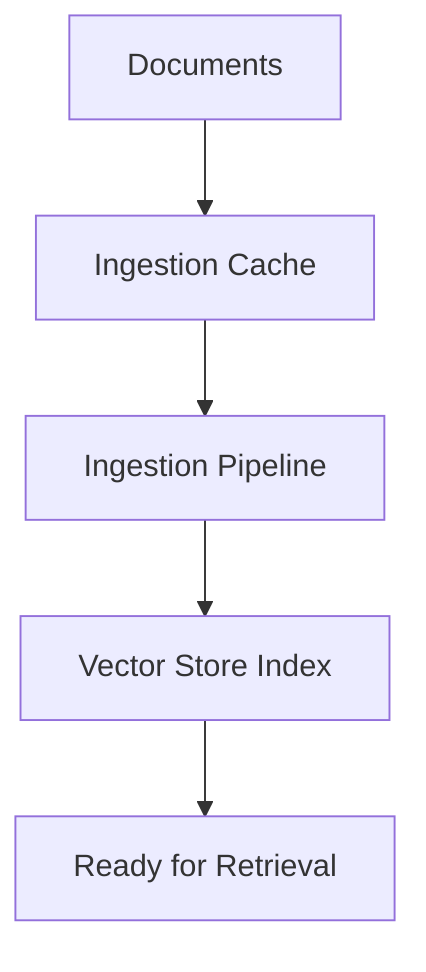
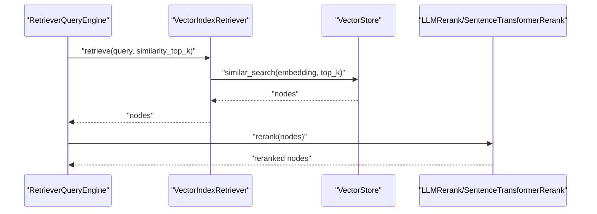
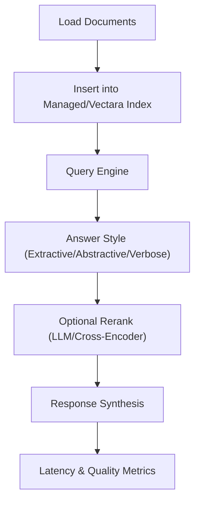
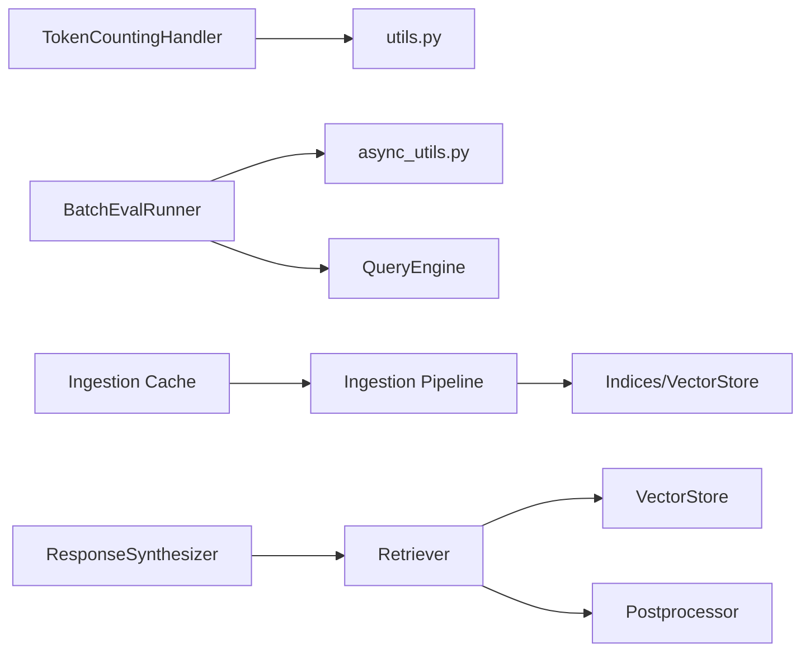

# Performance Issues

<cite>
**Referenced Files in This Document**
- [manage_retrieval_benchmark.ipynb](file://docs/examples/managed/manage_retrieval_benchmark.ipynb)
- [batch_runner.py](file://llama-index-core/llama_index/core/evaluation/batch_runner.py)
- [token_counting.py](file://llama-index-core/llama_index/core/callbacks/token_counting.py)
- [__init__.py](file://llama-index-core/llama_index/core/evaluation/benchmarks/__init__.py)
- [callbacks/__init__.py](file://llama-index-core/llama_index/core/callbacks/__init__.py)
- [instrumentation/dispatcher.py](file://llama-index-core/llama_index/core/instrumentation/dispatcher.py)
- [instrumentation/events/__init__.py](file://llama-index-core/llama_index/core/instrumentation/events/__init__.py)
- [query_engine/__init__.py](file://llama-index-core/llama_index/core/query_engine/__init__.py)
- [retrievers/__init__.py](file://llama-index-core/llama_index/core/retrievers/__init__.py)
- [vector_stores/__init__.py](file://llama-index-core/llama_index/core/vector_stores/__init__.py)
- [indices/vector_store/__init__.py](file://llama-index-core/llama_index/core/indices/vector_store/__init__.py)
- [indices/common/__init__.py](file://llama-index-core/llama_index/core/indices/common/__init__.py)
- [ingestion/cache.py](file://llama-index-core/llama_index/core/ingestion/cache.py)
- [ingestion/pipeline.py](file://llama-index-core/llama_index/core/ingestion/pipeline.py)
- [postprocessor/__init__.py](file://llama-index-core/llama_index/core/postprocessor/__init__.py)
- [response_synthesizers/__init__.py](file://llama-index-core/llama_index/core/response_synthesizers/__init__.py)
- [service_context.py](file://llama-index-core/llama_index/core/service_context.py)
- [settings.py](file://llama-index-core/llama_index/core/settings.py)
- [constants.py](file://llama-index-core/llama_index/core/constants.py)
- [async_utils.py](file://llama-index-core/llama_index/core/async_utils.py)
- [utils.py](file://llama-index-core/llama_index/core/utils.py)
</cite>

## Table of Contents
1. [Introduction](#introduction)
2. [Project Structure](#project-structure)
3. [Core Components](#core-components)
4. [Architecture Overview](#architecture-overview)
5. [Detailed Component Analysis](#detailed-component-analysis)
6. [Dependency Analysis](#dependency-analysis)
7. [Performance Considerations](#performance-considerations)
8. [Troubleshooting Guide](#troubleshooting-guide)
9. [Conclusion](#conclusion)
10. [Appendices](#appendices)

## Introduction
This document focuses on diagnosing and resolving performance issues in LlamaIndex applications. It covers common bottlenecks such as slow query responses, high memory usage, inefficient indexing, and retrieval performance degradation. It provides actionable solutions including memory optimization, caching strategies, batch processing improvements, and scaling considerations. It also outlines diagnostic tools and metrics for performance monitoring and addresses patterns commonly observed in large-scale deployments.

## Project Structure
The repository is organized into multiple packages. For performance troubleshooting, the most relevant areas are:
- Evaluation and benchmarking utilities for measuring throughput and latency
- Instrumentation and callbacks for tracing and token accounting
- Ingestion and caching for efficient data preparation
- Query engine, retrievers, and vector stores for retrieval performance
- Async utilities and service context for concurrency and configuration

**Diagram sources**
- [token_counting.py](file://llama-index-core/llama_index/core/callbacks/token_counting.py#L1-L270)
- [batch_runner.py](file://llama-index-core/llama_index/core/evaluation/batch_runner.py#L1-L444)
- [dispatcher.py](file://llama-index-core/llama_index/core/instrumentation/dispatcher.py#L1-L200)
- [cache.py](file://llama-index-core/llama_index/core/ingestion/cache.py#L1-L200)
- [pipeline.py](file://llama-index-core/llama_index/core/ingestion/pipeline.py#L1-L300)
- [service_context.py](file://llama-index-core/llama_index/core/service_context.py#L1-L200)
- [async_utils.py](file://llama-index-core/llama_index/core/async_utils.py#L1-L200)
- [retrievers/__init__.py](file://llama-index-core/llama_index/core/retrievers/__init__.py#L1-L200)
- [indices/vector_store/__init__.py](file://llama-index-core/llama_index/core/indices/vector_store/__init__.py#L1-L200)
- [vector_stores/__init__.py](file://llama-index-core/llama_index/core/vector_stores/__init__.py#L1-L200)
- [response_synthesizers/__init__.py](file://llama-index-core/llama_index/core/response_synthesizers/__init__.py#L1-L200)
- [postprocessor/__init__.py](file://llama-index-core/llama_index/core/postprocessor/__init__.py#L1-L200)

**Section sources**
- [token_counting.py](file://llama-index-core/llama_index/core/callbacks/token_counting.py#L1-L270)
- [batch_runner.py](file://llama-index-core/llama_index/core/evaluation/batch_runner.py#L1-L444)
- [dispatcher.py](file://llama-index-core/llama_index/core/instrumentation/dispatcher.py#L1-L200)
- [cache.py](file://llama-index-core/llama_index/core/ingestion/cache.py#L1-L200)
- [pipeline.py](file://llama-index-core/llama_index/core/ingestion/pipeline.py#L1-L300)
- [service_context.py](file://llama-index-core/llama_index/core/service_context.py#L1-L200)
- [async_utils.py](file://llama-index-core/llama_index/core/async_utils.py#L1-L200)
- [retrievers/__init__.py](file://llama-index-core/llama_index/core/retrievers/__init__.py#L1-L200)
- [indices/vector_store/__init__.py](file://llama-index-core/llama_index/core/indices/vector_store/__init__.py#L1-L200)
- [vector_stores/__init__.py](file://llama-index-core/llama_index/core/vector_stores/__init__.py#L1-L200)
- [response_synthesizers/__init__.py](file://llama-index-core/llama_index/core/response_synthesizers/__init__.py#L1-L200)
- [postprocessor/__init__.py](file://llama-index-core/llama_index/core/postprocessor/__init__.py#L1-L200)

## Core Components
- Token counting callback: Tracks prompt/completion token usage during LLM and embedding operations to quantify compute costs and detect token inflation.
- Batch evaluation runner: Provides asynchronous, rate-limited evaluation of queries and responses with retry/backoff, enabling controlled load testing and throughput measurement.
- Instrumentation dispatcher: Centralized event dispatching for tracing spans and performance events.
- Ingestion cache and pipeline: Optimizes repeated ingestion and reduces redundant embedding work.
- Service context and async utilities: Control concurrency limits, timeouts, and resource allocation for scalable operation.

Key capabilities for performance diagnostics:
- Token accounting for LLM and embedding calls
- Controlled worker concurrency via semaphores
- Retry/backoff for transient failures
- Event-driven tracing for end-to-end latency breakdown

**Section sources**
- [token_counting.py](file://llama-index-core/llama_index/core/callbacks/token_counting.py#L143-L270)
- [batch_runner.py](file://llama-index-core/llama_index/core/evaluation/batch_runner.py#L75-L120)
- [dispatcher.py](file://llama-index-core/llama_index/core/instrumentation/dispatcher.py#L1-L200)
- [cache.py](file://llama-index-core/llama_index/core/ingestion/cache.py#L1-L200)
- [pipeline.py](file://llama-index-core/llama_index/core/ingestion/pipeline.py#L1-L300)
- [service_context.py](file://llama-index-core/llama_index/core/service_context.py#L1-L200)
- [async_utils.py](file://llama-index-core/llama_index/core/async_utils.py#L1-L200)

## Architecture Overview
The performance-critical path typically follows:
- Ingestion pipeline caches and prepares documents
- Vector store index stores embeddings for fast similarity search
- Retrievers fetch candidate nodes with configurable top-k
- Postprocessors refine relevance (e.g., rerankers)
- Response synthesizers produce answers
- Token counting and instrumentation capture metrics

**Diagram sources**
- [batch_runner.py](file://llama-index-core/llama_index/core/evaluation/batch_runner.py#L319-L348)
- [retrievers/__init__.py](file://llama-index-core/llama_index/core/retrievers/__init__.py#L1-L200)
- [indices/vector_store/__init__.py](file://llama-index-core/llama_index/core/indices/vector_store/__init__.py#L1-L200)
- [postprocessor/__init__.py](file://llama-index-core/llama_index/core/postprocessor/__init__.py#L1-L200)
- [response_synthesizers/__init__.py](file://llama-index-core/llama_index/core/response_synthesizers/__init__.py#L1-L200)
- [token_counting.py](file://llama-index-core/llama_index/core/callbacks/token_counting.py#L143-L270)

## Detailed Component Analysis

### Token Counting Handler
Purpose:
- Capture token usage for LLM and embedding operations
- Aggregate prompt, completion, and total tokens
- Support verbose logging and reset of counters

Key behaviors:
- Extracts token counts from raw response usage metadata
- Falls back to tokenizer estimates when usage is unavailable
- Maintains separate counters for LLM and embeddings

**Diagram sources**
- [token_counting.py](file://llama-index-core/llama_index/core/callbacks/token_counting.py#L26-L141)
- [token_counting.py](file://llama-index-core/llama_index/core/callbacks/token_counting.py#L143-L270)

**Section sources**
- [token_counting.py](file://llama-index-core/llama_index/core/callbacks/token_counting.py#L143-L270)

### Batch Evaluation Runner
Purpose:
- Asynchronously evaluate queries and responses with controlled concurrency
- Apply retries with exponential backoff for resilience
- Aggregate evaluation results per evaluator

Key behaviors:
- Uses asyncio semaphore to cap concurrent workers
- Supports evaluating responses, response strings, and queries via a provided engine
- Validates inputs and supports per-evaluator kwargs

**Diagram sources**
- [batch_runner.py](file://llama-index-core/llama_index/core/evaluation/batch_runner.py#L75-L120)
- [batch_runner.py](file://llama-index-core/llama_index/core/evaluation/batch_runner.py#L195-L260)
- [batch_runner.py](file://llama-index-core/llama_index/core/evaluation/batch_runner.py#L319-L348)

**Section sources**
- [batch_runner.py](file://llama-index-core/llama_index/core/evaluation/batch_runner.py#L75-L120)
- [batch_runner.py](file://llama-index-core/llama_index/core/evaluation/batch_runner.py#L195-L260)
- [batch_runner.py](file://llama-index-core/llama_index/core/evaluation/batch_runner.py#L319-L348)

### Ingestion Caching and Pipeline
Purpose:
- Reduce redundant work by caching processed nodes and embeddings
- Streamline ingestion stages for improved throughput

Key behaviors:
- Cache stores computed embeddings and node metadata
- Pipeline composes transformations and sinks for efficient processing

**Diagram sources**
- [cache.py](file://llama-index-core/llama_index/core/ingestion/cache.py#L1-L200)
- [pipeline.py](file://llama-index-core/llama_index/core/ingestion/pipeline.py#L1-L300)

**Section sources**
- [cache.py](file://llama-index-core/llama_index/core/ingestion/cache.py#L1-L200)
- [pipeline.py](file://llama-index-core/llama_index/core/ingestion/pipeline.py#L1-L300)

### Retrieval and Vector Stores
Purpose:
- Efficient similarity search and retrieval of relevant nodes
- Configurable top-k and postprocessing for relevance refinement

Key behaviors:
- VectorIndexRetriever performs similarity search against vector stores
- Postprocessors (e.g., rerankers) improve precision at the cost of latency
- Vector store backends impact scalability and latency

**Diagram sources**
- [retrievers/__init__.py](file://llama-index-core/llama_index/core/retrievers/__init__.py#L1-L200)
- [indices/vector_store/__init__.py](file://llama-index-core/llama_index/core/indices/vector_store/__init__.py#L1-L200)
- [postprocessor/__init__.py](file://llama-index-core/llama_index/core/postprocessor/__init__.py#L1-L200)

**Section sources**
- [retrievers/__init__.py](file://llama-index-core/llama_index/core/retrievers/__init__.py#L1-L200)
- [indices/vector_store/__init__.py](file://llama-index-core/llama_index/core/indices/vector_store/__init__.py#L1-L200)
- [postprocessor/__init__.py](file://llama-index-core/llama_index/core/postprocessor/__init__.py#L1-L200)

### Benchmarking Notebook Patterns
Purpose:
- Compare retrieval strategies and answer styles
- Demonstrate reranking and synthesis trade-offs

Key behaviors:
- Compare managed retrieval providers vs. local rerankers
- Measure latency and quality across answer styles (extractive, abstractive, verbose)

**Diagram sources**
- [manage_retrieval_benchmark.ipynb](file://docs/examples/managed/manage_retrieval_benchmark.ipynb#L215-L800)

**Section sources**
- [manage_retrieval_benchmark.ipynb](file://docs/examples/managed/manage_retrieval_benchmark.ipynb#L215-L800)

## Dependency Analysis
High-level dependencies impacting performance:
- callbacks/token_counting.py depends on instrumentation and utilities for token estimation
- evaluation/batch_runner.py depends on async utilities and query engines
- ingestion/cache.py and pipeline.py depend on indices and vector stores
- retrievers and response synthesizers depend on service context and settings

**Diagram sources**
- [token_counting.py](file://llama-index-core/llama_index/core/callbacks/token_counting.py#L1-L270)
- [batch_runner.py](file://llama-index-core/llama_index/core/evaluation/batch_runner.py#L1-L444)
- [async_utils.py](file://llama-index-core/llama_index/core/async_utils.py#L1-L200)
- [cache.py](file://llama-index-core/llama_index/core/ingestion/cache.py#L1-L200)
- [pipeline.py](file://llama-index-core/llama_index/core/ingestion/pipeline.py#L1-L300)
- [retrievers/__init__.py](file://llama-index-core/llama_index/core/retrievers/__init__.py#L1-L200)
- [indices/vector_store/__init__.py](file://llama-index-core/llama_index/core/indices/vector_store/__init__.py#L1-L200)
- [postprocessor/__init__.py](file://llama-index-core/llama_index/core/postprocessor/__init__.py#L1-L200)
- [response_synthesizers/__init__.py](file://llama-index-core/llama_index/core/response_synthesizers/__init__.py#L1-L200)

**Section sources**
- [token_counting.py](file://llama-index-core/llama_index/core/callbacks/token_counting.py#L1-L270)
- [batch_runner.py](file://llama-index-core/llama_index/core/evaluation/batch_runner.py#L1-L444)
- [async_utils.py](file://llama-index-core/llama_index/core/async_utils.py#L1-L200)
- [cache.py](file://llama-index-core/llama_index/core/ingestion/cache.py#L1-L200)
- [pipeline.py](file://llama-index-core/llama_index/core/ingestion/pipeline.py#L1-L300)
- [retrievers/__init__.py](file://llama-index-core/llama_index/core/retrievers/__init__.py#L1-L200)
- [indices/vector_store/__init__.py](file://llama-index-core/llama_index/core/indices/vector_store/__init__.py#L1-L200)
- [postprocessor/__init__.py](file://llama-index-core/llama_index/core/postprocessor/__init__.py#L1-L200)
- [response_synthesizers/__init__.py](file://llama-index-core/llama_index/core/response_synthesizers/__init__.py#L1-L200)

## Performance Considerations
- Concurrency and batching
  - Use BatchEvalRunner with tuned worker counts and semaphores to balance throughput and resource utilization.
  - Prefer batched operations for embedding and retrieval to amortize overhead.
- Memory optimization
  - Leverage ingestion cache to avoid recomputation of embeddings.
  - Limit top-k and apply postprocessing judiciously to reduce intermediate node sets.
- Retrieval tuning
  - Adjust similarity_top_k and reranker top-n to trade off latency and accuracy.
  - Choose lightweight rerankers for high-throughput scenarios.
- Scaling
  - Scale horizontally across replicas and vertically with larger instances for compute-heavy LLMs.
  - Offload embedding and reranking to managed services where feasible.
- Monitoring
  - Enable TokenCountingHandler to track token usage trends.
  - Use instrumentation dispatcher to trace end-to-end latency and identify hotspots.

[No sources needed since this section provides general guidance]

## Troubleshooting Guide
Common symptoms and checks:
- Slow query responses
  - Inspect token usage and LLM latency via TokenCountingHandler.
  - Verify retriever top-k and reranker settings; reduce top-k for quicker responses.
  - Use BatchEvalRunner to measure throughput and latency under load.
- High memory usage
  - Review ingestion cache effectiveness; ensure cache keys match document versions.
  - Limit batch sizes and node counts in postprocessors.
- Inefficient indexing
  - Confirm vector store backend and index configuration align with workload.
  - Rebuild indices periodically to remove stale entries.
- Retrieval performance issues
  - Compare managed retrieval vs. local rerankers using benchmark notebook patterns.
  - Tune answer styles and reranking strategies for your domain.

Diagnostic tools and metrics:
- Token counting handler for prompt/completion token totals
- Batch evaluation runner for throughput and latency under concurrency
- Instrumentation dispatcher for tracing and event correlation

**Section sources**
- [token_counting.py](file://llama-index-core/llama_index/core/callbacks/token_counting.py#L143-L270)
- [batch_runner.py](file://llama-index-core/llama_index/core/evaluation/batch_runner.py#L75-L120)
- [dispatcher.py](file://llama-index-core/llama_index/core/instrumentation/dispatcher.py#L1-L200)
- [manage_retrieval_benchmark.ipynb](file://docs/examples/managed/manage_retrieval_benchmark.ipynb#L215-L800)

## Conclusion
Performance in LlamaIndex hinges on balanced retrieval, judicious reranking, effective caching, and robust monitoring. Use the provided components—token counting, batch evaluation, instrumentation, ingestion cache, and retrieval tuning—to diagnose bottlenecks, optimize configurations, and scale effectively for production workloads.

[No sources needed since this section summarizes without analyzing specific files]

## Appendices
- Benchmarking references
  - Managed retrieval benchmark notebook demonstrates comparative retrieval strategies and answer styles.
- Evaluation utilities
  - Benchmarks and evaluators are exposed via evaluation modules for standardized performance assessment.

**Section sources**
- [__init__.py](file://llama-index-core/llama_index/core/evaluation/benchmarks/__init__.py#L1-L5)
- [manage_retrieval_benchmark.ipynb](file://docs/examples/managed/manage_retrieval_benchmark.ipynb#L215-L800)