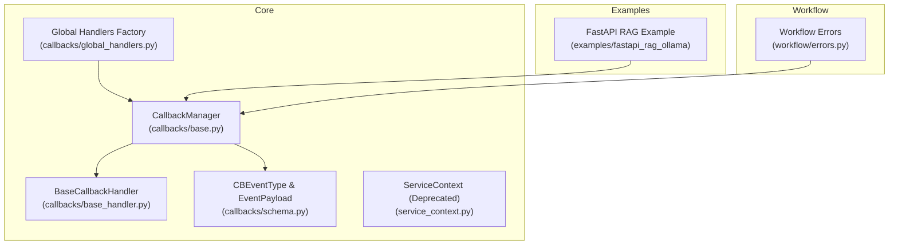
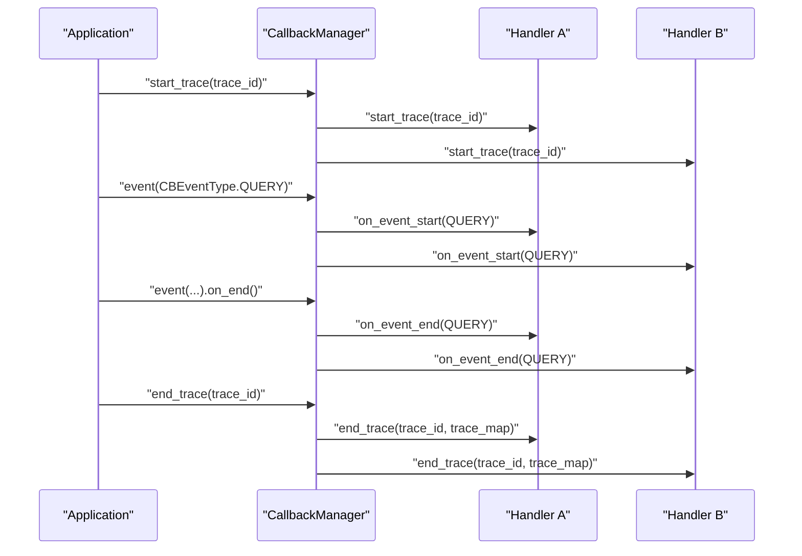
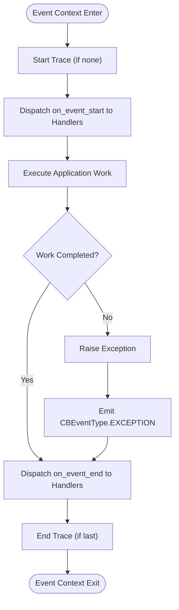
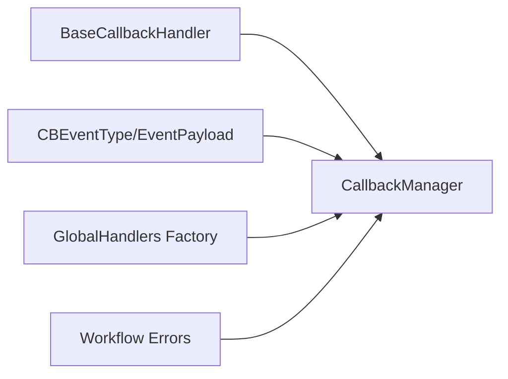

# Runtime Errors

<cite>
**Referenced Files in This Document**
- [base.py](file://llama-index-core/llama_index/core/callbacks/base.py)
- [base_handler.py](file://llama-index-core/llama_index/core/callbacks/base_handler.py)
- [schema.py](file://llama-index-core/llama_index/core/callbacks/schema.py)
- [global_handlers.py](file://llama-index-core/llama_index/core/callbacks/global_handlers.py)
- [service_context.py](file://llama-index-core/llama_index/core/service_context.py)
- [errors.py](file://llama-index-core/llama_index/core/workflow/errors.py)
- [README.md](file://examples/fastapi_rag_ollama/README.md)
- [app.py](file://examples/fastapi_rag_ollama/app.py)
</cite>

## Table of Contents
1. [Introduction](#introduction)
2. [Project Structure](#project-structure)
3. [Core Components](#core-components)
4. [Architecture Overview](#architecture-overview)
5. [Detailed Component Analysis](#detailed-component-analysis)
6. [Dependency Analysis](#dependency-analysis)
7. [Performance Considerations](#performance-considerations)
8. [Troubleshooting Guide](#troubleshooting-guide)
9. [Conclusion](#conclusion)

## Introduction
This document provides comprehensive troubleshooting guidance for runtime errors in LlamaIndex applications. It focuses on diagnosing and resolving common issues such as memory errors, timeouts, network connectivity problems, and processing failures. It also covers callback handler errors, indexing failures, retrieval problems, and query engine exceptions. Practical debugging techniques using callback handlers, logging configuration, and error tracking are included, along with production deployment strategies to avoid and recover from runtime errors.

## Project Structure
This repository organizes LlamaIndex core functionality under llama-index-core, with a dedicated callbacks subsystem for instrumentation and tracing. Examples demonstrate real-world integrations, including FastAPI-based RAG applications. The workflow module exposes error types that can surface during long-running or asynchronous operations.

**Diagram sources**
- [base.py](file://llama-index-core/llama_index/core/callbacks/base.py#L28-L303)
- [base_handler.py](file://llama-index-core/llama_index/core/callbacks/base_handler.py#L12-L56)
- [schema.py](file://llama-index-core/llama_index/core/callbacks/schema.py#L16-L102)
- [global_handlers.py](file://llama-index-core/llama_index/core/callbacks/global_handlers.py#L6-L150)
- [service_context.py](file://llama-index-core/llama_index/core/service_context.py#L4-L49)
- [errors.py](file://llama-index-core/llama_index/core/workflow/errors.py#L1-L11)
- [README.md](file://examples/fastapi_rag_ollama/README.md)
- [app.py](file://examples/fastapi_rag_ollama/app.py)

**Section sources**
- [base.py](file://llama-index-core/llama_index/core/callbacks/base.py#L28-L303)
- [base_handler.py](file://llama-index-core/llama_index/core/callbacks/base_handler.py#L12-L56)
- [schema.py](file://llama-index-core/llama_index/core/callbacks/schema.py#L16-L102)
- [global_handlers.py](file://llama-index-core/llama_index/core/callbacks/global_handlers.py#L6-L150)
- [service_context.py](file://llama-index-core/llama_index/core/service_context.py#L4-L49)
- [errors.py](file://llama-index-core/llama_index/core/workflow/errors.py#L1-L11)
- [README.md](file://examples/fastapi_rag_ollama/README.md)
- [app.py](file://examples/fastapi_rag_ollama/app.py)

## Core Components
- CallbackManager orchestrates event lifecycle hooks, manages trace stacks, and dispatches events to registered handlers. It supports nested traces and ensures proper cleanup via context managers.
- BaseCallbackHandler defines the interface for implementing custom instrumentation and tracing.
- CBEventType and EventPayload enumerate event categories and payload keys used across LLM, embedding, retrieval, synthesis, and exception events.
- GlobalHandlers factory creates and registers external evaluation/tracing integrations (e.g., wandb, openinference, langfuse) and validates installation prerequisites.
- ServiceContext is deprecated; migration guidance is provided in its module.
- Workflow errors expose types for timeouts, runtime errors, and validation issues in long-running workflows.

**Section sources**
- [base.py](file://llama-index-core/llama_index/core/callbacks/base.py#L28-L303)
- [base_handler.py](file://llama-index-core/llama_index/core/callbacks/base_handler.py#L12-L56)
- [schema.py](file://llama-index-core/llama_index/core/callbacks/schema.py#L16-L102)
- [global_handlers.py](file://llama-index-core/llama_index/core/callbacks/global_handlers.py#L6-L150)
- [service_context.py](file://llama-index-core/llama_index/core/service_context.py#L4-L49)
- [errors.py](file://llama-index-core/llama_index/core/workflow/errors.py#L1-L11)

## Architecture Overview
The callback system integrates with application workflows to emit structured events and traces. Handlers receive notifications on event start/end and trace lifecycle transitions. Global handlers can be attached to capture telemetry and diagnostics.

**Diagram sources**
- [base.py](file://llama-index-core/llama_index/core/callbacks/base.py#L156-L243)
- [base_handler.py](file://llama-index-core/llama_index/core/callbacks/base_handler.py#L24-L55)
- [schema.py](file://llama-index-core/llama_index/core/callbacks/schema.py#L16-L76)

## Detailed Component Analysis

### Callback Manager and Tracing
- Event lifecycle: start and end hooks are dispatched to all registered handlers. Non-leaf events push/pop from the trace stack to maintain hierarchical context.
- Trace lifecycle: start_trace initializes a trace and resets internal state; end_trace finalizes and emits trace maps to handlers.
- Exception handling: Exceptions raised within event contexts are captured and emitted as CBEventType.EXCEPTION with the exception payload.

**Diagram sources**
- [base.py](file://llama-index-core/llama_index/core/callbacks/base.py#L156-L243)
- [schema.py](file://llama-index-core/llama_index/core/callbacks/schema.py#L45-L76)

**Section sources**
- [base.py](file://llama-index-core/llama_index/core/callbacks/base.py#L88-L243)
- [schema.py](file://llama-index-core/llama_index/core/callbacks/schema.py#L16-L76)

### Base Callback Handler
- Defines the contract for on_event_start, on_event_end, start_trace, and end_trace.
- Provides lists to ignore specific event types for start/end, enabling selective instrumentation.

**Section sources**
- [base_handler.py](file://llama-index-core/llama_index/core/callbacks/base_handler.py#L12-L56)

### Event Types and Payload Keys
- CBEventType enumerates major phases: chunking, node parsing, embedding, LLM, query, retrieve, synthesize, tree, sub-question, templating, function call, reranking, exception, agent step.
- EventPayload defines standardized keys for documents, chunks, nodes, prompts/messages, completions/responses, query strings, embeddings, top_k, serialized objects, function call info, model name, template, and exceptions.

**Section sources**
- [schema.py](file://llama-index-core/llama_index/core/callbacks/schema.py#L16-L76)

### Global Handlers Factory
- Creates and attaches external callback handlers based on eval_mode.
- Validates availability of optional integrations and raises informative ImportErrors when dependencies are missing.
- Supports modes such as wandb, openinference, arize_phoenix, honeyhive, promptlayer, deepeval, simple, argilla, langfuse, agentops, literalai, and opik.

**Section sources**
- [global_handlers.py](file://llama-index-core/llama_index/core/callbacks/global_handlers.py#L6-L150)

### Deprecated ServiceContext
- ServiceContext is deprecated in favor of Settings and local module injection. Using it raises explicit errors with migration guidance.

**Section sources**
- [service_context.py](file://llama-index-core/llama_index/core/service_context.py#L4-L49)

### Workflow Errors
- Workflow errors include timeout, runtime, validation, cancellation, and configuration errors. These types can surface during long-running or asynchronous operations and should be handled gracefully in production.

**Section sources**
- [errors.py](file://llama-index-core/llama_index/core/workflow/errors.py#L1-L11)

### Example: FastAPI RAG Application
- Demonstrates a practical RAG pipeline integrated with FastAPI and Ollama.
- Useful for validating network connectivity, model availability, and request handling behavior under load.

**Section sources**
- [README.md](file://examples/fastapi_rag_ollama/README.md)
- [app.py](file://examples/fastapi_rag_ollama/app.py)

## Dependency Analysis
The callback system depends on:
- BaseCallbackHandler interface for handler implementations.
- CBEventType and EventPayload for event semantics.
- GlobalHandlers factory for attaching external integrations.
- Workflow errors for long-running operation failure modes.

**Diagram sources**
- [base_handler.py](file://llama-index-core/llama_index/core/callbacks/base_handler.py#L12-L56)
- [base.py](file://llama-index-core/llama_index/core/callbacks/base.py#L28-L303)
- [schema.py](file://llama-index-core/llama_index/core/callbacks/schema.py#L16-L102)
- [global_handlers.py](file://llama-index-core/llama_index/core/callbacks/global_handlers.py#L6-L150)
- [errors.py](file://llama-index-core/llama_index/core/workflow/errors.py#L1-L11)

**Section sources**
- [base.py](file://llama-index-core/llama_index/core/callbacks/base.py#L28-L303)
- [base_handler.py](file://llama-index-core/llama_index/core/callbacks/base_handler.py#L12-L56)
- [schema.py](file://llama-index-core/llama_index/core/callbacks/schema.py#L16-L102)
- [global_handlers.py](file://llama-index-core/llama_index/core/callbacks/global_handlers.py#L6-L150)
- [errors.py](file://llama-index-core/llama_index/core/workflow/errors.py#L1-L11)

## Performance Considerations
- Minimize overhead: Limit the number of active handlers and avoid heavy synchronous work in on_event_start/on_event_end.
- Use leaf events judiciously: Embedding and LLM events are leaf events; excessive instrumentation here can still impact throughput.
- Trace depth: Deeply nested traces increase memory usage; keep traces scoped to meaningful units.
- External integrations: Some global handlers may incur network or serialization costs; enable only what is necessary for your environment.

[No sources needed since this section provides general guidance]

## Troubleshooting Guide

### Memory Errors
Symptoms
- Out-of-memory (OOM) errors during embedding or retrieval.
- Gradual memory growth over time.

Root causes
- Large batch sizes for embeddings or retrieval top_k.
- Accumulation of trace data or handler buffers.
- Long-running workflows without periodic cleanup.

Mitigations
- Reduce batch sizes for embeddings and retrieval.
- Periodically end traces and clear handler state.
- Monitor handler buffer sizes and flush periodically.
- Use streaming or chunked processing for large documents.

**Section sources**
- [schema.py](file://llama-index-core/llama_index/core/callbacks/schema.py#L49-L76)
- [base.py](file://llama-index-core/llama_index/core/callbacks/base.py#L213-L243)

### Timeouts
Symptoms
- LLM calls or retrievals timing out.
- Workflow steps exceeding configured limits.

Root causes
- Network latency or throttling.
- Model server overload or misconfiguration.
- Workflow step timeouts or lack of retries.

Mitigations
- Increase timeout budgets for LLM calls and retrievals.
- Enable retry logic around external calls.
- Scale out model servers or reduce concurrency.
- Use workflow error types to detect and handle timeouts.

**Section sources**
- [errors.py](file://llama-index-core/llama_index/core/workflow/errors.py#L1-L11)

### Network Connectivity Problems
Symptoms
- Failures connecting to LLM providers or vector stores.
- Intermittent timeouts or DNS resolution errors.

Root causes
- Proxy misconfiguration or firewall restrictions.
- Provider rate limits or regional outages.
- Unavailable endpoints or incorrect credentials.

Mitigations
- Verify proxy and DNS settings.
- Retry with exponential backoff.
- Use fallback providers or cached responses where appropriate.
- Instrument with global handlers to capture connection metrics.

**Section sources**
- [global_handlers.py](file://llama-index-core/llama_index/core/callbacks/global_handlers.py#L6-L150)

### Processing Failures
Symptoms
- Exceptions during chunking, parsing, embedding, or synthesis.
- Partial results or corrupted artifacts.

Root causes
- Malformed input documents or prompts.
- Resource exhaustion during processing.
- Handler exceptions bubbling up unhandled.

Mitigations
- Validate inputs and sanitize prompts.
- Add guardrails and early exits for malformed data.
- Wrap processing in event contexts to emit CBEventType.EXCEPTION.
- Use handler ignore lists to focus on critical events.

**Section sources**
- [base.py](file://llama-index-core/llama_index/core/callbacks/base.py#L156-L243)
- [schema.py](file://llama-index-core/llama_index/core/callbacks/schema.py#L45-L76)

### Callback Handler Errors
Symptoms
- Handler crashes or silent failures.
- Duplicate or missing events.

Root causes
- Handler initialization errors.
- Conflicting handler types on the same manager.
- Ignoring critical events unintentionally.

Mitigations
- Initialize handlers once and reuse instances.
- Prevent adding duplicate handler types to the manager.
- Explicitly configure event_starts_to_ignore and event_ends_to_ignore.
- Use global handlers factory to validate dependencies.

**Section sources**
- [base.py](file://llama-index-core/llama_index/core/callbacks/base.py#L57-L85)
- [base_handler.py](file://llama-index-core/llama_index/core/callbacks/base_handler.py#L15-L23)
- [global_handlers.py](file://llama-index-core/llama_index/core/callbacks/global_handlers.py#L6-L150)

### Indexing Failures
Symptoms
- Failures during node parsing or embedding.
- Inconsistent or missing indices.

Root causes
- Chunking errors or oversized chunks.
- Embedding provider failures.
- Storage backend connectivity issues.

Mitigations
- Adjust chunk size and overlap.
- Retry embedding calls with jitter.
- Validate storage credentials and permissions.
- Emit and monitor CBEventType.NODE_PARSING and CBEventType.EMBEDDING.

**Section sources**
- [schema.py](file://llama-index-core/llama_index/core/callbacks/schema.py#L33-L36)
- [base.py](file://llama-index-core/llama_index/core/callbacks/base.py#L88-L123)

### Retrieval Problems
Symptoms
- Empty or irrelevant results.
- Slow retrieval times.

Root causes
- Incorrect query embeddings or mismatched models.
- Vector store performance or misconfiguration.
- Top_k too small or reranker misalignment.

Mitigations
- Verify embedding model alignment.
- Tune top_k and reranking strategies.
- Monitor retrieval latency and accuracy.
- Emit and inspect CBEventType.RETRIEVE.

**Section sources**
- [schema.py](file://llama-index-core/llama_index/core/callbacks/schema.py#L38-L71)
- [base.py](file://llama-index-core/llama_index/core/callbacks/base.py#L125-L143)

### Query Engine Exceptions
Symptoms
- Exceptions thrown by query engines.
- Unexpected responses or hallucinations.

Root causes
- Invalid query strings or malformed prompts.
- LLM provider errors or rate limiting.
- Synthesis failures or payload mismatches.

Mitigations
- Sanitize queries and enforce schema validation.
- Add circuit breakers and fallbacks for LLM calls.
- Capture CBEventType.SYNTHESIZE and CBEventType.LLM payloads.
- Use global handlers to track downstream failures.

**Section sources**
- [schema.py](file://llama-index-core/llama_index/core/callbacks/schema.py#L37-L46)
- [base.py](file://llama-index-core/llama_index/core/callbacks/base.py#L180-L191)

### Debugging Techniques
- Callback handlers: Attach handlers to capture CBEventType.LLM, CBEventType.EMBEDDING, CBEventType.RETRIEVE, and CBEventType.SYNTHESIZE. Use global handlers to export telemetry.
- Logging configuration: Configure Python logging to capture warnings and errors from the callbacks module.
- Error tracking: Emit CBEventType.EXCEPTION with EventPayload.EXCEPTION to include stack traces in handler payloads.
- Tracing: Use start_trace/end_trace to bound diagnostics and inspect trace maps for event relationships.

**Section sources**
- [global_handlers.py](file://llama-index-core/llama_index/core/callbacks/global_handlers.py#L6-L150)
- [schema.py](file://llama-index-core/llama_index/core/callbacks/schema.py#L45-L76)
- [base.py](file://llama-index-core/llama_index/core/callbacks/base.py#L193-L243)

### Production Deployment Strategies
- Instrumentation: Enable only necessary handlers in production to minimize overhead.
- Health checks: Monitor embedding and retrieval latencies; alert on outliers.
- Retries and backoff: Implement robust retry policies for transient failures.
- Graceful degradation: Fallback to smaller models or cached results when providers fail.
- Observability: Use global handlers to export metrics and traces to external systems.

**Section sources**
- [global_handlers.py](file://llama-index-core/llama_index/core/callbacks/global_handlers.py#L6-L150)
- [README.md](file://examples/fastapi_rag_ollama/README.md)
- [app.py](file://examples/fastapi_rag_ollama/app.py)

## Conclusion
Effective troubleshooting of LlamaIndex runtime errors requires a combination of structured event tracing, targeted handler instrumentation, and robust error handling. By leveraging the callback system, understanding event semantics, and adopting production-grade resilience strategies, teams can diagnose and resolve issues quickly while maintaining system stability.