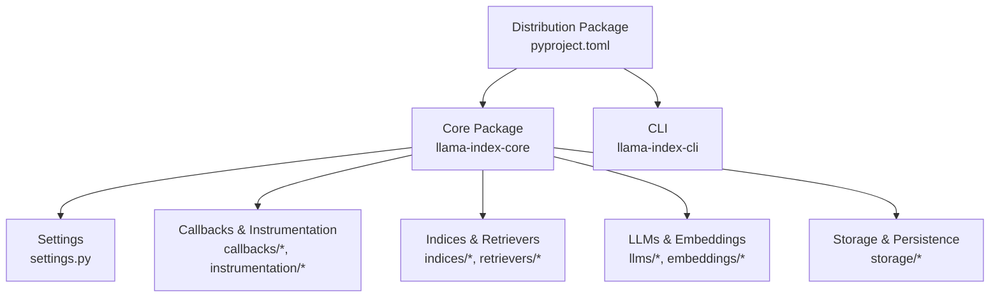
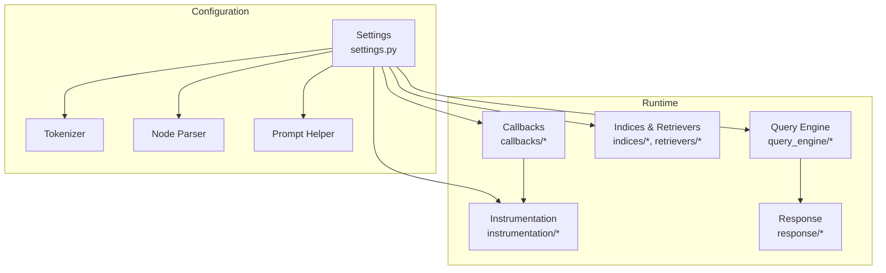
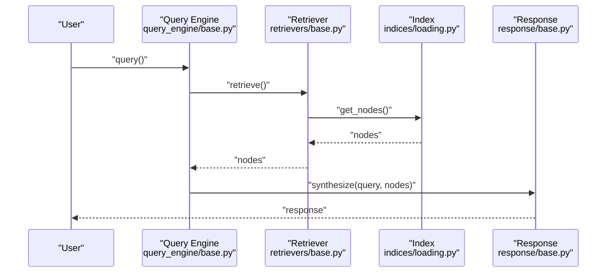
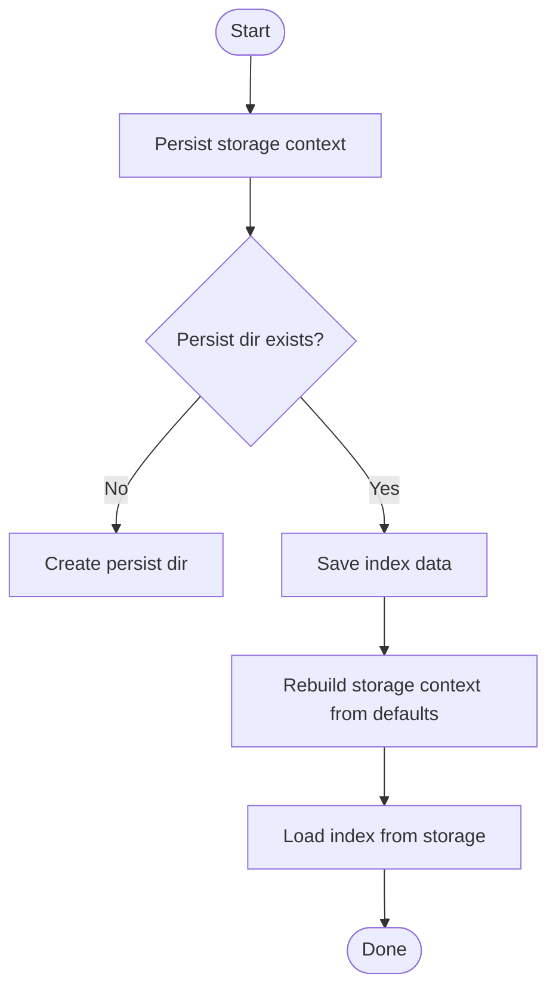
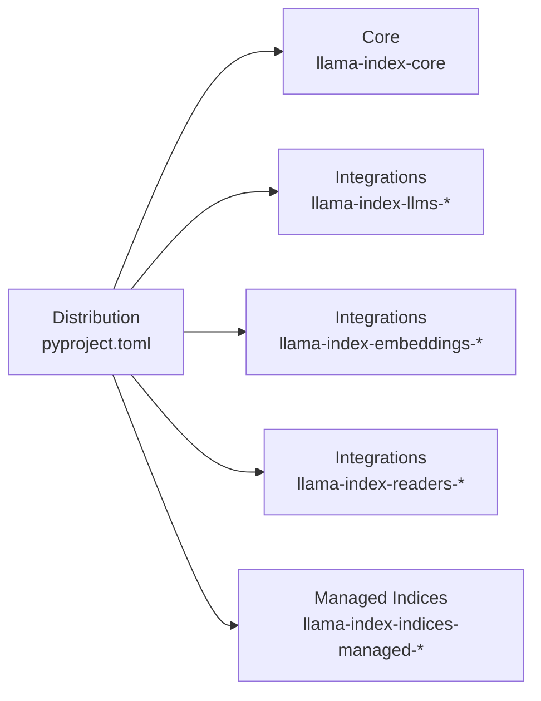

# Troubleshooting and FAQ

<cite>
**Referenced Files in This Document**
- [README.md](file://README.md)
- [CONTRIBUTING.md](file://CONTRIBUTING.md)
- [pyproject.toml](file://pyproject.toml)
- [settings.py](file://llama-index-core/llama_index/core/settings.py)
- [service_context.py](file://llama-index-core/llama_index/core/service_context.py)
- [callbacks/base.py](file://llama-index-core/llama_index/core/callbacks/base.py)
- [callbacks/llama_debug.py](file://llama-index-core/llama_index/core/callbacks/llama_debug.py)
- [callbacks/token_counting.py](file://llama-index-core/llama_index/core/callbacks/token_counting.py)
- [callbacks/utils.py](file://llama-index-core/llama_index/core/callbacks/utils.py)
- [indices/loading.py](file://llama-index-core/llama_index/core/indices/loading.py)
- [storage/storage_context.py](file://llama-index-core/llama_index/core/storage/storage_context.py)
- [embeddings/loading.py](file://llama-index-core/llama_index/core/embeddings/loading.py)
- [llms/utils.py](file://llama-index-core/llama_index/core/llms/utils.py)
- [node_parser/text/token.py](file://llama-index-core/llama_index/core/node_parser/text/token.py)
- [vector_stores/simple.py](file://llama-index-core/llama_index/core/vector_stores/simple.py)
- [instrumentation/dispatcher.py](file://llama-index-core/llama_index/core/instrumentation/dispatcher.py)
- [instrumentation/events/events.py](file://llama-index-core/llama_index/core/instrumentation/events/events.py)
- [chat_engine/context.py](file://llama-index-core/llama_index/core/chat_engine/context.py)
- [query_engine/base.py](file://llama-index-core/llama_index/core/query_engine/base.py)
- [retrievers/base.py](file://llama-index-core/llama_index/core/retrievers/base.py)
- [response/base.py](file://llama-index-core/llama_index/core/response/base.py)
- [callbacks/global_handlers.py](file://llama-index-core/llama_index/core/callbacks/global_handlers.py)
- [callbacks/pythonically_printing_base_handler.py](file://llama-index-core/llama_index/core/callbacks/pythonically_printing_base_handler.py)
- [callbacks/schema.py](file://llama-index-core/llama_index/core/callbacks/schema.py)
- [callbacks/simple_llm_handler.py](file://llama-index-core/llama_index/core/callbacks/simple_llm_handler.py)
- [callbacks/utils.py](file://llama-index-core/llama_index/core/callbacks/utils.py)
- [callbacks/base_handler.py](file://llama-index-core/llama_index/core/callbacks/base_handler.py)
- [callbacks/token_counting.py](file://llama-index-core/llama_index/core/callbacks/token_counting.py)
- [callbacks/llama_debug.py](file://llama-index-core/llama_index/core/callbacks/llama_debug.py)
- [callbacks/base.py](file://llama-index-core/llama_index/core/callbacks/base.py)
- [callbacks/global_handlers.py](file://llama-index-core/llama_index/core/callbacks/global_handlers.py)
- [callbacks/pythonically_printing_base_handler.py](file://llama-index-core/llama_index/core/callbacks/pythonically_printing_base_handler.py)
- [callbacks/schema.py](file://llama-index-core/llama_index/core/callbacks/schema.py)
- [callbacks/simple_llm_handler.py](file://llama-index-core/llama_index/core/callbacks/simple_llm_handler.py)
- [callbacks/utils.py](file://llama-index-core/llama_index/core/callbacks/utils.py)
- [callbacks/base_handler.py](file://llama-index-core/llama_index/core/callbacks/base_handler.py)
- [callbacks/token_counting.py](file://llama-index-core/llama_index/core/callbacks/token_counting.py)
- [callbacks/llama_debug.py](file://llama-index-core/llama_index/core/callbacks/llama_debug.py)
- [callbacks/base.py](file://llama-index-core/llama_index/core/callbacks/base.py)
- [callbacks/global_handlers.py](file://llama-index-core/llama_index/core/callbacks/global_handlers.py)
- [callbacks/pythonically_printing_base_handler.py](file://llama-index-core/llama_index/core/callbacks/pythonically_printing_base_handler.py)
- [callbacks/schema.py](file://llama-index-core/llama_index/core/callbacks/schema.py)
- [callbacks/simple_llm_handler.py](file://llama-index-core/llama_index/core/callbacks/simple_llm_handler.py)
- [callbacks/utils.py](file://llama-index-core/llama_index/core/callbacks/utils.py)
- [callbacks/base_handler.py](file://llama-index-core/llama_index/core/callbacks/base_handler.py)
- [callbacks/token_counting.py](file://llama-index-core/llama_index/core/callbacks/token_counting.py)
- [callbacks/llama_debug.py](file://llama-index-core/llama_index/core/callbacks/llama_debug.py)
- [callbacks/base.py](file://llama-index-core/llama_index/core/callbacks/base.py)
- [callbacks/global_handlers.py](file://llama-index-core/llama_index/core/callbacks/global_handlers.py)
- [callbacks/pythonically_printing_base_handler.py](file://llama-index-core/llama_index/core/callbacks/pythonically_printing_base_handler.py)
- [callbacks/schema.py](file://llama-index-core/llama_index/core/callbacks/schema.py)
- [callbacks/simple_llm_handler.py](file://llama-index-core/llama_index/core/callbacks/simple_llm_handler.py)
- [callbacks/utils.py](file://llama-index-core/llama_index/core/callbacks/utils.py)
- [callbacks/base_handler.py](file://llama-index-core/llama_index/core/callbacks/base_handler.py)
- [callbacks/token_counting.py](file://llama-index-core/llama_index/core/callbacks/token_counting.py)
- [callbacks/llama_debug.py](file://llama-index-core/llama_index/core/callbacks/llama_debug.py)
- [callbacks/base.py](file://llama-index-core/llama_index/core/callbacks/base.py)
- [callbacks/global_handlers.py](file://llama-index-core/llama_index/core/callbacks/global_handlers.py)
- [callbacks/pythonically_printing_base_handler.py](file://llama-index-core/llama_index/core/callbacks/pythonically_printing_base_handler.py)
- [callbacks/schema.py](file://llama-index-core/llama_index/core/callbacks/schema.py)
- [callbacks/simple_llm_handler.py](file://llama-index-core/llama_index/core/callbacks/simple_llm_handler.py)
- [callbacks/utils.py](file://llama-index-core/llama_index/core/callbacks/utils.py)
- [callbacks/base_handler.py](file://llama-index-core/llama_index/core/callbacks/base_handler.py)
- [callbacks/token_counting.py](file://llama-index-core/llama_index/core/callbacks/token_counting.py)
- [callbacks/llama_debug.py](file://llama-index-core/llama_index/core/callbacks/llama_debug.py)
- [callbacks/base.py](file://llama-index-core/llama_index/core/callbacks/base.py)
- [callbacks/global_handlers.py](file://llama-index-core/llama_index/core/callbacks/global_handlers.py)
- [callbacks/pythonically_printing_base_handler.py](file://llama-index-core/llama_index/core/callbacks/pythonically_printing_base_handler.py)
- [callbacks/schema.py](file://llama-index-core/llama_index/core/callbacks/schema.py)
- [callbacks/simple_llm_handler.py](file://llama-index-core/llama_index/core/callbacks/simple_llm_handler.py)
- [callbacks/utils.py](file://llama-index-core/llama_index/core/callbacks/utils.py)
- [callbacks/base_handler.py](file://llama-index-core/llama_index/core/callbacks/base_handler.py)
- [callbacks/token_counting.py](file://llama-index-core/llama_index/core/callbacks/token_counting.py)
- [callbacks/llama_debug.py](file://llama-index-core/llama_index/core/callbacks/llama_debug.py)
- [callbacks/base.py](file://llama-index-core/llama_index/core/callbacks/base.py)
- [callbacks/global_handlers.py](file://llama-index-core/llama_index/core/callbacks/global_handlers.py)
- [callbacks/pythonically_printing_base_handler.py](file://llama-index-core/llama_index/core/callbacks/pythonically_printing_base_handler.py)
- [callbacks/schema.py](file://llama-index-core/llama_index/core/callbacks/schema.py)
- [callbacks/simple_llm_handler.py](file://llama-index-core/llama_index/core/callbacks/simple_llm_handler.py)
- [callbacks/utils.py](file://llama-index-core/llama_index/core/callbacks/utils.py)
- [callbacks/base_handler.py](file://llama-index-core/llama_index/core/callbacks/base_handler.py)
- [callbacks/token_counting.py](file://llama-index-core/llama......)
</cite>

## Table of Contents
1. [Introduction](#introduction)
2. [Project Structure](#project-structure)
3. [Core Components](#core-components)
4. [Architecture Overview](#architecture-overview)
5. [Detailed Component Analysis](#detailed-component-analysis)
6. [Dependency Analysis](#dependency-analysis)
7. [Performance Considerations](#performance-considerations)
8. [Troubleshooting Guide](#troubleshooting-guide)
9. [Conclusion](#conclusion)
10. [Appendices](#appendices)

## Introduction
This document provides a comprehensive Troubleshooting and FAQ guide for LlamaIndex. It focuses on diagnosing and resolving common issues during installation, configuration, usage, performance tuning, integration troubleshooting, memory concerns, and deployment. It also outlines diagnostic approaches, debugging techniques, and links to community resources. The content is grounded in the repository’s codebase and aligns with the terminology and patterns used in the core and integration modules.

## Project Structure
LlamaIndex is a monorepo with a core package and numerous integrations. The primary distribution package aggregates core and selected integrations. The core package exposes configuration via a central settings object and provides instrumentation, callbacks, and foundational modules for indexing, retrieval, and querying.

**Diagram sources**
- [pyproject.toml](file://pyproject.toml#L41-L50)
- [settings.py](file://llama-index-core/llama_index/core/settings.py#L17-L249)
- [callbacks/base.py](file://llama-index-core/llama_index/core/callbacks/base.py)
- [instrumentation/dispatcher.py](file://llama-index-core/llama_index/core/instrumentation/dispatcher.py)
- [indices/loading.py](file://llama-index-core/llama_index/core/indices/loading.py)
- [storage/storage_context.py](file://llama-index-core/llama_index/core/storage/storage_context.py)
- [embeddings/loading.py](file://llama-index-core/llama_index/core/embeddings/loading.py)
- [llms/utils.py](file://llama-index-core/llama_index/core/llms/utils.py)

**Section sources**
- [README.md](file://README.md#L11-L24)
- [pyproject.toml](file://pyproject.toml#L41-L50)

## Core Components
Key components frequently involved in troubleshooting:
- Settings: Centralized configuration for LLM, embeddings, tokenizer, node parser, prompt helper, and transformations.
- Callbacks and Instrumentation: Token counting, debug tracing, and event dispatching for observability.
- Indices and Retrievers: Loading, persistence, and retrieval mechanics.
- Storage Context: Persistence and reloading of indices.
- Embeddings and LLMs: Model resolution and configuration.

**Section sources**
- [settings.py](file://llama-index-core/llama_index/core/settings.py#L17-L249)
- [callbacks/token_counting.py](file://llama-index-core/llama_index/core/callbacks/token_counting.py)
- [callbacks/llama_debug.py](file://llama-index-core/llama_index/core/callbacks/llama_debug.py)
- [indices/loading.py](file://llama-index-core/llama_index/core/indices/loading.py)
- [storage/storage_context.py](file://llama-index-core/llama_index/core/storage/storage_context.py)
- [embeddings/loading.py](file://llama-index-core/llama_index/core/embeddings/loading.py)
- [llms/utils.py](file://llama-index-core/llama_index/core/llms/utils.py)

## Architecture Overview
The following diagram shows how configuration flows through Settings and how callbacks/instrumentation can observe and influence runtime behavior.

**Diagram sources**
- [settings.py](file://llama-index-core/llama_index/core/settings.py#L17-L249)
- [callbacks/base.py](file://llama-index-core/llama_index/core/callbacks/base.py)
- [instrumentation/dispatcher.py](file://llama-index-core/llama_index/core/instrumentation/dispatcher.py)
- [query_engine/base.py](file://llama-index-core/llama_index/core/query_engine/base.py)
- [response/base.py](file://llama-index-core/llama_index/core/response/base.py)

## Detailed Component Analysis

### Installation and Environment Setup
Common issues:
- Missing or incompatible Python version.
- Conflicting or missing dependencies.
- Virtual environment activation problems.
- Static assets verification in core.

Resolution steps:
- Ensure Python version compatibility as declared in the project metadata.
- Use the recommended package manager and environment setup described in the contribution guide.
- Verify static assets if encountering runtime caching issues.

Practical checks:
- Confirm Python version satisfies the project requirement.
- Reinstall dependencies using the documented environment setup.
- If using core with embedded static assets, verify caches as indicated in the repository documentation.

**Section sources**
- [pyproject.toml](file://pyproject.toml#L72-L73)
- [CONTRIBUTING.md](file://CONTRIBUTING.md#L11-L34)
- [README.md](file://README.md#L191-L208)

### Configuration and Settings
Common issues:
- Deprecated ServiceContext usage.
- Incorrect tokenizer assignment.
- Node parser settings not applied.
- Prompt helper context window mismatches.

Resolution steps:
- Replace deprecated ServiceContext with Settings.
- Set tokenizer via Settings to ensure compatibility with LLM tokenizers.
- Configure node parser chunk size and overlap via Settings properties.
- Align prompt helper context window with LLM capabilities.

Diagnostic tips:
- Use Settings properties to inspect current configuration.
- Leverage callbacks for token counting and debug tracing.

**Section sources**
- [service_context.py](file://llama-index-core/llama_index/core/service_context.py#L4-L49)
- [settings.py](file://llama-index-core/llama_index/core/settings.py#L108-L134)
- [settings.py](file://llama-index-core/llama_index/core/settings.py#L137-L184)
- [settings.py](file://llama-index-core/llama_index/core/settings.py#L198-L231)
- [callbacks/token_counting.py](file://llama-index-core/llama_index/core/callbacks/token_counting.py)
- [callbacks/llama_debug.py](file://llama-index-core/llama_index/core/callbacks/llama_debug.py)

### Usage Patterns and Query Flow
Common issues:
- Incorrect query engine usage.
- Retrieval returning unexpected results.
- Response synthesis errors.

Resolution steps:
- Ensure proper index creation and query engine instantiation.
- Verify retriever and node parser alignment with index type.
- Inspect response objects and handle exceptions gracefully.

**Diagram sources**
- [query_engine/base.py](file://llama-index-core/llama_index/core/query_engine/base.py)
- [retrievers/base.py](file://llama-index-core/llama_index/core/retrievers/base.py)
- [indices/loading.py](file://llama-index-core/llama_index/core/indices/loading.py)
- [response/base.py](file://llama-index-core/llama_index/core/response/base.py)

**Section sources**
- [query_engine/base.py](file://llama-index-core/llama_index/core/query_engine/base.py)
- [retrievers/base.py](file://llama-index-core/llama_index/core/retrievers/base.py)
- [indices/loading.py](file://llama-index-core/llama_index/core/indices/loading.py)
- [response/base.py](file://llama-index-core/llama_index/core/response/base.py)

### Persistence and Reloading
Common issues:
- Persistence directory not found.
- Reload fails after process restart.
- Vector store persistence mismatch.

Resolution steps:
- Persist storage context to the intended directory.
- Rebuild storage context from defaults and reload the index.
- Ensure vector store backend supports persistence.

**Diagram sources**
- [storage/storage_context.py](file://llama-index-core/llama_index/core/storage/storage_context.py)
- [indices/loading.py](file://llama-index-core/llama_index/core/indices/loading.py)

**Section sources**
- [storage/storage_context.py](file://llama-index-core/llama_index/core/storage/storage_context.py)
- [indices/loading.py](file://llama-index-core/llama_index/core/indices/loading.py)

### Embeddings and LLMs
Common issues:
- Model resolution failures.
- Tokenizer mismatch with LLM.
- Embedding dimension mismatches.

Resolution steps:
- Configure LLM and embeddings via Settings.
- Ensure tokenizer matches the LLM’s expected encoding.
- Verify embedding model compatibility with downstream components.

**Section sources**
- [settings.py](file://llama-index-core/llama_index/core/settings.py#L32-L47)
- [settings.py](file://llama-index-core/llama_index/core/settings.py#L60-L75)
- [settings.py](file://llama-index-core/llama_index/core/settings.py#L108-L134)
- [llms/utils.py](file://llama-index-core/llama_index/core/llms/utils.py)
- [embeddings/loading.py](file://llama-index-core/llama_index/core/embeddings/loading.py)

### Instrumentation and Observability
Common issues:
- Missing spans or events.
- Excessive overhead from instrumentation.
- Debug traces not visible.

Resolution steps:
- Enable instrumentation and configure event handlers.
- Use token counting callbacks to estimate costs.
- Apply debug handlers selectively for targeted diagnostics.

**Section sources**
- [instrumentation/dispatcher.py](file://llama-index-core/llama_index/core/instrumentation/dispatcher.py)
- [callbacks/token_counting.py](file://llama-index-core/llama_index/core/callbacks/token_counting.py)
- [callbacks/llama_debug.py](file://llama-index-core/llama_index/core/callbacks/llama_debug.py)

### Chat Engines and Conversational Context
Common issues:
- Context not preserved across turns.
- Unexpected summarization behavior.

Resolution steps:
- Use appropriate chat engine modes for conversational context.
- Review context management and summarization strategies.

**Section sources**
- [chat_engine/context.py](file://llama-index-core/llama_index/core/chat_engine/context.py)

## Dependency Analysis
The distribution package depends on core and several integrations. Misconfiguration often arises from incompatible versions or missing optional dependencies.

**Diagram sources**
- [pyproject.toml](file://pyproject.toml#L41-L50)

**Section sources**
- [pyproject.toml](file://pyproject.toml#L41-L50)

## Performance Considerations
- Chunk size and overlap: Tune via Settings.node_parser properties to balance recall and cost.
- Token counting: Use callbacks to estimate token usage and cost.
- Prompt helper context window: Align with LLM capabilities to avoid truncation or errors.
- Vector store backend: Choose a backend that supports your scale and latency targets.
- Node parsing strategy: Select a text splitter appropriate for your content type.

[No sources needed since this section provides general guidance]

## Troubleshooting Guide

### Installation and Setup
- Issue: Installation fails due to dependency conflicts.
  - Resolution: Use the documented environment setup and ensure Python version compatibility.
  - References: [CONTRIBUTING.md](file://CONTRIBUTING.md#L11-L34), [pyproject.toml](file://pyproject.toml#L72-L73)

- Issue: Static asset verification warnings.
  - Resolution: Follow the verification procedure outlined in the repository documentation.
  - References: [README.md](file://README.md#L191-L208)

### Configuration
- Issue: Deprecated ServiceContext usage.
  - Resolution: Migrate to Settings as documented.
  - References: [service_context.py](file://llama-index-core/llama_index/core/service_context.py#L4-L49)

- Issue: Tokenizer mismatch causing encoding errors.
  - Resolution: Set tokenizer via Settings to match the LLM’s expected encoding.
  - References: [settings.py](file://llama-index-core/llama_index/core/settings.py#L108-L134)

- Issue: Node parser settings not taking effect.
  - Resolution: Configure via Settings.node_parser and related properties.
  - References: [settings.py](file://llama-index-core/llama_index/core/settings.py#L137-L184)

- Issue: Prompt helper context window too small or large.
  - Resolution: Adjust via Settings.prompt_helper or Settings.context_window.
  - References: [settings.py](file://llama-index-core/llama_index/core/settings.py#L198-L231)

### Usage and Query Flow
- Issue: Query returns no results or irrelevant results.
  - Resolution: Verify retriever and index type compatibility; adjust node parser and chunk settings.
  - References: [query_engine/base.py](file://llama-index-core/llama_index/core/query_engine/base.py), [retrievers/base.py](file://llama-index-core/llama_index/core/retrievers/base.py)

- Issue: Response synthesis errors.
  - Resolution: Inspect response objects and handle exceptions; confirm prompt helper context window.
  - References: [response/base.py](file://llama-index-core/llama_index/core/response/base.py), [settings.py](file://llama-index-core/llama_index/core/settings.py#L198-L231)

### Persistence and Reloading
- Issue: Cannot persist or reload index.
  - Resolution: Persist storage context to a writable directory; rebuild storage context and reload.
  - References: [storage/storage_context.py](file://llama-index-core/llama_index/core/storage/storage_context.py), [indices/loading.py](file://llama-index-core/llama_index/core/indices/loading.py)

- Issue: Vector store persistence mismatch.
  - Resolution: Ensure the chosen vector store backend supports persistence and is configured correctly.
  - References: [vector_stores/simple.py](file://llama-index-core/llama_index/core/vector_stores/simple.py)

### Embeddings and LLMs
- Issue: Model resolution failure.
  - Resolution: Configure LLM and embeddings via Settings; verify environment variables and credentials.
  - References: [settings.py](file://llama-index-core/llama_index/core/settings.py#L32-L47), [settings.py](file://llama-index-core/llama_index/core/settings.py#L60-L75)

- Issue: Embedding dimension mismatch.
  - Resolution: Ensure embedding model dimensions match downstream components.
  - References: [embeddings/loading.py](file://llama-index-core/llama_index/core/embeddings/loading.py)

### Instrumentation and Observability
- Issue: No instrumentation events captured.
  - Resolution: Enable instrumentation and configure event handlers; apply debug handlers for targeted diagnostics.
  - References: [instrumentation/dispatcher.py](file://llama-index-core/llama_index/core/instrumentation/dispatcher.py), [callbacks/llama_debug.py](file://llama-index-core/llama_index/core/callbacks/llama_debug.py)

- Issue: High overhead from instrumentation.
  - Resolution: Disable or reduce instrumentation in production; use sampling strategies.
  - References: [instrumentation/dispatcher.py](file://llama-index-core/llama_index/core/instrumentation/dispatcher.py)

### Memory and Resource Issues
- Symptom: Out-of-memory errors during ingestion or querying.
  - Resolution: Reduce chunk size and overlap; limit concurrent operations; use lazy loading where available; monitor token usage with callbacks.
  - References: [settings.py](file://llama-index-core/llama_index/core/settings.py#L137-L184), [callbacks/token_counting.py](file://llama-index-core/llama_index/core/callbacks/token_counting.py)

### Deployment Challenges
- Symptom: Runtime caching or permission issues.
  - Resolution: Follow the static asset verification procedure; ensure write permissions to persistence directories.
  - References: [README.md](file://README.md#L191-L208), [storage/storage_context.py](file://llama-index-core/llama_index/core/storage/storage_context.py)

### Community Resources
- Official documentation and migration guides.
- Contribution guide and development setup.
- Community channels for support.

**Section sources**
- [README.md](file://README.md#L37-L91)
- [CONTRIBUTING.md](file://CONTRIBUTING.md#L18-L72)

## Conclusion
This guide consolidates common LlamaIndex issues and their resolutions, focusing on installation, configuration, usage, performance, integration, memory, and deployment. Use Settings as the central configuration point, instrument with callbacks for observability, and follow the repository’s documentation and community resources for ongoing support.

[No sources needed since this section summarizes without analyzing specific files]

## Appendices

### Quick Reference: Common Commands and Paths
- Distribution dependencies and scripts: [pyproject.toml](file://pyproject.toml#L41-L50), [pyproject.toml](file://pyproject.toml#L75-L77)
- Settings configuration: [settings.py](file://llama-index-core/llama_index/core/settings.py#L17-L249)
- Callbacks and instrumentation: [callbacks/base.py](file://llama-index-core/llama_index/core/callbacks/base.py), [instrumentation/dispatcher.py](file://llama-index-core/llama_index/core/instrumentation/dispatcher.py)
- Persistence and reloading: [storage/storage_context.py](file://llama-index-core/llama_index/core/storage/storage_context.py), [indices/loading.py](file://llama-index-core/llama_index/core/indices/loading.py)
- Embeddings and LLMs: [embeddings/loading.py](file://llama-index-core/llama_index/core/embeddings/loading.py), [llms/utils.py](file://llama-index-core/llama_index/core/llms/utils.py)
- Text splitting: [node_parser/text/token.py](file://llama-index-core/llama_index/core/node_parser/text/token.py)